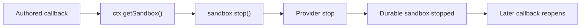

# Authored sandbox stop

## Summary

Authored runtime callbacks can access their session sandbox through
`ctx.getSandbox()`, but they cannot release its backing compute. This prevents
hooks from stopping compute when a turn or session reaches an
application-defined boundary and keeps authored tools from satisfying sandbox
consumers that require an explicit stop operation.

Return a `RuntimeSandboxSession` from `ctx.getSandbox()`. It extends the
existing `SandboxSession` I/O surface with `stop()`, an eve-owned operation
implemented by every sandbox backend through its native lifecycle primitive.

## Authoring API

```ts
import { defineHook } from "eve/hooks";

export default defineHook({
  events: {
    async "turn.completed"(_event, ctx) {
      const sandbox = await ctx.getSandbox();
      await sandbox.stop();
    },
  },
});
```

`RuntimeSandboxSession` is exported from `eve/sandbox`. Sandbox lifecycle
`bootstrap({ use })` and `onSession({ use })` keep returning `SandboxSession`:
template and session initialization do not own runtime teardown.

## Semantics



- Each built-in backend maps `stop()` to its native lifecycle operation:
  Vercel stops its persistent sandbox, Docker stops its session container,
  microsandbox stops and detaches its VM, and just-bash disposes its interpreter.
- A resolved stop preserves the durable session state. A later callback opens
  the same session through the normal backend `create()` path. Vercel also
  automatically resumes the same handle on later I/O, matching its inactivity
  timeout behavior.
- eve does not create stop-specific reconnect state. Ordinary step persistence
  continues recording the backend's existing reconnect metadata.
- A provider stop failure rejects the authored call. Server-shutdown cleanup
  remains a separate best-effort lifecycle path.
- Custom `SandboxBackend` handles implement `stop()` alongside `shutdown()` so
  the runtime session contract is supported by every provider.

## Scope

This change does not destroy sandbox state, terminate the durable eve session,
or expose a native provider handle. Ports and public port URLs from the broader
issue remain separate work.

## Validation

- Provider coverage proves each built-in backend delegates authored stops to
  its native lifecycle operation and authored stop failures propagate.
- Integration coverage proves `ctx.getSandbox()` exposes `stop()`.
- The sandbox fixture stops from an authored hook, then reads a persisted file
  after the configured backend reopens it on the next turn.
