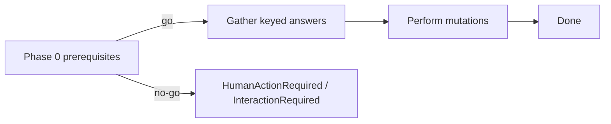

# Deterministic integration setup for coding agents

## Summary

Built-in integration setup (`eve add` / registry setup flows) is optimized for
interactive terminals. Coding agents cannot reliably answer branching prompts,
and replaying setup after a partial run is unsafe once earlier choices mutated
external state (Connect connectors, Discord commands, project links).

Make every semantic setup decision addressable by a stable key through the
existing `Asker` channel, collect decisions before irreversible mutation, and
let headless callers supply answers by key. Shared one-time prerequisites
(Vercel project linking) are a go/no-go phase 0 in headless mode—completed
separately—not an unexpected interactive diversion mid-flow.

Interactive CLI/TUI behavior stays unchanged, including editable selects.

## Public / composition API

### Asker stacks (already exist)

```ts
withAnswers(agentArgs)(headlessAsker());
withAnswers(flags)(withPolicy("confirm-detected")(interactiveAsker(prompter)));
```

Boxes and integrations only see `Asker`. Headless required questions refuse with
`InteractionRequired` (full question payload). Invalid supplied answers refuse
with `InvalidAnswerError`.

### Integration runner

```ts
await runIntegrationSetup(kind, {
  appRoot,
  prompter,
  headless: true,
  answers: {
    "discord-bot-token": "...",
    "discord-command-name": "ask",
    "discord-command-description": "Ask the eve agent",
  },
});
```

Interactive default remains `interactiveAsker(prompter)`. When `headless: true`,
the runner composes `withAnswers(answers)(headlessAsker())` and passes
`headless` on `IntegrationSetupContext` so shared prerequisites can fail closed.

### Prerequisite phase 0

`ensureVercelProject` keeps today's interactive linking wizard when not
headless. In headless mode, a missing on-disk project link throws
`HumanActionRequiredError` (`kind: "vercel-link"`, command `vercel link`)
instead of opening prompts. Callers complete linking separately, then retry.

## Lifecycle

```text
phase 0  prerequisites (auth, linked project)  → go / HumanActionRequired
phase 1  gather  keyed Asker decisions         → Input (no external mutation)
phase 2  perform idempotent side effects       → Payload / fail closed
```



Invariants:

1. Every semantic decision travels through keyed `Asker` (one channel).
2. Gather never mutates external systems; perform is idempotent or fails closed.
3. Headless missing required keys throw `InteractionRequired` before perform.
4. Interactive rendering (including specialized controls) is unchanged.

## Slice boundaries (this change)

In scope:

- Integration runner headless Asker composition (`answers` / `headless`).
- Discord setup gather-then-perform split as the first migrated integration.
- `ensureVercelProject` headless fail-closed (no surprise interactive link).
- Unit tests for headless success, missing-key refusal, and interactive path.

Out of scope (follow-ups):

- Migrating Linear, Slack, GitHub, Photon to explicit gather-then-perform.
- Structured CLI / agent tool contract for `eve add` answer bags.
- Full SetupBox migration of every integration.
- Changing interactive TUI controls.

## Reproduction

See [deterministic-integration-setup-repro.md](./deterministic-integration-setup-repro.md).
