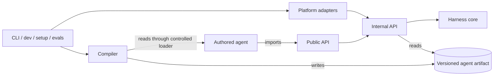

# eve filesystem boundaries

> Proposal grounded in `vercel/eve` `origin/main` at
> [`dfe0d181a0aa89b342717658d2b7799e1c5289a6`](https://github.com/vercel/eve/tree/dfe0d181a0aa89b342717658d2b7799e1c5289a6)
> (2026-08-25). This is a behavior-preserving source reorganization, not a
> public API or artifact-format proposal.

## Decision

Organize eve around three dependency layers and two side pipelines:

1. `public` is the published package surface. It depends inward.
2. `internal` is the framework-owned runtime API. It depends on the core.
3. `core` owns the harness and its contracts. It does not depend outward.
4. `compiler` reads authored definitions and emits versioned artifacts. It is
   not a runtime layer.
5. `adapters` bind the internal API to Workflow, Nitro, sandboxes, providers,
   channels, and telemetry. Applications compose these pieces.

The generated agent is data, not another source layer. The compiler is its
only writer. Runtime loading is read-only. Authored code never imports the
compiler, runtime, or harness; it imports only published `eve` entrypoints.



This refines the supplied diagram in one important way: dependency direction,
build-time data flow, and ownership are separate graphs. Putting all six nodes
on one hierarchy would make lifecycle order look like import permission.

## Why the current tree cannot express the target

At the pinned revision, the top-level production import graph contains one
strongly connected component spanning 25 areas:

```text
acp, channel, cli, client, compiler, context, discover, evals, eve-channel,
execution, framework, harness, instrumentation, internal, protocol, public,
runtime, sandbox, services, setup, shared, source-change, tasks, tools, tracing
```

That is not a naming problem. Moving the same files into `public/`, `internal/`,
and `core/` would preserve the cycle.

The main structural breaks are:

- Runtime imports compiler-owned artifact types and validators. There are 44
  production `runtime -> compiler` imports; for example,
  [`runtime/resolve-agent-graph.ts`](https://github.com/vercel/eve/blob/dfe0d181a0aa89b342717658d2b7799e1c5289a6/packages/eve/src/runtime/resolve-agent-graph.ts#L1-L10)
  imports manifest, module-map, and validation code from `compiler/`.
- `public/` is both an export boundary and an implementation bucket. Public
  definitions reach into runtime context, such as
  [`public/definitions/channel.ts`](https://github.com/vercel/eve/blob/dfe0d181a0aa89b342717658d2b7799e1c5289a6/packages/eve/src/public/definitions/channel.ts#L1-L24),
  while channel implementations reach into host internals, such as
  [`public/channels/mcp.ts`](https://github.com/vercel/eve/blob/dfe0d181a0aa89b342717658d2b7799e1c5289a6/packages/eve/src/public/channels/mcp.ts#L1-L42).
- `shared/` is not an inward leaf. For example,
  [`shared/tool-task.ts`](https://github.com/vercel/eve/blob/dfe0d181a0aa89b342717658d2b7799e1c5289a6/packages/eve/src/shared/tool-task.ts#L1-L4)
  imports `execution/` and `harness/`, while public definitions import it. The
  directory name hides dependency direction rather than describing it.
- The runtime/compiler data boundary is already real, but its contract is
  owned by the writer. The compiler writes a manifest, module map, diagnostics,
  and metadata under `.eve/` in
  [`compiler/artifacts.ts`](https://github.com/vercel/eve/blob/dfe0d181a0aa89b342717658d2b7799e1c5289a6/packages/eve/src/compiler/artifacts.ts#L201-L253),
  and runtime loaders consume compiler modules directly.
- The repository already states that channels, harness, and tracing must stay
  Workflow-agnostic, with runtime/execution owning Workflow primitives
  ([guard rule 15](https://github.com/vercel/eve/blob/dfe0d181a0aa89b342717658d2b7799e1c5289a6/scripts/guard-invariants.mjs#L19-L22)).
  The target tree should generalize this existing boundary instead of inventing
  a competing one.

Two recent precedents point in the right direction. Root `src/index.ts` is
already a one-line public facade
([source](https://github.com/vercel/eve/blob/dfe0d181a0aa89b342717658d2b7799e1c5289a6/packages/eve/src/index.ts#L1)),
and `eve/tools/bash` is already a thin re-export over its owned implementation
([source](https://github.com/vercel/eve/blob/dfe0d181a0aa89b342717658d2b7799e1c5289a6/packages/eve/src/public/tools/bash.ts#L1-L2)).

## Path grammar

Keep one published `eve` package. Every source path has the same grammar:

```text
src/<role>/<capability>/<component>/...
```

Each level answers one question:

| Level             | Meaning                                        | Example question                                                       |
| ----------------- | ---------------------------------------------- | ---------------------------------------------------------------------- |
| `src/`            | One independently checked source graph         | Is this shipped framework source?                                      |
| `<role>/`         | Dependency direction and side-effect authority | May this code define policy, perform effects, or only expose a facade? |
| `<capability>/`   | The domain owner and encapsulation boundary    | Is this owned by tools, sessions, channels, artifacts, or sandboxes?   |
| `<component>/...` | Private decomposition inside that owner        | Which part of the capability implements it?                            |
| file              | One concept or entrypoint                      | What concrete operation or value is this?                              |

This is a context-sensitive filesystem grammar, not a taxonomy of convenient
nouns. The meaning of a segment is determined by its depth. A name cannot be
promoted or demoted merely because a directory gets crowded.

For example:

```text
src/adapters/sandbox/vercel/session.ts
    ^role    ^owner  ^private decomposition

src/public/channels/slack/index.ts
    ^role  ^owner    ^published component
```

From the first path, a reader can infer that Vercel is an effectful
implementation of the sandbox capability. From the second, a reader can infer
that Slack is a published entrypoint in the channels capability. Neither path
requires opening the file to learn its architectural relationship.

### Role semantics

The first segment is a closed vocabulary:

| Role        | Meaning                                                                                          |
| ----------- | ------------------------------------------------------------------------------------------------ |
| `core/`     | Pure contracts and provider-neutral policy. Innermost dependency role.                           |
| `internal/` | Framework runtime mechanisms implementing capabilities over core contracts.                      |
| `adapters/` | Concrete effect implementations for an internal capability or port.                              |
| `compiler/` | Build-time transformation from authored sources to core artifact contracts.                      |
| `public/`   | Published npm entrypoints. Facades and author-facing constructors, not an implementation bucket. |
| `apps/`     | Executable composition roots such as CLI, dev, setup, and eval runners. Outermost role.          |

The roles are not architectural peers. Their names encode import permission.
The capability segment is the peer grouping within each role.

### Capability semantics

The second segment is always a cohesive owner, never a technical kind such as
`utils`, `types`, `helpers`, `models`, or `services`. A capability owns its
contract, state vocabulary, and change reason at each role where it appears.
The same capability name across roles describes refinement:

```text
core/tools/       tool contract and provider-neutral policy
internal/tools/   tool registry and execution orchestration
adapters/tools/   concrete built-in tool effects
public/tools/     eve/tools entrypoints
```

This alignment is intentional. `public/tools/bash.ts` and
`adapters/tools/bash/execute.ts` are two views of the same capability, while
`internal/sessions/driver.ts` belongs to a different owner even if it invokes a
tool. Prefer a small, explicit capability vocabulary: `agent`, `artifact`,
`channels`, `connections`, `context`, `protocol`, `sandbox`, `sessions`,
`tools`, and `telemetry`. Add one only when it owns a real invariant.

### Encapsulation semantics

The capability directory is the unit of encapsulation:

- `src/<role>/<capability>/index.ts` is its package-private facade.
- Sibling capabilities import that facade, never a deeper path.
- Files below the capability may use relative imports anywhere inside it.
- Only `public/` may define npm export targets.
- A public deep subpath, such as `eve/channels/slack`, maps to a file below the
  public capability; it does not grant access to the corresponding adapter.
- Tests are colocated below the same capability, so moving or deleting the
  owner moves its proof with it.

Therefore directory nesting means containment, not merely grouping. A deeper
directory cannot be imported from outside the nearest capability boundary
unless its owner deliberately re-exports it.

## Target tree

Use the grammar above throughout the package. The third level shown below is
illustrative private decomposition, not another global category system.

```text
packages/eve/
  src/
    core/
      agent/                 # agent definition and graph invariants
      artifact/              # manifest, module map, metadata schemas + versions
      channels/              # channel and route contracts
      connections/           # authorization and connection contracts
      context/               # provider-neutral context vocabulary
      protocol/              # stable in-process and wire values
      sandbox/               # sandbox contracts and policy
      sessions/              # session/turn model and transitions
      tools/                 # tool contract, harness, effects, model loop

    internal/
      agent/                 # artifact hydration and resolved graph
      channels/              # registry and generic dispatch
      connections/           # registry and authorization orchestration
      context/               # live context construction and serialization
      sandbox/               # provider-neutral sandbox lifecycle
      sessions/              # durable session and turn orchestration
      tools/                 # registry and execution orchestration

    adapters/
      channels/
        slack/               # one concrete channel component
        github/
        mcp/
      host/
        nitro/               # one concrete host component
        next/
        nuxt/
        sveltekit/
      sandbox/
        vercel/              # one concrete backend component
        docker/
        microsandbox/
        just-bash/
      sessions/
        workflow/            # durable Workflow implementation of sessions
      telemetry/
        opentelemetry/
        local/
      tools/
        bash/                # concrete built-in implementations
        web-fetch/

    compiler/
      agent/                 # compiler capability
        source/              # discover authored definitions
        normalize/           # construct core artifact values
        publish/             # only generated-output writer
      extensions/            # extension compatibility compilation

    public/
      agent/                 # eve
      channels/              # eve/channels/*
      client/                # eve/client
      context/               # eve/context
      evals/                 # eve/evals
      host/                  # eve/next, eve/nuxt, eve/sveltekit
      sandbox/               # eve/sandbox/*
      telemetry/             # eve/instrumentation/*
      tools/                 # eve/tools/*

    apps/
      cli/                   # executable capability
        dev/                 # private CLI component
        build/
        start/
      setup/                 # setup application capability
      evals/                 # eval runner application capability

  test/
    architecture/           # package surface, import DAG, artifact compatibility
```

`public/` means visibility only. A public entrypoint re-exports a core contract,
an internal operation, or an adapter; the operational implementation stays
with its capability owner. `internal/` means runtime mechanism, not a
miscellaneous private-code directory. Generic helpers stay with the capability
whose invariant they serve. There is no target `shared/` directory.

The innermost artifact contract deliberately lives under `core/artifact`, not
`compiler`. Both compiler and runtime depend on it. This removes
`runtime -> compiler` without creating a new `compiler -> runtime` edge.

## Allowed dependencies

An arrow means “may import.” Omitted edges are forbidden.

```text
public    -> adapters, internal, core
apps      -> public, adapters, internal, compiler, core
adapters  -> internal, core
compiler  -> core
internal  -> core
core      -> core
```

Additional rules narrow that matrix:

| Boundary       | Invariant                                                                                                                                                                                                                                                                   |
| -------------- | --------------------------------------------------------------------------------------------------------------------------------------------------------------------------------------------------------------------------------------------------------------------------- |
| `core`         | Value shapes, schemas, brands, pure validators, and provider-neutral policy only. No filesystem, network, Workflow, Nitro, provider SDK, or runtime registry imports.                                                                                                       |
| `core/tools`   | Owns the provider-neutral model/tool harness. No compiler, public entrypoint, host, Workflow, concrete channel, or concrete sandbox imports. Effects cross an internal port.                                                                                                |
| `internal`     | No public entrypoint imports. It may consume core contracts and harness operations, but it cannot know which CLI, host, or provider adapter called it.                                                                                                                      |
| `adapters`     | Concrete effects only. An adapter may call internal/core APIs; core and internal never import an adapter.                                                                                                                                                                   |
| `compiler`     | Build-time only. It may evaluate authored modules through the controlled authored-module loader, but it cannot import runtime, harness, execution, host, or adapter implementations.                                                                                        |
| `public`       | Every file is an npm export target or is reachable only from one. Public entrypoints contain no durable state, host lifecycle, or generated-artifact writes.                                                                                                                |
| `.eve/compile` | Compiler-owned, versioned output. Compiler writes; runtime reads. Runtime behavior remains in the `eve` package, matching the existing repository principle ([AGENTS.md](https://github.com/vercel/eve/blob/dfe0d181a0aa89b342717658d2b7799e1c5289a6/AGENTS.md#L137-L139)). |
| Authored agent | Imports only declared `eve` package exports and its own dependencies. It never imports `#internal`, source paths, generated artifacts, or the harness.                                                                                                                      |

Do not allow same-layer deep imports through another subsystem's private files.
Each subsystem exposes an `index.ts` or explicitly named facade to its sibling
callers. Intra-subsystem relative imports remain unrestricted.

## Artifact boundary

Treat the generated agent artifact as a protocol between compiler and runtime:

```text
Authored tree
  -> source discovery
  -> normalization
  -> core/artifact schemas
  -> .eve/compile/<published generation>
  -> internal/agent loader
  -> resolved runtime graph
  -> core harness
```

The current pipeline already derives the module map from the compiled manifest
before writing the artifact set
([source](https://github.com/vercel/eve/blob/dfe0d181a0aa89b342717658d2b7799e1c5289a6/packages/eve/src/compiler/artifacts.ts#L210-L244)).
Preserve that ordering and the existing paths in the first reorganization.
Changing paths or formats at the same time would turn a source-layout change
into a migration and rollback problem.

The artifact contract owns:

- schema and semantic validation;
- kind and version constants;
- stable node/source identity value types;
- serialization fixtures and compatibility tests.

The compiler owns construction and publication. The internal runtime owns
loading, caching, and hydration. Neither side owns the shared contract.

## Migration sequence

Each step must leave the package building and preserve public exports. Move
tests with the code they prove. Do not add compatibility wrappers for private
source paths.

1. **Extract the contract floor.** Move manifest, module-map, metadata, source
   identity, public callback value shapes, and pure validators into
   `core/artifact`. Change compiler and runtime imports without changing
   serialized output. This removes the load-bearing `runtime -> compiler`
   edge first.
2. **Form the harness core.** Move provider-neutral harness, context, and
   protocol primitives under `core/`. Replace calls into Workflow, sandbox,
   tracing, and channel implementations with narrow internal ports. Extend the
   existing Workflow-agnostic invariant from selected directories to all core
   code.
3. **Create the internal runtime API.** Move graph hydration, registries, and
   session/tool/channel orchestration under `internal/`. Split current
   `execution/` by responsibility: generic orchestration moves inward;
   Workflow steps and concrete sandbox effects move to adapters.
4. **Make public a facade.** Move concrete channels, sandbox providers,
   framework tools, and frontend integrations to adapters or their owning
   subsystem. Keep package-export files as thin exports and constructors. The
   existing `public/tools/bash.ts` pattern is the migration model, not the
   current large `public/channels/*` implementations.
5. **Unify the compiler pipeline.** Move discovery, normalization, and
   publication under `compiler/agent/{source,normalize,publish}`. Keep authored
   module evaluation behind one loader.
6. **Move composition roots last.** Consolidate CLI, dev, setup, services, and
   eval runners under `apps/`; move Nitro, Workflow, telemetry, and provider
   code under `adapters/`. These outer layers may depend on multiple inner
   layers because composition is their job.
7. **Delete ambiguous buckets.** Drain and remove `shared/`, the current
   catch-all `internal/`, top-level `runtime/`, `execution/`, `context/`, and
   `harness/`. Enable the final dependency matrix with no baseline exceptions.

Avoid one repository-wide move. Steps 1-3 change dependency direction; steps
4-7 make the filesystem reflect the direction already established.

## Mechanical enforcement

Use the existing `pnpm guard:invariants` path rather than adding a runtime
dependency. Add one architecture rule that parses static imports and resolves
`#...` aliases.

The rule should fail on:

- any cross-root edge absent from the allowed matrix;
- any import of `compiler/` from `internal/`, `core/`, or `adapters/`;
- any import of `public/` from `core/` or `internal/`;
- any Workflow, Nitro, provider, filesystem, or network import from core;
- any package export target outside `src/public/`;
- any `src/public/` entrypoint not represented in `package.json#exports`;
- any generated artifact write outside `compiler/agent/publish/`;
- any strongly connected component across boundary roots.

During migration, keep a path-level allowlist that can only shrink, matching
the repository's existing baseline policy
([source](https://github.com/vercel/eve/blob/dfe0d181a0aa89b342717658d2b7799e1c5289a6/scripts/guard-invariants.mjs#L112-L115)).
Do not baseline aggregate edge counts: a count can stay constant while a new,
more damaging edge replaces an old one.

The boundary check is a backstop. The tree and aliases should make the right
import obvious in editor autocomplete:

```jsonc
{
  "imports": {
    "#core/*": { "eve-source": "./src/core/*.ts", "default": "./dist/src/core/*.js" },
    "#internal/*": { "eve-source": "./src/internal/*.ts", "default": "./dist/src/internal/*.js" },
    "#adapters/*": { "eve-source": "./src/adapters/*.ts", "default": "./dist/src/adapters/*.js" },
    "#compiler/*": { "eve-source": "./src/compiler/*.ts", "default": "./dist/src/compiler/*.js" },
    "#public/*": { "eve-source": "./src/public/*.ts", "default": "./dist/src/public/*.js" },
  },
}
```

The exact wildcard mapping needs to preserve Node's current subpath behavior;
the example shows ownership, not a ready-to-apply package manifest.

## Completion criteria

- The production boundary graph is acyclic.
- `runtime -> compiler`, `core -> internal`, and `internal -> public` edges are
  zero.
- `shared/` no longer exists.
- Every npm export resolves to `src/public/`; public entrypoints are facades,
  not composition roots.
- Core has no Workflow, Nitro, provider, filesystem, or concrete adapter
  imports.
- Compiler output is byte-for-byte equivalent for representative fixture
  agents before any separately reviewed artifact-version change.
- Existing unit, integration, scenario, and e2e behavior remains at the same
  test tier. Artifact construction, loading, and semantic validation each have
  an owner and direct tests.
- `pnpm guard:invariants`, typecheck, build, unit, and relevant scenario tests
  reject a deliberate reverse import.

## Non-goals

- Splitting runtime functionality into separately published packages. The
  package remains `eve`.
- Changing authoring paths, npm subpaths, artifact paths, artifact versions, or
  runtime behavior in the reorganization.
- Treating compiler stages as runtime layers.
- Creating another generic `utils`, `common`, `shared`, or unrestricted
  `internal` bucket.
- Using barrel files everywhere. Facades are boundary crossings; local code
  should continue importing its owned modules directly.

## Current-to-target map

| Current root                                       | Target owner                                                                       |
| -------------------------------------------------- | ---------------------------------------------------------------------------------- |
| `harness/`                                         | Split by capability, primarily `core/tools/`                                       |
| `context/`                                         | Split between `core/context/` and `internal/sessions/`                             |
| `protocol/`                                        | `core/protocol/`                                                                   |
| `shared/`                                          | Split by capability under `core/`; no replacement bucket                           |
| `runtime/`                                         | `internal/{agent,channels,connections,context,sandbox,sessions,tools}/`            |
| `execution/`                                       | Split between internal capability orchestration and `adapters/{sessions,sandbox}/` |
| `channel/`                                         | Split between core channel contracts and `internal/channels/`                      |
| `compiler/`, `discover/`                           | `compiler/agent/{source,normalize,publish}/` plus owned compiler capabilities      |
| `public/`                                          | Thin entrypoints only; implementations move to core/internal/adapters              |
| `tools/`, `sandbox/`, `eve-channel/`, `framework/` | Owned adapter/default-source modules, re-exported by public entrypoints            |
| `internal/nitro`, `internal/workflow`, `tracing/`  | `adapters/{host,sessions,telemetry}/`                                              |
| `cli/`, `setup/`, `evals/`, `services/`            | `apps/` composition roots                                                          |
| `client/`, `react/`, `vue/`, `svelte/`, `acp/`     | Client/integration owners plus thin `public/` exports                              |

This map is a classification starting point, not a bulk `git mv` list. Files
that currently combine contract, orchestration, and adapter behavior must split
at the behavior boundary before they move.
