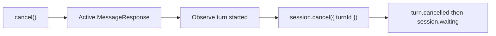

# Durable frontend turn cancellation

## Summary

Frontend bindings exposed `stop()`, which aborted the browser stream without stopping durable server execution. Templates that needed a real Stop button rebuilt cancellation manually by tracking the session ID and waiting for `turn.started` to reveal a guarded turn ID.

Replace `stop()` with `cancel()` on the React, Vue, and Svelte bindings. Put exact-turn cancellation on `MessageResponse`, the client abstraction that already owns one accepted turn and its stream, so every frontend binding delegates to the same lifecycle.

## Authoring API

```ts
const agent = useEveAgent();

const sending = agent.send("Run the analysis");
await agent.cancel();
await sending;
```

Lower-level clients can cancel the exact response while continuing to consume its stream:

```ts
const response = await session.send("Run the analysis");
const result = response.result();

await response.cancel();
await result;
```

## Semantics



- Cancellation can be requested while a send is still submitted. The frontend binding waits for its accepted `MessageResponse`; the response then waits for its own `turn.started` event before dispatching one guarded request.
- Concurrent cancellation calls for the same live turn share one request. A failed request can be retried while the turn remains active.
- Cancellation acceptance and turn settlement are separate. The stream remains attached until the durable boundary so the session cursor advances normally.
- Component disposal, page closure, `AbortSignal`, and `reset()` detach local transport only. They do not imply durable cancellation.
- A response that reaches a boundary without starting a turn, or a binding with no active response, returns `no_active_turn`.

## Scope

The existing session cancel route and `ClientSession.cancel({ turnId })` remain available for consumers that have only a session handle. `detach` stays an internal framework-adapter operation rather than a second public stopping primitive.

## Validation

- Unit coverage exercises queued cancellation, exact turn-ID guarding, single-flight calls, rejection retry, reset races, boundary races, and local detach behavior.
- React, Vue, and Svelte typechecks prove the shared public surface, and their example applications handle cancellation request failures.
- Existing cancellation e2e fixtures continue to prove durable `turn.cancelled` followed by `session.waiting` and successful session continuation.
