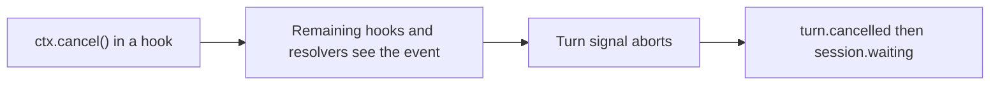

# Hook turn cancellation

## Summary

#3091 let a `turn.started` or `step.started` hook reject a turn by throwing: the turn failed with `EVENT_HANDLER_FAILED` and the session parked. That coupled two unrelated intents. An audit or metrics hook that crashed could stop the agent, and a hook that meant to stop the turn had to express it as a failure.

#3684 makes stream-event hooks isolated observers: eve logs a thrown handler and keeps executing, so throwing no longer vetoes anything. This plan gives hooks an explicit replacement, `ctx.cancel()`, which stops the running turn through the same durable path as `session.cancel()`.

## Authoring API

`HookContext` gains one method:

```ts
interface HookContext extends SessionContext {
  readonly agent: { readonly name: string; readonly nodeId?: string };
  readonly channel: { readonly kind?: string; readonly continuationToken?: string };
  cancel(): void;
}
```

```ts title="agent/hooks/step-budget.ts"
import { defineHook } from "eve/hooks";

const MAX_STEPS_PER_TURN = 20;

export default defineHook({
  events: {
    "step.started"(event, ctx) {
      if (event.data.stepIndex >= MAX_STEPS_PER_TURN) ctx.cancel();
    },
  },
});
```

`cancel()` returns `void` and does not throw, so it composes with the failure isolation contract: the handler keeps running, and the author returns when appropriate.

## Semantics



- **Deferred to the end of the event.** Every consumer of the event still runs: memory lifecycle, the remaining hook subscribers (typed handlers first, then `*`), and the dynamic model, connection, subagent, tool, skill, and instruction resolvers. Only then does the turn stop. An audit hook never misses the event that caused the cancellation.
- **Same outcome as `session.cancel()`.** In-flight model and tool work is aborted, delegated child turns are cancelled, and the turn settles as `turn.cancelled` followed by `session.waiting`. No failure event is emitted and no step is retried. A conversation accepts the next message as a new turn. A delegated task reports the cancellation to its caller.
- **Deterministic before the model.** A cancel from `turn.started` or `step.started` stops the turn before that model call starts.
- **Only a running turn can be cancelled.** The call is ignored with a warning log on events at or after settlement (`turn.completed`, `turn.failed`, `turn.cancelled`, `session.waiting`, `session.completed`, `session.failed`), on `subagent.called` and `subagent.completed`, and during clear or compact requests. Cancelling after a terminal event would create a second terminal for the same turn.
- **Hook exceptions stay isolated.** Throwing from a hook is logged with the hook slug, subscription, event type, event ID, and session ID, and execution continues. Only `ctx.cancel()` stops a turn.

Internally, each turn step combines the workflow-owned turn signal with a step-local signal that `ctx.cancel()` aborts. The harness already checks that signal at every model, tool, and error-recovery boundary, so hook cancellation adds no new settlement path.

## Scope

- `cancel()` is on `HookContext` only. Tools, dynamic resolvers, and channel adapters do not gain it. Tool errors pass through tool-result handling, so a tool-level cancel would need its own contract.
- `cancel()` targets the current turn only. It does not cancel background tasks (`session.cancel({ tasks: true })`) and does not end the session.
- There is no reason or payload. `turn.cancelled` carries the same shape as other cancellations. Hooks that need an audit trail record it themselves before calling `cancel()`.

## Compatibility

- Hooks that relied on throwing from `turn.started` or `step.started` to reject a turn now observe that the turn continues. They migrate to `ctx.cancel()`. The #3684 changeset is `minor` for this break.
- Adding `cancel()` bumps the hook extension contract to epoch 28 and retains epoch 27. eve always constructs `HookContext`, and handlers compiled against epoch 27 never call `cancel()`.

## Validation

- Unit: a `step.started` cancel returns a cancelled step result with the turn signal aborted after both typed and wildcard subscribers run. A `turn.completed` cancel keeps the settled turn and logs the warning.
- Integration: the dispatcher forwards `cancel()` without skipping later subscribers and warns when no turn can be cancelled. A full workflow session cancelled from `turn.started` emits `turn.cancelled` then `session.waiting`, no `step.started`, no failure events, and no step retries, and the next message completes.
- E2E: `agent-basic-runtime` `boundary-hook-cancel` cancels from `turn.started` and `step.started`, then requires the next turn in the same session to complete.
