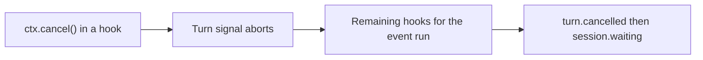

# Hook turn cancellation

## Summary

#3091 let a `turn.started` or `step.started` hook reject a turn by throwing: the turn failed with `EVENT_HANDLER_FAILED` and the session parked. That coupled two unrelated intents. An audit or metrics hook that crashed could stop the agent, and a hook that meant to stop the turn had to express it as a failure.

#3684 makes stream-event hooks isolated observers: eve logs a thrown handler and keeps executing, so throwing no longer vetoes anything. This plan gives hooks an explicit replacement, `ctx.cancel()`, which stops the running turn through the same durable path as `session.cancel()`.

## Authoring API

`HookContext` gains one method:

```ts
interface HookContext extends SessionContext {
  readonly agent: { readonly name: string; readonly nodeId?: string };
  readonly channel: { readonly kind?: string; readonly continuationToken?: string };
  cancel(): void;
}
```

```ts title="agent/hooks/require-credentials.ts"
import { defineHook } from "eve/hooks";
import { loadWorkspaceCredentials } from "../lib/credentials";

export default defineHook({
  events: {
    async "turn.started"(_event, ctx) {
      try {
        await loadWorkspaceCredentials(ctx.session.auth.current);
      } catch (error) {
        console.warn("cancelling turn: workspace credentials unavailable", { error });
        ctx.cancel();
      }
    },
  },
});
```

### Why `void`, not `Promise<void>`

`session.cancel()` returns a promise because it crosses a durable inbox and reports `accepted` or `no_active_turn`. `ctx.cancel()` runs inside the turn it stops, and that turn cannot settle while eve is still awaiting the hook. A promise would either resolve before the cancellation takes effect or never resolve. `void` states the real contract: the request is recorded now and applied when the event's hooks return. `await ctx.cancel()` still type-checks and behaves the same.

`cancel()` also does not throw. Throwing would route through the failure isolation catch and hide the intent in an error log. The handler keeps running and returns when appropriate.

## Semantics



- **Aborts at once, stops after the event's hooks.** The call aborts the turn signal immediately. The remaining hook subscribers for the event still run, so an audit hook sees the event that caused the cancellation. Turn-level consumers that honor the signal, such as dynamic model resolution, may stop early. If one of them throws, the turn still settles as cancelled because the signal was already aborted.
- **Same outcome as `session.cancel()`.** In-flight model and tool work is aborted, delegated child turns are cancelled, and the turn settles as `turn.cancelled` followed by `session.waiting`. No failure event is emitted and no step is retried. A conversation accepts the next message as a new turn. A delegated task reports the cancellation to its caller.
- **Task sessions with no caller end.** A scheduled or invoked task-mode session has no one left to send it work. Parking it after a cancel would leave the run open until its timeout, so it ends with `session.completed`. The workflow result, the session callback (as `failed`), and any delegated parent carry the error "The turn was cancelled." This also applies to `session.cancel()`.
- **Deterministic before the model.** A cancel from `turn.started` or `step.started` stops the turn before that model call is sent.
- **Fails closed on events.** Eligibility is a total map over hook event types, so a new event does not compile until it is classified. `step.failed`, turn and session terminal events, `context.cleared`, and `subagent.*` are not cancellable, and neither are clear or compact requests. Cancelling after a terminal event would give the turn a second terminal. eve logs a warning and ignores these calls.
- **Only during dispatch.** A call from work the handler did not await, made after the event's hooks returned, is ignored with a warning. Otherwise it could cancel at an arbitrary later point, or never.
- **Hook exceptions stay isolated.** Throwing from a hook is logged with the hook slug, subscription, event type, event ID, and session ID, and execution continues. Only `ctx.cancel()` stops a turn.

Internally, each turn step combines the workflow-owned turn signal with a step-local signal that `ctx.cancel()` aborts. The harness already checks that signal at every model, tool, and error-recovery boundary, so hook cancellation adds no new settlement path.

## Scope

- `cancel()` is on `HookContext` only. Tools, dynamic resolvers, and channel adapters do not gain it. Tool errors pass through tool-result handling, so a tool-level cancel would need its own contract.
- `cancel()` targets the current turn only. It does not cancel background tasks (`session.cancel({ tasks: true })`) and does not end the session.
- There is no reason or payload. `turn.cancelled` carries the same shape as other cancellations. Hooks that need an audit trail record it themselves before calling `cancel()`.

## Compatibility

- Hooks that relied on throwing from `turn.started` or `step.started` to reject a turn now observe that the turn continues. They migrate to `ctx.cancel()`. The #3684 changeset is `minor` for this break.
- Adding `cancel()` bumps the hook extension contract to epoch 28 and retains epoch 27. eve always constructs `HookContext`, and handlers compiled against epoch 27 never call `cancel()`.

## Validation

- Unit: eligibility is table-tested across settlement, subagent, and unknown event types. A `step.started` cancel returns a cancelled step result with the turn signal aborted after both typed and wildcard subscribers run. A cancel followed by a throwing dynamic model resolver still returns a cancelled result. A `turn.completed` cancel keeps the settled turn and logs the warning.
- Integration: the dispatcher forwards `cancel()` without skipping later subscribers, and warns on ineligible events and on calls after the hooks returned. Full workflow sessions cancelled from `turn.started` and from `step.started` emit `turn.cancelled` then `session.waiting`, no model output, no failure events, and no step retries, and the next message completes. A task-mode session with no caller cancelled from `turn.started` ends with `session.completed` and returns "The turn was cancelled." instead of staying parked.
- E2E (`agent-basic-runtime`): the fixture authenticates workspace members by bearer token. `require-credentials` cancels Bob's turn because his credential grant was revoked: no `step.started` and no failure events. Alice's credentials load, and her turn completes. In `audit-export-failure`, Carol's audit sink is unreachable, so the audit hook queues each `turn.started` and `step.started` event in a durable outbox and rethrows. Both of her turns complete, and a `read_audit_outbox` tool call in the second turn must return the first turn's two event IDs. That proves the hook ran, threw, and kept its side effect. Each case starts a fresh session.
