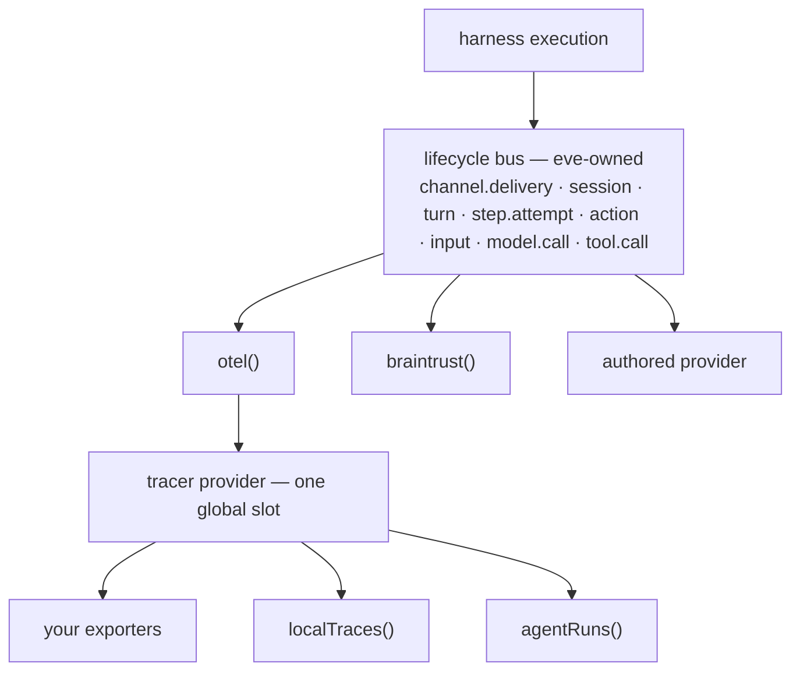

# Instrumentation providers

eve should give you tracing out of the box: local traces you can read with
`eve trace` in development, and Agent Runs in production. It mostly does. What
it cannot do is keep those on once you bring a backend of your own. Adding an
`agent/instrumentation.ts` switches the local trace writer off completely, and
not for any interesting reason — your `setup` callback calls `registerOTel`, a
process only gets one OpenTelemetry tracer provider, and yours took it. eve's
[Honeycomb integration](https://eve.dev/integrations/honeycomb-instrumentation)
is ten lines and eight of them are that call; most of the other
[instrumentation integrations](https://eve.dev/integrations?filter=instrumentation)
are the same file with a different URL.

One of them is not an OpenTelemetry backend at all, and it is the more
interesting failure. [Braintrust](https://eve.dev/integrations/braintrust)
records rows rather than spans, so there is no provider for it to take and no
exporter for it to configure, and eve offers it nothing else. Its integration is
built on the runtime event stream instead — the protocol that renders a
conversation — and reconstructs agent execution from it.

So eve should own the pipeline and expose the event bus underneath it. Then
every backend an agent wants runs at once and none of them clobbers another: in
development and in production alike, local tracing and Agent Runs are always on,
an OpenTelemetry backend is processors you add, and anything else is a provider
you add.

## Current problems

### One global slot

OpenTelemetry has one global tracer provider slot per process. You can build as
many providers as you like, but only one is reachable through
`trace.getTracer()`, which is where the model SDK, auto-instrumentation, and
your own code all go looking. The second registration is refused: it returns
false, which `registerOTel` discards, and logs through `diag`, which goes
nowhere unless `OTEL_LOG_LEVEL` is set. The exporter you configured never
receives anything and nothing tells you. You also cannot add to a provider after
it is built — that method was removed in the current major version of the SDK.

### One destination for spans

Because the slot holds one provider, an agent gets one place its spans can go.
Put Honeycomb and Datadog in the same `setup` and only the first `registerOTel`
call reaches anything; the second exports nothing. eve's local trace writer is
in exactly that position — another `registerOTel` caller with its own processor,
which starts a probe span to confirm the registration took and throws if it did
not. eve notices the collision; nobody else does.

### Adding a backend turns local tracing off

Rather than let that error fire, eve avoids the collision. When an
`agent/instrumentation.ts` exists, eve does not install the local tracing plugin
at all, and it never installs it in production regardless of what you wrote. You
get your exporter and lose `.eve/traces` and `eve trace`, and you lose the
lifecycle bus underneath them along with it. The defaults and the extension are
mutually exclusive, and the defaults lose.

### A backend that does not speak OpenTelemetry has nowhere to go

There is no provider surface, so Braintrust infers execution structure from the
runtime event stream — a protocol built to render a conversation, not to
describe execution. It ends up carrying its own pairing of requests to results,
its own ordering, its own replay-stable identity, and its own way of holding
state across a Workflow step boundary, because eve exposes none of those.

eve already has the contract that answers all of it: a lifecycle bus carrying
session, turn, step, and call events, with state kept per provider and per
operation and failures isolated to the provider that caused them. eve's own OTel
mapping is one provider on it. The whole thing is internal, and an authored
`instrumentation.ts` turns it off.

### Agent Runs is assembled from Workflow's telemetry, not eve's

Agent Runs renders a run by pre-processing Workflow's OpenTelemetry data, so it
can only show what Workflow spans imply. eve already produces a better
description of a run than that — the `agent.*` spans behind `eve trace` — and
cannot get them there, because it does not hold the pipeline in production.

## The bus

eve owns the pipeline and a provider is the unit of it. `instrumentation/`
becomes a directory and each file is one provider, the way `tools/` and `hooks/`
already work, so a backend is a file named after itself and the directory is the
list. A provider handles the lifecycle events it cares about; nothing about it is
specific to how those events are recorded.



Only `otel` builds a tracer provider. Everything under it is a span processor,
eve's own included, which is why they are values you place rather than defaults
appended behind you.

```typescript
// ---------------------------------------------------------------------------
// eve/instrumentation
// ---------------------------------------------------------------------------

// `agent/instrumentation.ts` is gone. One file per provider under
// `agent/instrumentation/`, and `defineInstrumentation` makes one of them
// rather than holding the whole configuration. `functionId` and
// `traceChannelRequests` were only ever OpenTelemetry settings, so they move
// onto `otel()`; `recordInputs` and `recordOutputs` move onto the destinations.

export function defineInstrumentation(provider: InstrumentationProvider): InstrumentationProvider;

/**
 * Turns off one of eve's two built-in integrations. Only meaningful as the default
 * export of `instrumentation/local.ts` or `instrumentation/agent-runs.ts`.
 */
export function disableInstrumentation(): InstrumentationProvider;

export interface InstrumentationProvider {
  /** Defaults to metadata. Content adds prompts, responses, and tool payloads. */
  readonly capture?: "metadata" | "content";
  readonly events?: ProviderEvents;
  /** Once per process. eve accepts no request until it resolves. */
  readonly setup?: (context: ProviderSetupContext) => void | PromiseLike<void>;
  readonly flush?: () => PromiseLike<void>;
  readonly shutdown?: () => PromiseLike<void>;
}

export interface ProviderSetupContext {
  readonly agentName: string;
  readonly environment: "development" | "preview" | "production";
  readonly frameworkVersion: string;
  /** Present when this process is running an `eve eval` case. */
  readonly evaluation?: EvaluationRef;
}

export interface ProviderEvents {
  readonly "channel.delivery.started"?: Handler<ChannelDeliveryStarted>;
  readonly "channel.delivery.completed"?: Handler<ChannelDeliveryTerminal>;
  readonly "channel.delivery.failed"?: Handler<ChannelDeliveryTerminal>;
  readonly "channel.delivery.cancelled"?: Handler<ChannelDeliveryTerminal>;

  readonly "session.started"?: Handler<SessionStarted>;
  readonly "session.completed"?: Handler<SessionTerminal>;
  readonly "session.failed"?: Handler<SessionTerminal>;
  // Not terminal. The session may resume with a later turn, so a provider
  // holds session state across this and releases it on completed or failed.
  readonly "session.waiting"?: Handler<SessionWaiting>;

  readonly "turn.started"?: Handler<TurnStarted>;
  readonly "turn.completed"?: Handler<TurnTerminal>;
  readonly "turn.failed"?: Handler<TurnTerminal>;
  readonly "turn.cancelled"?: Handler<TurnTerminal>;

  // One actual model attempt, not one step. A step retried three times
  // dispatches three of these; the protocol stream's `step.started` fires once
  // per step and keeps that name.
  readonly "step.attempt.started"?: Handler<StepAttemptStarted>;
  readonly "step.attempt.completed"?: Handler<StepAttemptTerminal>;
  readonly "step.attempt.failed"?: Handler<StepAttemptTerminal>;
  readonly "step.attempt.metadata"?: Handler<StepAttemptMetadata>;

  // eve's dispatch unit, and the one to reach for: a tool call, a skill load,
  // or a subagent, correlated by call id.
  readonly "action.started"?: Handler<ActionStarted>;
  readonly "action.completed"?: Handler<ActionTerminal>;
  readonly "action.failed"?: Handler<ActionTerminal>;

  // One request for user input, including tool approval. The pair survives
  // session suspension and a worker change.
  readonly "input.requested"?: Handler<InputRequested>;
  readonly "input.resolved"?: Handler<InputResolved>;

  // The model SDK's own view of one execution inside one attempt. An ordinary
  // tool call fires these *and* `action.*`, so handling both records it twice.
  readonly "tool.call.started"?: Handler<ToolCallStarted>;
  readonly "tool.call.completed"?: Handler<ToolCallTerminal>;
  readonly "tool.call.failed"?: Handler<ToolCallTerminal>;
  readonly "model.call.started"?: Handler<ModelCallStarted>;
  readonly "model.call.completed"?: Handler<ModelCallTerminal>;
  readonly "model.call.failed"?: Handler<ModelCallTerminal>;
}

type Handler<TEvent> = (event: TEvent, ctx: ProviderContext) => void | PromiseLike<void>;

/** Every event payload above extends this. */
export interface LifecycleEvent {
  /**
   * Derived from identity eve already holds and stable across replay, and a
   * `started` carries the same one as its terminal. What you key by it is
   * written once however many times a worker replays the work that wrote it.
   */
  readonly idempotencyKey: string;
}

export interface ProviderContext {
  /**
   * Serialized per provider and per operation, handed back on the terminal and
   * released there. A `completed` handler reads what its `started` handler
   * wrote even when the two run in different processes.
   *
   * `set` is synchronous because it is not a write to a backend: it stages a
   * value in the durable context eve commits once the dispatch settles. So a
   * handler cannot await its own persistence, and a `set` from a handler that
   * resolves after release is dropped rather than committed.
   */
  readonly state: { get(): JsonValue | undefined; set(value: JsonValue): void };
}
```

### What the bus carries

These are the events eve's own OTel mapping already consumes, with one rename:
`attempt.*` becomes `step.attempt.*`. Not `step.*`, which is taken: the protocol
stream's `step.started` fires once per logical step, and a step retried three
times dispatches three `step.attempt.started` against that one. The span is
still `agent.step`, because a span is one attempt and the `agent.step.attempt`
attribute on it says which.

`channel.delivery.*` is the durable inbound boundary above a turn. Each accepted
channel send or response gets an opaque delivery id that survives session
creation, inbox persistence, coalescing, active-turn buffering, and descendant
routing. One turn may process several deliveries, and an adapter may consume a
delivery without starting a turn. The terminal therefore carries optional turn
identity rather than deriving delivery identity from the turn.

OTel maps the pair to an `agent.channel.delivery` consumer span under the durable
session window. A short-lived HTTP server span is a link, not the parent: request
acknowledgement and durable processing have different lifetimes and may have
different sampling contexts. Content capture projects only eve-known message,
context, input-response, and output-schema fields; arbitrary adapter payload is
never exposed. Outbound platform sends are separate operations and do not delay
the inbound delivery terminal.

`action.*` is the addition. eve's protocol already treats an action as the unit
— a tool call is one kind, alongside a skill load and a subagent — but the bus
carries only `tool.call`, so the OTel provider builds `agent.action` out of it
and hardcodes the kind. A skill load or a subagent call gets no span at all, and
neither does a tool that resolves after an approval, because the model SDK's
callbacks never fire in the process that resolves it.

It does not replace `tool.call.*`: an ordinary in-process tool call fires both,
so handle one or record it twice. Reach for `action.*` — it is every dispatch eve
makes, including the three the model SDK never reports, and its `kind` says
which. `tool.call.*` is the SDK's own execution boundary, for when that is
specifically what you want; `model.call.*` is the other half of that view and
overlaps nothing.

The terminal event carries the action verdict rather than leaving each provider
to infer it from output. It also records when the parent workflow accepted that
individual result, before a parallel batch waits for slower siblings. Completed
actions include normalized subagent usage; failed actions distinguish runtime
failure, rejection, cancellation, and abandonment and keep a stable error code
separate from the content-bearing error object. OTel maps those fields, but they
originate on the provider-neutral bus.

User input needs its own durable boundary. `input.requested` fires once per
request, not once per batch, and `input.resolved` carries the normalized outcome
against the original action and turn even when another worker handles the
response. The generic pair covers questions and session-limit prompts as well as
tool approval. An OpenTelemetry provider maps `tool-approval` to a durable
`agent.approval` child of `agent.action`; the span measures human wait time, while
the later `ai.toolCall` measures execution after approval.

### State that outlives the handler

`ctx.state` is what a provider would otherwise hand-roll. eve keys it by provider
and operation, hands it back on the terminal, and releases it there. For a
channel delivery, session, turn, step attempt, action, or input request it is
serialized, so a terminal handler reads what its start handler wrote even in a
different process.

This is not hypothetical: eve already keeps exactly this for itself. The store
that carries session, channel delivery, and turn trace context across a step
boundary now also holds a pre-allocated span id and a start time, so the worker
that settles a turn can emit a span the descendants of an earlier worker already
parented to — which is what turned `agent.turn` from a zero-duration marker into
a span with a real duration. `agent.session` stays a marker because an idle
session never closes. A provider outside eve has neither the store nor the option
to degrade its own output instead.

### One provider cannot stop the others

A provider that throws is logged and skipped and the ones after it still run. A
provider that hangs would stop the bus rather than only itself, because dispatch
is sequential and awaited — a `started` handler has to finish before the events
for its children arrive. So each handler gets a timeout; exceeding it abandons
the handler and the bus moves on. A `started` that exceeds it also marks the
provider failed for that operation and skips its terminal handler, so `completed`
never fires against state `started` never got to write.

Release does not depend on any of that, because releasing state is eve's, not the
handler's. eve releases a scope once its terminal dispatch settles — returned,
threw, or timed out — so an abandoned handler cannot leak serialized state into
the durable context. The handle is stamped with the scope it was issued for; a
`ctx.state.set` from a handler that resolves after release is dropped rather than
resurrecting a closed scope. Serialized state also survives step cancellation,
which discards the rest of a step's context changes: eve already carves out its
own trace state there by name, and the provider namespace is carved out the same
way — the namespace is eve's, the values inside it are the provider's.

### Identity comes from the event

A handler gets its identity from the event and nothing from ambient context. eve
cannot run handlers inside an OpenTelemetry span context: the span for a boundary
exists only because some provider built it, so making it current would give a
provider-neutral bus a dependency on OpenTelemetry and on which provider ran
first. `trace.getActiveSpan()` inside a handler reaches whatever the harness
happened to be under, which is not the span for the event it is handling.

`idempotencyKey` does what state alone cannot. State survives a boundary, but a
replaying worker re-runs the `started` handler, and only a key stable across
replays makes that second write land where the first one did. eve's own OTel
provider gets there by allocating a span id and persisting it — available to it
only because it owns the store.

### Flushing and eval runs

`flush` is on the provider because a batching backend cannot see when the process
stops existing: on Vercel Functions it can freeze the moment the response goes
out, and an unflushed batch is lost. eve already flushes at the end of a step and
when a turn settles after cancellation; those become calls to every provider's
`flush`, plus a third when a session suspends. For `otel` that is `forceFlush` on
the tracer provider rather than anything per destination, which reaches every
processor under it — including the `BatchSpanProcessor` each wrapped exporter
sits behind, whose default batching is what loses spans on a frozen function in
[#679](https://github.com/vercel/eve/issues/679).

`evaluation` on the setup context is there so a provider running under `eve eval`
can attach what it records to the eval run, rather than leaving the two
unrelated.

## OpenTelemetry

OpenTelemetry is one provider on that bus, and the only one that builds a tracer
provider. Because a process holds exactly one, its settings split in two.

One file per integration, named for the integration. `instrumentation/sentry.ts`
says where spans go and nothing else, and eve knows what it is from what it
returns rather than from where it sits.

A telemetry type with process-wide singletons gets one more file, named for the
type. `instrumentation/otel.ts` owns the things one tracer provider can only have
one of — the sampler, the resource, the propagators — and it is the
`registerOTel` call itself, made once after every destination has been collected.
It exists only when you have one of those to name, so reaching for a sampler
later adds a file rather than moving the ones you already wrote. Because the
singletons and the destinations are separate functions, they are separate types.

eve has two built-in integrations: local traces, on in development, and Agent
Runs, on in production. You do not write a file for either one, and both are on
whether or not the directory exists, because a default you have to opt into is
not a default. Two filenames are reserved so you can say otherwise:
`instrumentation/local.ts` and `instrumentation/agent-runs.ts`.
Each accepts either `disableInstrumentation()` to turn that one off or the
matching `localTraces()` / `agentRuns()` value to keep it and narrow it. The
default export there is a union, and eve tells the two apart by a discriminant on
the value rather than by the filename.

Agent Runs is production-only, and not by choice. On Vercel, `@vercel/otel`
reports spans through the request context, which is how eve gets them there for
free.

**Today**

```typescript
import { OTLPHttpProtoTraceExporter, registerOTel } from "@vercel/otel";
import { defineInstrumentation } from "eve/instrumentation";

export default defineInstrumentation({
  setup: ({ agentName }) =>
    registerOTel({
      serviceName: agentName,
      traceExporter: new OTLPHttpProtoTraceExporter({
        url: "https://api.honeycomb.io/v1/traces",
        headers: { "x-honeycomb-team": process.env.HONEYCOMB_API_KEY! },
      }),
    }),
});
```

**Proposed**

```typescript
// agent/instrumentation/honeycomb.ts
import { OTLPHttpProtoTraceExporter } from "@vercel/otel";
import { otelIntegration } from "eve/instrumentation/otel";

export default otelIntegration({
  traceExporter: new OTLPHttpProtoTraceExporter({
    url: "https://api.honeycomb.io/v1/traces",
    headers: { "x-honeycomb-team": process.env.HONEYCOMB_API_KEY! },
  }),
});
```

There is no `otel.ts` in that example. eve registers the pipeline either way; the
file is only necessary when you have a sampler, a resource, or propagators to
name.

Making `otel` a value a file exports rather than a side effect inside a callback
also deletes the machinery a side effect would need. There is nothing to scope to
a callback, no second call to detect, and no call that can escape through an
unawaited promise, because a value cannot be called twice or escape.

eve holding the `registerOTel` call is also what makes real durations possible. A
span whose lifetime crosses a Workflow step boundary is emitted by a different
worker than the one that started it, so eve threads its own id generator into the
tracer provider and primes it, letting that span carry the id its descendants
already parented to. An author cannot supply that generator — it is eve's, keyed
to eve's state — which is why `idGenerator` is absent from `OtelOptions` despite
being something a process can only have one of.

That persisted action context is also the distributed parent for remote agents.
The caller sends it as a standard W3C `traceparent` header when creating the
remote session, and an updated eve receiver seeds the remote run from it. Old
receivers ignore the header, and persistent-session continuations keep the trace
chosen at creation rather than being reparented on every message.

```typescript
// ---------------------------------------------------------------------------
// eve/instrumentation/otel
// ---------------------------------------------------------------------------

/**
 * The pipeline itself: the settings one tracer provider can only have one of,
 * and the `registerOTel` call, made once after every `otelIntegration` beside
 * it has been collected. Belongs in `instrumentation/otel.ts`.
 */
export function otel(options?: OtelOptions): InstrumentationProvider;

export interface OtelOptions {
  /**
   * The function identifier on every span (`ai.telemetry.functionId`).
   * Defaults to the agent name.
   */
  readonly functionId?: string;
  /**
   * Emit the inbound HTTP `SERVER` span that wraps each channel request — the
   * parent of the turn trace and of any outgoing HTTP spans. Defaults to
   * `false`.
   */
  readonly traceChannelRequests?: boolean;
  /** Merged into eve's resource, which already carries the service name. */
  readonly resource?: Resource;
  /**
   * Head sampling, and it is global: it decides whether a span is created at
   * all, so it thins eve's own sinks and the `traceparent` eve propagates along
   * with your exporters — a ratio below 1 in development thins `eve trace` and
   * the TUI too. To thin one backend only, drop spans in a processor.
   */
  readonly sampler?: Sampler;
  /** Composed into one propagator. All inject; the first to extract wins. */
  readonly propagators?: readonly TextMapPropagator[];

  /**
   * OpenTelemetry `Instrumentation` instances, passed through to
   * `registerOTel`. Use them to patch Node.js built-ins (HTTP, DNS, fs, etc.)
   * for automatic spans around outbound work. Disabled by default because eve
   * imports the model SDK before registration, so patching cannot reach it —
   * but code loaded after registration (tool modules, connection clients) will
   * be instrumented.
   */
  readonly instrumentations?: readonly Instrumentation[];

  // No `spanProcessors` and no `traceExporter`. Every destination is an
  // `otelIntegration` in its own file, which is what makes this file's fields
  // exactly the ones a process can only have one of.
}

/**
 * One destination in that pipeline — `instrumentation/sentry.ts`.
 *
 * It carries no singletons, so declaring a sampler in a second file does not
 * compile.
 */
export function otelIntegration(options: OtelIntegrationOptions): OtelIntegration;

export interface OtelIntegrationOptions {
  /** Merged with every other file's, in directory order. */
  readonly spanProcessors?: readonly SpanProcessor[];
  /**
   * Wrapped in a default `BatchSpanProcessor` and appended. `@vercel/otel`
   * takes only one exporter, so wrapping is what lets each file carry its own.
   */
  readonly traceExporter?: SpanExporter;
  /**
   * Contributes runtime context that the AI SDK merges into telemetry spans
   * for each model call. Child spans inherit the values, so a destination can
   * stamp channel or auth identity onto every span in the turn — the same
   * propagation the legacy `events["step.started"]` return provided.
   *
   * Synchronous: the harness collects from every destination before the model
   * call, so a return that is not a plain object is dropped (warning-only).
   * Keys beginning with `eve.` are reserved and dropped. Return `undefined`
   * to contribute nothing.
   */
  readonly runtimeContext?: (input: InstrumentationRuntimeContextInput) => JsonObject | undefined;
}

// eve installs its two built-in integrations itself. Local traces are on in
// development; in production eve passes `"auto"` and `@vercel/otel` reports
// through the Vercel request context, which is what reaches Agent Runs.
//
// Two filenames are reserved to override them. Export `disableInstrumentation()`
// from `instrumentation/local.ts` or `instrumentation/agent-runs.ts` to turn
// one off; pass content options to keep it and narrow what it records.

export function localTraces(options?: ContentOptions): OtelIntegration;
export function agentRuns(options?: ContentOptions): OtelIntegration;

export interface ContentOptions {
  /** Record model prompts and tool call inputs. Defaults to `true`. */
  readonly recordInputs?: boolean;
  /** Record model responses and tool call outputs. Defaults to `true`. */
  readonly recordOutputs?: boolean;
}

// Not offered: `contextManager`, which eve's span nesting depends on.
```

`instrumentations` is offered on `otel()` with a caveat: eve imports the model
SDK before registration, so patching cannot reach it. Code loaded after
registration — tool modules, connection clients — will be instrumented. The
common case is `@opentelemetry/auto-instrumentations-node` with HTTP disabled
when the host runtime already covers it.

`runtimeContext` moves onto `otelIntegration()`, where it belongs: per
destination, not per process. Today an author returns it from a `step.started`
handler and eve merges it onto the AI SDK's telemetry span; on the new bus
there is no return value from event handlers, so the resolver is a dedicated
field. The harness collects from every destination before each model call and
merges results with framework `eve.*` keys. Child spans inherit the values,
which is the propagation the legacy hook provided and a side-effect
`trace.getActiveSpan()?.setAttribute(...)` cannot match.

`recordInputs` and `recordOutputs` are per destination, so eve implements them as
a span processor in front of that destination's exporter. It cannot edit the span
it is handed: that object is shared with every other processor, and stripping an
attribute there strips it everywhere. So it copies the span, drops what the
destination declined, and exports the copy. That covers the destinations eve
builds the processor for — an `otelIntegration`, not a raw `spanProcessor` an
author supplies.

Capture at construction is then the union of what the destinations ask for, which
inverts what the current environment variable implies: content is written onto
the span if anything wants it, and each destination that declined simply never
exports it. The union of nothing is still nothing, so an agent whose every
destination declines never materializes a prompt on a span at all — the hard
guarantee survives, as a property of the whole configuration rather than of one
switch. `EVE_TRACES_CONTENT` becomes the override for `localTraces()` alone and
intersects with its options, so off still wins where it applies.

### Agent Runs reads the same spans

The `agent.*` spans behind `eve trace` become the one format. Agent Runs renders
those rather than inferring a run from Workflow's telemetry, and your exporters
receive the same spans wherever you send them.

eve gets them there by passing `"auto"` in production, which is what installs
`@vercel/otel`'s reporting through the Vercel request context.

### All the options at once

```typescript
// agent/instrumentation/otel.ts — only what a process can have one of.
import { B3Propagator } from "@opentelemetry/propagator-b3";
import { resourceFromAttributes } from "@opentelemetry/resources";
import { ParentBasedSampler, TraceIdRatioBasedSampler } from "@opentelemetry/sdk-trace-base";
import { otel } from "eve/instrumentation/otel";

const production = process.env.VERCEL_ENV === "production";

export default otel({
  functionId: "support-agent",

  resource: resourceFromAttributes({
    "deployment.environment": process.env.VERCEL_ENV ?? "development",
    "service.version": process.env.VERCEL_GIT_COMMIT_SHA ?? "local",
  }),

  // A twentieth in production, and globally: every destination sees the same
  // twentieth, because the spans they would have read do not exist.
  sampler: new ParentBasedSampler({
    root: new TraceIdRatioBasedSampler(production ? 0.05 : 1),
  }),

  // An upstream service sends B3 headers, so read them and keep the trace.
  propagators: [new B3Propagator()],
});
```

```typescript
// agent/instrumentation/honeycomb.ts
import { OTLPTraceExporter } from "@opentelemetry/exporter-trace-otlp-http";
import { otelIntegration } from "eve/instrumentation/otel";

export default otelIntegration({
  traceExporter: new OTLPTraceExporter({
    url: "https://api.honeycomb.io/v1/traces",
    headers: { "x-honeycomb-team": process.env.HONEYCOMB_API_KEY! },
  }),
});
```

```typescript
// agent/instrumentation/datadog.ts — a second backend, because on-call
// reads this one. Structure and timing only; the prompts stay put.
import { OTLPTraceExporter } from "@opentelemetry/exporter-trace-otlp-http";
import { otelIntegration } from "eve/instrumentation/otel";

export default otelIntegration({
  traceExporter: new OTLPTraceExporter({
    url: process.env.DATADOG_OTLP_TRACES_ENDPOINT!,
    headers: { "dd-api-key": process.env.DD_API_KEY! },
  }),
  recordInputs: false,
  recordOutputs: false,
});
```

```typescript
// agent/instrumentation/agent-runs.ts — a reserved name. eve ships to Agent
// Runs in production without this file; write it only to narrow or stop it.
import { agentRuns } from "eve/instrumentation/otel";

export default agentRuns({ recordInputs: false });

// agent/instrumentation/local.ts — the other reserved name, turned off.
import { disableInstrumentation } from "eve/instrumentation";

export default disableInstrumentation();
```

## Backends that are not OpenTelemetry

Supporting a backend that is not OpenTelemetry needs two things from eve, and
they are the same two `otel` needs.

The first is durable state. Whatever handle you open when something starts cannot
be held until it ends, because an approval suspends, a retry runs again, and a
replaying worker re-executes work it has already observed. So you put JSON in
`ctx.state`, eve keeps it under your namespace, and the terminal handler reads it
wherever it runs.

The second is `idempotencyKey`. Key what you write by it and a replaying worker
updates what it wrote before rather than recording the same work twice.

Both are independent of OpenTelemetry, so a backend that wants neither singletons
nor a tracer provider still gets what it needs: one file beside the others,
returning one provider, reading the same as any of them. Backends like Braintrust
build both of these themselves today, working around what `defineInstrumentation`
exposes. Below is a strawman for what that integration looks like on the bus
instead.

```typescript
// agent/instrumentation/braintrust.ts
import { braintrust } from "braintrust/eve";

export default braintrust({ metadata: { app: "support-agent" } });
```

```typescript
// braintrust/eve — the vendor side, importing eve's types and nothing else.
import type { InstrumentationProvider } from "eve/instrumentation";

export function braintrust(options: BraintrustOptions = {}): InstrumentationProvider {
  let logger: Logger;

  return {
    setup({ agentName, environment, evaluation }) {
      logger = initLogger({
        projectName: agentName,
        apiKey: process.env.BRAINTRUST_API_KEY,
        metadata: { ...options.metadata, environment, ...evaluation },
      });
    },

    flush: () => logger.flush(),

    events: {
      "step.attempt.started"({ idempotencyKey, step, model, input }, ctx) {
        ctx.state.set(
          logger
            .startSpan({
              id: idempotencyKey,
              name: "eve.step",
              type: "llm",
              input: input?.messages,
              metadata: { model: model.id, provider: model.provider, ...step },
            })
            .export(),
        );
      },
      "step.attempt.completed"({ output, usage }, ctx) {
        const span = logger.resumeSpan(ctx.state.get() as string);
        span.log({ output: output?.messages, metrics: metrics(usage) });
        span.end();
      },
      "step.attempt.failed"({ error }, ctx) {
        const span = logger.resumeSpan(ctx.state.get() as string);
        span.log({ error });
        span.end();
      },

      "action.started": ({ idempotencyKey, kind, name, input }, ctx) => /* … */,
      "action.completed": ({ output }, ctx) => /* … */,
      "action.failed": ({ error }, ctx) => /* … */,
    },
  };
}
```

Redaction is a span processor. eve puts one in front of each OpenTelemetry
destination, and `recordInputs` and `recordOutputs` say what it strips. Bus
providers use `capture`: metadata is the default, while `"content"` adds model
messages, tool payloads, input prompts, responses, and failure details. eve only
builds those projections when some provider asks for them.

## Migration

`agent/instrumentation.ts` is the break. eve fails the build when it finds one
and names the new layout in the error, because the fix is mechanical. The `setup`
callback in the **Today** example becomes the `otelIntegration` in the
**Proposed** one, moved to `instrumentation/<backend>.ts`; the `registerOTel`
call and the `serviceName` go away, because eve makes that call now. `functionId`
and `traceChannelRequests` move to `instrumentation/otel.ts`, a file you add only
if you had one of them. `recordInputs` and `recordOutputs` move onto the
destination, where they describe that destination rather than the agent.

Every one of those could have been read at the old location and forwarded. The
`setup` callback could not, and it is the reason for the break. A `setup` that
calls `registerOTel` is the collision: eve registers too, and one of the two
silently loses. Accepting the old file keeps local tracing off for exactly the
agents meant to get it back.

A shim would be worse. eve could intercept `registerOTel` and fold what it was
handed into its own pipeline, but only for an author who went through
`@vercel/otel`. Anyone who builds a tracer provider and sets it global goes
around it, and the failure returns as something silent that depends on which
import you reached for.

`runtimeContext` moves from the `step.started` event return to the
`otelIntegration` that needs it. An author who returned
`{ runtimeContext: { "posthog.distinct_id": principalId } }` from a
`step.started` handler instead passes a `runtimeContext(input)` function to
the `otelIntegration` call in `instrumentation/posthog.ts`. The harness
collects from every destination and merges before each model call, so
propagation to child spans is preserved. Everything is a file move. The
integrations eve ships are one edit each and go out with the change, and an
agent that wrote its own `instrumentation.ts` gets a build error the first
time it compiles against the new version — which is where a break like this
should land.
