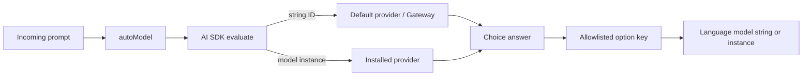

# Evaluation model routing in eve

## Recommendation

Add only `autoModel` at `eve/experimental/evaluate`. Build it on AI SDK's
`experimental_evaluate` API instead of owning a TypeSafe client, AI Gateway
transport, credential resolver, or public decision API. Default to the
`typesafe-ai/jev-latest` model string. AI SDK model strings use its default
provider, normally Vercel AI Gateway; explicit model instances use the provider
package that created them.

Keep the first integration narrow: select an allowlisted language model from the
incoming task. Defer a generic agent-facing decision tool. Asking the main model
to generate tool arguments adds output tokens and latency before the cheaper
evaluation can happen.

The API is experimental because AI SDK's evaluation model specification is also
experimental and can change in patch releases. The implemented authoring API is
documented in [Automatic Model Selection](../docs/guides/evaluate.md).

```ts
import { defineAgent } from "eve";
import { autoModel } from "eve/experimental/evaluate";

export default defineAgent({
  model: autoModel({
    options: {
      "openai/gpt-5.6-sol": "Difficult reasoning and engineering tasks",
      "openai/gpt-5.6-luna": "Routine tasks where fast completion matters",
    },
  }),
});
```

## Why AI SDK is the boundary

AI SDK 7.0.105 adds `experimental_evaluate` and the v4 experimental evaluation
model contract. The core function accepts a string or
`Experimental_EvaluationModel`, validates input and output, checks supported
question types, retries transient provider failures, propagates cancellation,
and normalizes usage and response metadata.
[AI SDK evaluation](https://ai-sdk.dev/docs/ai-sdk-core/evaluation).

This gives evaluation models the same selection rules as other AI SDK models:

- A string resolves through `globalThis.AI_SDK_DEFAULT_PROVIDER`. With no
  override, AI SDK uses Vercel AI Gateway. Gateway credentials and OIDC remain
  AI SDK concerns.
- A provider model instance calls that provider directly. Users install the
  provider package and configure its credentials.
- A registry or custom provider can supply application aliases without eve
  learning provider names.
- Provider validation, retries, errors, and model resolution retain AI SDK
  semantics. eve forwards the active turn's `AbortSignal`.

The boundary removes duplicate request validation, error translation, retries,
credential precedence, Gateway URL construction, TypeSafe wire conversion, and
provider metadata parsing from eve.



## What Jev provides

TypeSafe describes Jev as a System One decision model trained with Reinforcement
Learning for Calibrated Decisions. It evaluates structured state against
constrained questions instead of generating prose. The native TypeSafe API
describes three primitives:

| TypeSafe primitive | AI SDK type | Result                                                    | Useful eve applications                              |
| ------------------ | ----------- | --------------------------------------------------------- | ---------------------------------------------------- |
| Choice             | `choice`    | One option and, when available, a distribution            | Model selection, classification, candidate selection |
| Score              | `score`     | A position on an ordered rubric and optional distribution | Relevance, severity, quality                         |
| Noul               | `boolean`   | Estimated probability of true                             | Independent flags and evidence checks                |

Sources: [System One](https://docs.typesafe.ai/concepts/system-one),
[primitives](https://docs.typesafe.ai/primitives),
[Choice](https://docs.typesafe.ai/primitives/choice),
[Score](https://docs.typesafe.ai/primitives/score), and
[Noul](https://docs.typesafe.ai/primitives/noul).

Every question in one request sees the same state and is evaluated independently
by native Jev. Question IDs correlate inputs and outputs but are not model
instructions. A question that targets one item in structured state must identify
that item in its instructions. Related questions can share one request; unrelated
tenant data should remain in separate requests.
[State](https://docs.typesafe.ai/concepts/state) and
[question authoring](https://docs.typesafe.ai/primitives).

Choice and Score distributions are optional in the AI SDK contract because
language-model adapters do not produce them. Boolean probability is required.
TypeSafe's separate confidence statistic remains provider metadata. A generic eve
router must therefore make no confidence-threshold promise across providers.

Constrained output prevents fabricated option names after SDK validation, but it
does not guarantee the selected option is correct. Model descriptions and labeled
evaluation data remain part of the routing policy. Calibration describes behavior
across a dataset rather than certainty for one answer.
[Confidence](https://docs.typesafe.ai/confidence).

## Provider behavior

AI SDK documents native TypeSafe evaluation through
`typeSafeAi.evaluationModel("jev-latest")`. OpenAI, Anthropic, and Google expose
evaluation model adapters that use structured language-model output. Those
adapters evaluate all questions in one prompt, do not reproduce Jev's native
independent-question execution, and omit Choice and Score distributions.

The AI SDK documentation uses `typesafe-ai/jev-latest` as the Gateway model ID.
Using it as an AI SDK string keeps Gateway API keys, Vercel OIDC, request headers,
endpoint selection, and future protocol changes inside AI SDK. A direct TypeSafe
setup installs `@ai-sdk/typesafe-ai` and supplies its model instance. eve does not
pick between those paths or fall back from one provider to another.

TypeSafe advertises low latency and $0.042 per million input tokens with free
output tokens. These are vendor claims rather than an eve benchmark or SLA. The
parallel-question cookbook reports a large advantage from sending related
questions together, but its comparison uses sequential individual calls;
concurrent calls narrow the time difference.
[Launch and methodology](https://typesafe.ai/blog/introducing-system-one-models-and-jev)
and [parallel questions](https://docs.typesafe.ai/cookbooks/parallel_questions).

## eve lifecycle

Prompt-aware routing belongs at `step.started`. A `turn.started` resolver now
receives the incoming message and history, but its result must be durable and
cannot contain a live provider model instance. The tool loop resolves the step
model after projecting the turn input and before language-model inference, so it
has the same prompt and can return either a model string or a live instance.

`autoModel` stores only the selected option key and turn ID in a durable
`ContextKey`. A selection is reused for later tool-loop steps in that turn.
Provider model objects stay in authored configuration and are resolved again from
the key after resume. New turns and child sessions make independent choices.

The active execution `AbortSignal` is passed through dynamic model context into
AI SDK evaluation. This prevents a cancelled turn from completing routing or
persisting a late choice.

Per-option `reasoning` is part of the selected dynamic model result, so the
chosen model can override the agent-level reasoning setting. String language
models retain standard Gateway resolution; `LanguageModel` instances retain
direct provider behavior.

## Scope boundaries

The first release intentionally does not expose `experimental_evaluate`, a
TypeSafe-specific `decide` function, decision schemas, direct HTTP clients,
credentials, custom retry logic, provider fallbacks, confidence thresholds, or
an agent-callable decision tool. Applications that need arbitrary evaluations
can call AI SDK directly. eve adds only the lifecycle and durable routing policy
needed to use an evaluation result as an agent model.

No live Jev inference or independent quality, latency, or cost benchmark was run
for this research. Deterministic tests use AI SDK evaluation model mocks and
exercise model selection, validation, cancellation, retention, provider model
instances, reasoning, and packaging.
