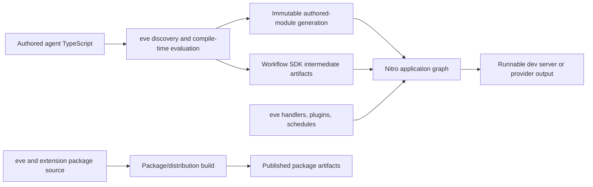

# Nitro and bundling audit

## Executive finding

eve should make Nitro the only owner of the final application server graph: server handlers,
provider output, Vercel functions and queue triggers, dependency tracing, externals, public assets,
prerendering, and the final production bundle. Workflow SDK should own Workflow directive
compilation, step registration, the workflow VM bundle, and the Workflow manifest.

That does not mean eve should have no integration code. The appropriate end state is a small
eve-owned Nitro module that expresses eve policy using public Nitro and Workflow SDK APIs. It may
select source directories, install eve aliases and bootstrap imports, choose the queue namespace,
declare stable workflow identities, and register eve routes. It should not parse directives,
construct Workflow bundles, patch generated JavaScript, invoke Nitro's private Rolldown copy, or
repair Nitro's completed output.

The current implementation is already partway there:

- Nitro performs one final application build and owns hosted dependency tracing.
- Vercel workflow execution is a route-specific function from that same Nitro graph, not a second
  application build.
- The Nitro release pinned by eve already contains the production and local-development queue
  features identified by Nitro's maintainer.

The largest remaining deletion is the Workflow compiler in
[`src/internal/workflow-bundle`](../packages/eve/src/internal/workflow-bundle). Its 3,674 lines of
production code and 3,017 lines of colocated tests duplicate substantial parts of Workflow SDK's
current builder. Replacing the general compiler, dynamic-tool compiler, generated-output patching,
and most Nitro Workflow glue exposes 3,500–4,500 gross production lines and more than 3,000 test
lines for removal. Net deletion will be lower because a thin module and semantic tests replace
part of that surface. The exact total depends on which small integration hooks land upstream.

Two boundaries should not be forced into Nitro:

1. Building the published `eve` library, vendored dependencies, and extension distributions is
   package production, not application server bundling.
2. eve's transactional development generations preserve stronger runtime behavior than Nitro's
   stock watcher. Those semantics must either remain in eve or be upstreamed before their code is
   removed.

The recommendation from Nitro's maintainer is consistent with this conclusion: use the smaller
Workflow core packages and keep a local Nitro module when eve needs flexibility. “Local module”
should mean a thin adapter over upstream builders, not a local Workflow compiler.

## Scope and baseline

This audit covers every place eve builds, transforms, packages, traces, or post-processes
JavaScript:

- the Nitro development and production host;
- Workflow and step compilation;
- dynamic-tool compilation and durable replay metadata;
- authored module evaluation and development generations;
- Vercel Build Output post-processing;
- extension distribution builds;
- the published `eve` package and compiled dependency vendoring.

The repository baseline is eve `0.27.12` at
`80731c17074a7ebb3958b104c2afe6f40a422e28`. The dependency baseline is:

| Component                                          | Audited version                                                                                                   |
| -------------------------------------------------- | ----------------------------------------------------------------------------------------------------------------- |
| Nitro used by eve                                  | `3.0.260610-beta`, published 2026-06-10                                                                           |
| Nitro upstream main                                | `77b77ffb19fd522400b517f6773b78832ff436b7`                                                                        |
| Workflow packages used by eve                      | Mixed betas: core `.37`, errors `.13`, serde `.2`, utils `.7`, world `.23`, world-local `.31`, world-vercel `.33` |
| Audited `@workflow/nitro` and `@workflow/builders` | `5.0.0-beta.37`                                                                                                   |
| Workflow upstream main                             | `e8934ade9cba196616a34caf9e0fe4cdfe40868f`                                                                        |

The audit used source inspection, call-site tracing, scenario and unit test inspection, repository
history, and the current Nitro and Workflow SDK source. Line counts are a snapshot for sizing, not
a requirement to delete every line in a directory.

## Three different bundle graphs

“Remove custom bundling” is only precise after separating three graphs with different consumers
and lifetimes.

The application graph should converge on Nitro. The package graph should use ordinary package
tooling. Compile-time evaluation and immutable development generations are compiler/runtime
concerns; they can become thinner, but Nitro does not expose an API that replaces them today.

## Current surface inventory

| Surface                         | Current owner and purpose                                                                                                                                     | Finding                                                                                                                                     |
| ------------------------------- | ------------------------------------------------------------------------------------------------------------------------------------------------------------- | ------------------------------------------------------------------------------------------------------------------------------------------- |
| Nitro host assembly             | [`create-application-nitro.ts`](../packages/eve/src/internal/nitro/host/create-application-nitro.ts), 862 lines                                               | Correct final owner, but too much private bundler and Workflow surgery is attached to it.                                                   |
| Nitro bundler configuration     | [`nitro-bundler-config.ts`](../packages/eve/src/internal/nitro/host/nitro-bundler-config.ts) and plugins under `internal/nitro/host`                          | Keep eve policy; replace builder-specific mutation with public, builder-neutral hooks.                                                      |
| Private Rolldown access         | [`nitro-rolldown.ts`](../packages/eve/src/internal/bundler/nitro-rolldown.ts), `scripts/nitro-rolldown.mjs`, and `scripts/check-bin-runtime-dependencies.mjs` | Unsupported dependency on Nitro's transitive package layout. Remove from runtime and package tooling.                                       |
| Workflow bundle                 | [`src/internal/workflow-bundle`](../packages/eve/src/internal/workflow-bundle), 3,674 production lines                                                        | Replace with Workflow SDK builders plus a thin eve Nitro module.                                                                            |
| Dynamic-tool transform          | `dynamic-tool-transform.ts` and `dynamic-tool-ast-references.ts`, 824 production and 2,139 test lines                                                         | Replace the implicit closure compiler with an explicit durable authoring contract.                                                          |
| Authored module loader          | [`authored-module-loader.ts`](../packages/eve/src/internal/authored-module-loader.ts), 519 lines, plus shared bundler plugins                                 | Necessary today for executable TypeScript discovery and immutable generations; redesign separately.                                         |
| Development generations         | `internal/nitro/development-generation.ts`, rebuild coordinator, materialization, worker ownership                                                            | Preserve transactional activation and draining even if the code moves upstream.                                                             |
| Vercel Workflow output          | `vercel-workflow-output.ts`, 259 lines                                                                                                                        | Delete the flow-function repair after Nitro preserves relative symlinks; retain multi-service ownership logic until Nitro has that concept. |
| Extension build                 | `internal/nitro/host/build-extension.ts` and the authored-module multi-entry builder                                                                          | Not a Nitro server responsibility. Move toward a conventional package builder.                                                              |
| Published package build         | `scripts/build-rolldown.mjs`, 393 lines                                                                                                                       | Separate from Nitro. It should not resolve Nitro's private Rolldown installation.                                                           |
| Compiled dependency vendoring   | `scripts/vendor-compiled/_shared.mjs`, 872 lines, and generated entries                                                                                       | A packaging policy created by eve's small-runtime-dependency goal, not a Nitro feature.                                                     |
| Workflow test/build integration | `internal/testing/workflow-vitest-plugin.ts`, test setup/config helpers, and the package-build transform                                                      | Move to upstream Workflow test/build adapters when the custom compiler is removed.                                                          |

Together, the 519-line authored-module loader and its seven core plugins—package-boundary
resolution, asset imports, tsconfig paths, relative extensions, the Node ESM banner, extension
scoping, and the Nitro Rolldown wrapper—account for roughly 2,000 production lines. That is a
longer-term simplification opportunity, not part of the first Workflow cutover.

## How eve uses Nitro today

### Final graph and lifecycle

Both development and production call `createNitro()` from `nitro/builder`. eve supplies:

- the app root and eve's execution source directory;
- generated Nitro plugins and route handlers;
- Workflow aliases and generated entries;
- `traceDeps` derived from agent configuration and selected optional engines;
- Rollup and Rolldown configuration;
- Vercel `functionRules`, schedule handlers, and provider metadata.

Production then invokes Nitro's lifecycle functions itself:

1. `prepare(nitro)`;
2. `copyPublicAssets(nitro)`;
3. `prerender(nitro)`;
4. `build(nitro)`;
5. eve-specific publication and Vercel normalization.

This is directionally correct: Nitro sees the final dependency graph and generates the provider
output. [PR #803](https://github.com/vercel/eve/pull/803) already deleted 665 lines by removing
eve's custom development dependency materializer and making Nitro the hosted dependency owner.
[PR #1229](https://github.com/vercel/eve/pull/1229) then replaced two Vercel Nitro builds with one,
deleting 1,707 lines and reducing the measured local build by about one third.

### Production and Vercel queues

On Vercel, eve adds a `functionRules` entry for the Workflow flow route. Nitro emits one additional
function with the same compiled server contents and route-specific configuration:

- a queue trigger scoped to the eve agent;
- maximum duration;
- Workflow replay safety and public-route-prefix environment.

That is the consolidation described by Nitro's maintainer. It removes a second server build; it
does not reduce the deployment to one physical function. The current Vercel Build Output contract
needs a distinct function directory to attach the queue trigger.

Nitro's current copy implementation duplicates the root function tree for a function rule. Main's
[PR #4373](https://github.com/nitrojs/nitro/pull/4373) uses copy-on-write reflinks where the
filesystem supports them, but output still appears as a complete function tree and
[issue #4233](https://github.com/nitrojs/nitro/issues/4233) remains open. eve should describe the
result as one compiled graph with one queue-configured function, not as a single deployed
function.

### Development

eve deliberately ignores the authored app root in Nitro's watcher. Its own source watcher builds
an immutable candidate generation, starts a candidate worker, changes the active generation only
after readiness, and drains the retired worker. This avoids resetting a Workflow stream while a
tool call is in flight.

Those guarantees came from [PR #787](https://github.com/vercel/eve/pull/787):

- failed candidates do not replace the live generation;
- activation is transactional;
- existing HTTP streams and WebSockets drain on the old worker;
- runtime-only changes can avoid an unnecessary worker swap;
- generated artifacts remain available while a retired worker references them.

Nitro can own the dev server build without automatically owning this supervisor. A cutover that
reverts to unconditional `dev:reload` would be a behavioral regression.

### Configuration ambiguity

`rootDir` is the application root, so Nitro also loads application-local `nitro.config.*`,
`.nitrorc`, and package configuration. Explicit eve overrides win for keys eve sets, while other
Nitro options can enter the build implicitly. There is no eve contract documenting which
application Nitro configuration is supported.

The builder is also not pinned. Nitro defaults to Rolldown, but auto-selects Vite when the app has
Vite installed and a `vite.config.*` containing `nitro(`. eve currently installs Rollup/Rolldown
hooks and assumes their behavior. Until the integration is builder-neutral, eve should explicitly
set `builder: "rolldown"` and test the resolved value.

Similarly, eve decides whether to install Vercel behavior from `process.env.VERCEL`, while Nitro
can resolve `vercel` from `NITRO_PRESET`, `SERVER_PRESET`, application configuration, or automatic
detection. All provider-specific decisions should use `nitro.options.preset` after resolution.

## Current Workflow pipeline

The Workflow path is a compiler nested inside a compiler:

1. eve compiles the agent and emits runtime bootstrap artifacts.
2. `WorkflowBundleBuilder` scans eve's execution sources and testing sources.
3. String checks select files containing Workflow directives or serde markers.
4. A direct Rolldown invocation creates a neutral/CJS Workflow VM graph using eve virtual-entry,
   pseudo-package, alias, import-resolution, transform, and Node-builtin-guard plugins.
5. eve writes `workflows.mjs` and a raw-source `steps.mjs`.
6. It patches generated imports and embeds generated source through textual replacement.
7. Nitro parses the generated step entry, changes externalization and side-effect policy, and
   transforms direct step sources again.
8. Nitro adds the flow/webhook routes and performs the final application build.
9. eve repairs and prunes the Vercel output.

This has several overlapping representations of the same information: directive ASTs, comment
manifests, Workflow manifests, generated step imports, Nitro virtual modules, and route output.
The string patching is coupled to exact generated source spelling and template-literal shape.

### Measured custom Workflow surface

| Concern                                                | Production lines |                        Test lines |
| ------------------------------------------------------ | ---------------: | --------------------------------: |
| General Workflow compiler and generated-entry plumbing |            2,527 |                               878 |
| Dynamic-tool Workflow compiler                         |              824 |                             2,139 |
| Vercel Workflow/output helpers                         |              323 | Included in surrounding scenarios |
| Total `internal/workflow-bundle` directory             |            3,674 |                             3,017 |

The general compiler includes `builder.ts`, `builder-support.ts`, `workflow-transformer.ts`,
`workflow-builders.ts`, `workflow-core-shim.ts`, `nitro-step-entry.ts`, and the build queue. The
dynamic compiler is intentionally counted separately because removing it requires an eve authoring
contract change, not merely adopting the upstream builder.

The directory total is not the whole migration surface. `workflow-vitest-plugin.ts` and three test
setup helpers call the same custom transform/builder, while `scripts/build-rolldown.mjs` applies the
dynamic-tool transform to framework-owned tools. They must move to upstream Workflow testing
adapters and the explicit dynamic template contract; otherwise the compiler survives outside its
current directory.

### Why the custom path still exists

The code preserves real eve requirements:

- `workflowEntry` and `turnWorkflow` have stable IDs so a long-lived run can target
  `deploymentId: "latest"` across eve package versions.
- a per-agent queue namespace prevents co-deployed agents from consuming one another's events;
- Workflow execution installs the compiled eve world/bootstrap;
- eve aliases its vendored Workflow runtime identities;
- authored configured externals and optional native packages need consistent treatment;
- direct in-process handlers and development generations have eve-specific lifecycle behavior.

These requirements justify integration seams. They do not justify keeping a second directive
compiler.

## What upstream Workflow already provides

The audited Workflow integration at `5.0.0-beta.37` exports `workflow/nitro`, backed by
`@workflow/nitro`. eve does not install that module today; it uses the mixed core/world versions
listed above. For Nitro v3 the upstream module:

- uses one `LocalBuilder` for local development and production;
- discovers Workflow/step/serde inputs;
- applies the upstream SWC transform;
- builds combined workflow and step artifacts plus a manifest;
- registers Nitro virtual flow and webhook handlers;
- imports step registrations for side effects;
- adds a Vercel `functionRules` queue trigger;
- queues development rebuilds and serves generated files with cache-busted imports.

[Workflow PR #1575](https://github.com/vercel/workflow/pull/1575) moved Nitro v3 Vercel output to this
single-Nitro-graph design. Relevant follow-up fixes include:

- [#1386](https://github.com/vercel/workflow/pull/1386), preserve step-registration side effects;
- [#2713](https://github.com/vercel/workflow/pull/2713), use the Nitro workspace root;
- [#2722](https://github.com/vercel/workflow/pull/2722), pass configured Workflow directories;
- [#2925](https://github.com/vercel/workflow/pull/2925), avoid transforming generated Nitro
  artifacts twice.

This is substantially the target architecture already. Its upstream transformer also supports
more syntax and serde behavior than eve's top-level named-async-function transform and has more
complete duplicate identity checks.

### Why direct module adoption is not yet sufficient

The public Nitro module options currently expose only directories, TypeScript-plugin generation,
runtime, and source-map mode. eve needs a few policy seams:

| Required seam                                    | Why eve needs it                                                                                                                                    |
| ------------------------------------------------ | --------------------------------------------------------------------------------------------------------------------------------------------------- |
| Stable workflow identity policy                  | `workflowEntry` and `turnWorkflow` must keep the same ID across package versions.                                                                   |
| Surface project and module-identity roots        | Core builder types distinguish them, but `createBaseBuilderConfig()` and the Nitro module do not expose/forward the full contract.                  |
| Queue namespace forwarding                       | Workflow's trigger/entrypoint helpers already accept a namespace, but the Nitro module config does not expose and forward one.                      |
| Bootstrap or additional step-side-effect entries | Compiled eve artifacts and runtime registration must be installed before execution.                                                                 |
| Runtime/builtin alias policy                     | eve currently ships vendored Workflow modules and must guarantee one registry identity.                                                             |
| Transform input boundary                         | Prove configured directories plus upstream generated-build exclusion are sufficient; request a filter hook only for a demonstrated remaining input. |
| Builder/module factory                           | eve needs to compose the Workflow integration inside its own Nitro module rather than install an all-or-nothing module.                             |
| Forward external-package policy                  | Core builders accept `externalPackages`, but Nitro v3 no longer exposes the v2 shape from which `@workflow/nitro` currently reads them.             |

The best upstream shape is a composable `createWorkflowNitroModule(options)` or exported builder
factory with these narrow inputs. eve can then own a small module that supplies policy without
forking the compiler. A prelude/handler extension should be requested only if the compiled
bootstrap cannot be expressed as an ordinary side-effect entry.

This is mostly integration plumbing, not missing compiler machinery. Workflow already exports
`BaseBuilder`; its core config has `moduleSpecifierRoot` and `externalPackages`; and its queue
trigger/entrypoint helpers accept a namespace. The work is to expose and forward those contracts
through the Nitro module, then add the genuinely missing narrow identity override and bootstrap
composition.

There is also a dependency-policy decision. `@workflow/nitro` depends on `@workflow/builders`,
`@swc/core`, esbuild, Workflow Rollup/Vite/web packages, and supporting packages. Making it a
runtime dependency conflicts with eve's stated goal that Nitro be its only substantial runtime
dependency. A lighter integration can remove dashboard and Vite-only dependencies, but the
Workflow builder still needs esbuild, SWC, and the Workflow transform while building each user's
agent. eve must either package generated upstream builder artifacts into its installed CLI or
declare those packages as runtime dependencies. Repository policy prefers generated,
provenance-checked vendored artifacts; adding runtime dependencies would be an explicit policy
exception requiring install-size, native-binary, and supply-chain evidence. Neither choice should
be implemented as an eve-maintained copy of upstream source.

## Nitro upstream assessment

### Queue support is already present in eve's pin

The maintainer-referenced changes are:

- [Nitro PR #4127](https://github.com/nitrojs/nitro/pull/4127): Vercel queue triggers and the
  `vercel:queue` runtime event;
- [Nitro PR #4264](https://github.com/nitrojs/nitro/pull/4264): local queue delivery through the
  Nitro development environment runner.

Both commits are ancestors of the `v3.0.260610-beta` release currently pinned by eve. An immediate
Nitro version bump is therefore not required to use the same-server queue architecture. This is
available capability, not behavior eve currently exercises.

Nitro's local bridge runs only when development resolves the `vercel-dev` preset and
`vercel.queues.triggers` is nonempty. It uses env-runner and imports `@vercel/queue`. Current eve
development resolves `nitro-dev`; `@workflow/nitro` beta.37 also uses local virtual handlers and
adds `functionRules` only for production. Adopting the native bridge is therefore a deliberate
transport migration with dependency, authentication, retry, and local-world compatibility tests,
not an automatic benefit of the current pin.

The Workflow flow entrypoint currently consumes ordinary decoded Workflow requests. Before using
`vercel:queue` directly, Workflow SDK should expose or own the adapter from a Nitro queue message to
that entrypoint. This belongs upstream because every Nitro Workflow integration needs identical
decoding and acknowledgement semantics.

### Improvements after the current Nitro release

Nitro main is 67 commits ahead of the pinned release at the audit point. Changes particularly
relevant to eve include:

- [#4391](https://github.com/nitrojs/nitro/pull/4391), trace named dependencies correctly under
  nested pnpm layouts;
- [#4420](https://github.com/nitrojs/nitro/pull/4420), force-trace only native packages observed in
  the graph; the PR reports a Takumi output reduction from 82.4 MB to 6.6 MB and tracing time from
  5.1 seconds to 115 milliseconds;
- [#4431](https://github.com/nitrojs/nitro/pull/4431), native `bytes` and `text` import attributes;
- [#4371](https://github.com/nitrojs/nitro/pull/4371), faster internal alias resolution;
- [#4368](https://github.com/nitrojs/nitro/pull/4368), disable internal-export minification for
  more debuggable Rolldown/Vite chunks;
- [#4369](https://github.com/nitrojs/nitro/pull/4369), disable Rolldown's independent tsconfig
  discovery and rely on Nitro-resolved transform options consistently.

eve should test these on Nitro main or a nightly in CI, then consume them from a tagged release. A
Git SHA pin would trade custom bundling risk for dependency-release risk and is not recommended.

### Missing Nitro APIs

`nitro/builder` exposes the whole-application lifecycle—create, prepare, copy assets, prerender,
build, and dev—but not an arbitrary module compiler, parser, or auxiliary entry builder.
Consequently, `nitro-rolldown.ts` resolves Nitro's private `rolldown` and `rolldown/parseAst`
packages by installation layout.

The first upstream requests should be capabilities, not a public escape hatch to Nitro's private
Rolldown:

1. A builder-neutral pre-bundle hook with a discriminated Rollup/Rolldown/Vite configuration.
   `rollup:before` is typed as Rollup but is also invoked for Rolldown through a cast and for Vite's
   underlying configuration.
2. A public virtual-module descriptor that can carry code and `moduleSideEffects`, avoiding
   plugins whose only purpose is to preserve generated registrations.
3. A programmatic full-build function with a documented result and lifecycle ownership, so
   frameworks do not reconstruct Nitro CLI sequencing.
4. Vercel function-rule copies that preserve relative symlink text.
5. Only if the authored-generation redesign needs it, a builder-neutral auxiliary-entry or build
   service with named entries, external policy, output manifest, and development invalidation.

Nitro's experimental Vite services are not an immediate substitute: they are Vite-only and
fetch-service-shaped, while authored module evaluation needs arbitrary module namespaces and
transactional generation activation.

## Target ownership

| Capability                                   | Target owner                                         | eve responsibility                                                                       |
| -------------------------------------------- | ---------------------------------------------------- | ---------------------------------------------------------------------------------------- |
| Final server graph and chunks                | Nitro                                                | Supply source roots, handlers, aliases, and policy through public APIs.                  |
| Provider presets and Build Output            | Nitro                                                | Select provider after Nitro resolution; no generic output rewriting.                     |
| Queue delivery in dev and production         | Nitro + Workflow SDK adapter                         | Supply deterministic agent namespace and eve runtime environment.                        |
| Dependency tracing and native-package policy | Nitro                                                | Add only explicit app/eve `traceDeps`; do not materialize a parallel tree.               |
| Workflow/step/serde compilation              | Workflow SDK                                         | Declare identity and bootstrap policy through upstream options.                          |
| Workflow manifest                            | Workflow SDK                                         | Consume it; do not parse comment manifests or merge hand-built fragments.                |
| Stable eve workflow references               | eve policy over Workflow SDK                         | Define which functions are cross-deployment stable and test the emitted IDs.             |
| Dynamic tool captures                        | eve public/runtime contract + Workflow step compiler | Validate serializable captures; let Workflow assign the executor's stable step identity. |
| Agent discovery and normalization            | eve compiler                                         | Produce source references and static metadata without becoming the final bundler.        |
| Transactional dev activation                 | eve or upstream Nitro supervisor                     | Preserve readiness, rollback, retention, and draining invariants.                        |
| Extension and npm package output             | package builder                                      | Keep separate from Nitro server lifecycle.                                               |

## Deletion opportunity

### Near-term, credible

After the required Workflow and Nitro seams exist, eve should be able to delete:

- `WorkflowBundleBuilder`, its build queue, discovery helpers, virtual package plugins, manifest
  converters, and custom Workflow transform;
- `workflow-core-shim.ts`;
- generated `workflows.mjs` text rewriting and manual `steps.mjs` construction;
- Nitro step parsing, double transformation, manual no-external discovery, and
  `workflow:transform` monkey-patching;
- the dynamic-tool AST compiler after the explicit capture contract lands;
- flow-function materialization after Nitro preserves symlinks;
- private Nitro Rolldown use from the application runtime.

The measured gross removable surface is approximately 3,351 production lines and 3,017 test lines
inside `internal/workflow-bundle` before counting adjacent Nitro plugins. Including Vercel repair
and adjacent host glue yields the 3,500–4,500 gross production-line target; replacement module and
semantic-test additions reduce the net deletion.

### Longer-term, conditional

Another roughly 2,000 lines of authored-module bundling and plugin code may become removable if eve
changes compilation so authored TypeScript is structurally discovered and evaluated once in the
final Nitro graph, or Nitro exposes a suitable auxiliary build service. This must not be included
in the first deletion promise because current compile-time definition validation and development
generation isolation depend on it.

Package-build and vendoring code can also shrink, but replacing it with a conventional library
builder is independent of Nitro adoption.

## Defects and risks found

### High priority

1. **Dynamic tool step IDs are process-order-dependent.** A module-global `transformCounter`
   creates IDs such as `eve:dynamic-tool//__eve_dynamic_exec_17`. The ID has no source path or
   exported identity and changes with transform order, rebuild history, or another file gaining an
   executor. Durable session/turn metadata stores that ID, creating a replay and collision risk.
   Runtime-revision refresh, deployment pinning, and drained dev workers may mask the risk in some
   transitions, so a cross-build/replay test must establish the exact failure boundary. Replace it
   with a source-derived identity regardless.

2. **Session- and turn-scoped dynamic tools lose `toModelOutput` before use.** The resolved live
   tool carries the function, but these scopes immediately store durable metadata and
   `buildDynamicTools()` reconstructs the tool from that metadata. The metadata has no projection
   identity, so only step-scoped tools retain `toModelOutput`.

3. **Dynamic capture serialization silently changes data.** `safeSerialize()` returns `{}` when
   `JSON.stringify` throws, drops functions and `undefined` without an error, and normalizes values
   such as dates and class instances to different shapes. A later step can execute with corrupted
   configuration instead of failing at the authoring boundary. Captures should use an explicit
   serializable data contract and fail with the tool/source identity.

4. **Unsupported dynamic executor syntax silently falls back to process-local durability.**
   `execute: namedFunction`, factories, and `.bind()` are documented as untransformed. Runtime
   fallback registers the live closure under a synthetic ID, which can work within that worker but
   cannot reconstruct the function after worker or deployment replacement. A durable API should
   reject unsupported shapes during compilation, not degrade after a successful first call.

5. **The stable Workflow ID resolver can collide for non-exported same-package files.** Selected
   stable functions can fall back to the package name without a subpath. Two internal files with
   the same selected function name may produce the same stable ID. Add a characterization test and
   make stable identities explicit rather than inferred from package exports.

### Nitro integration risks

6. **eve relies on Nitro's private Rolldown installation.** A Nitro dependency-layout change can
   break parsing, authored compilation, Workflow compilation, and package build scripts at once.

7. **Nitro builder auto-detection can invalidate eve's hook assumptions.** An application Vite
   config using `nitro()` changes the resolved builder while eve still supplies Rollup/Rolldown
   configuration and hooks.

8. **Provider state can split.** `process.env.VERCEL` controls eve post-processing, while
   `nitro.options.preset` controls Nitro output. `NITRO_PRESET=vercel` is enough to produce
   inconsistent decisions.

9. **`publicAssets: []` does not disable Nitro's default public directory.** Nitro adds existing
   `public/` directories during option resolution. If app public files are intended, this needs a
   contract and test; if they are not, eve must set `noPublicDir: true`.

10. **Development Workflow externalization discards declarative external forms.** The wrapper
    preserves an existing function-valued `external`, but an array, string, or regular expression
    is replaced by a function that returns `undefined` for all non-Workflow modules.

11. **Path filters contain edge cases.** Workflow-directory matching accepts sibling paths sharing
    the same string prefix, and the dynamic-tool Nitro plugin checks `"/tools/"`, which misses
    Windows separators before normalization. The Workflow Vitest plugin also lowercases root/path
    comparisons on case-sensitive filesystems.

12. **Normal eve configuration does not install a plugin named `workflow:transform`.** The code
    that searches Nitro's private plugin list and monkey-patches that plugin is legacy/no-op in the
    stock path; only a synthetic scenario installs it. It should disappear with the upstream
    module cutover rather than be preserved.

13. **Broad warning suppression hides migration evidence.** The bundler configuration suppresses
    several classes of unresolved and circular warnings. The cutover should classify and narrow
    these suppressions so missing externals or side effects do not become silent output changes.

### Provider output and upstream observations

14. **Nitro function-rule copying rewrites relative symlink targets.** eve's post-build
    materializer recopies with `verbatimSymlinks: true` because absolute links otherwise point into
    a disposable workspace. This is a Nitro defect and should be fixed upstream; reflinks do not
    change symlink semantics.

15. **Multi-service Vercel normalization is real composition policy.** Pruning generic root routes
    and relocating the shared eve server prevents collisions when eve is embedded in a Next.js
    service. It should remain until Nitro or the host integration has an explicit service-ownership
    API. The unused `_servicePrefix` parameter in one route helper is residue, not a reason to
    remove the whole boundary.

16. **`@workflow/nitro` bypasses sequential-replay trigger policy.** Workflow SDK exposes
    `getWorkflowQueueTrigger()`, which adds `maxConcurrency: 1` when
    `WORKFLOW_SEQUENTIAL_REPLAYS=1`. The Nitro module imports the static
    `WORKFLOW_QUEUE_TRIGGER` instead, so its function rule cannot acquire that setting and reads
    namespace environment only at module initialization. The new module option should call the
    dynamic helper at build time and test both namespace and sequential replay.

17. **Open Nitro tracing defects reinforce the need for characterization.** Relevant open reports
    include [#4468](https://github.com/nitrojs/nitro/issues/4468) and
    [#4093](https://github.com/nitrojs/nitro/issues/4093). They do not justify retaining eve's old
    dependency materializer; they justify fixture tests around the explicit native and
    conditionally exported packages eve supports.

### Other bundling hygiene risks

18. **Authored tsconfig caches never invalidate.** Package tsconfig paths and nearest package roots
    are stored in module-global maps. A development watcher can observe a tsconfig change while
    the next compile still uses the old mapping.

19. **The authored content-addressed cache is unbounded.** Generated evaluation modules accumulate
    under `node_modules/.cache/eve/authored-modules` without pruning.

20. **The vendor cache does not fingerprint installed bytes.** Its stamp hashes build scripts and
    package versions, so a same-version patched package can reuse stale output. Publication writes
    into the live destination, and a lock older than 120 seconds is deleted without checking its
    recorded owner PID, so a slow live build can lose its lock.

21. **The Node ESM compatibility banner detects only variable declarations.** A top-level import,
    function, or class binding named `require`, `__filename`, or `__dirname` can still collide with
    the injected `const`.

22. **Extension metadata and output do not share one publication transaction.**
    `ensureExtensionExports()` mutates `package.json` before the staged distribution replaces the
    prior output. A later publication failure can leave new exports pointing at old or absent
    artifacts.

## Historical evidence

Recent deletions validate the ownership direction:

- [eve #803](https://github.com/vercel/eve/pull/803) made Nitro the development dependency packager
  and deleted 665 lines.
- [eve #804](https://github.com/vercel/eve/pull/804) centralized remaining one-off builds behind
  the private Nitro Rolldown wrapper. That reduced duplication but also made the private dependency
  a single visible removal target.
- [eve #1229](https://github.com/vercel/eve/pull/1229) made one Nitro graph own all Vercel route
  groups and deleted 1,707 lines.
- [eve #1279](https://github.com/vercel/eve/pull/1279) added the symlink materialization workaround
  after the single-build consolidation exposed Nitro's copy behavior.

The pattern is consistent: assigning one owner deletes more code than making two builders agree.
The next step is to assign Workflow compilation to Workflow SDK and keep Nitro as the final graph
owner.

## Conclusion

The desired end state is not “eve uses no bundling code.” It is:

- Nitro is the application and provider bundler.
- Workflow SDK is the durable-function compiler.
- eve owns filesystem discovery, agent semantics, a thin Nitro policy module, and only the
  development supervisor behavior not yet available upstream.
- Package distribution uses package tooling.

This boundary unlocks upstream Nitro improvements without giving up eve's stable workflow
identity, per-agent isolation, or drained development reloads. The accompanying implementation
plan defines the upstream work and deletion gates needed to reach it safely.
