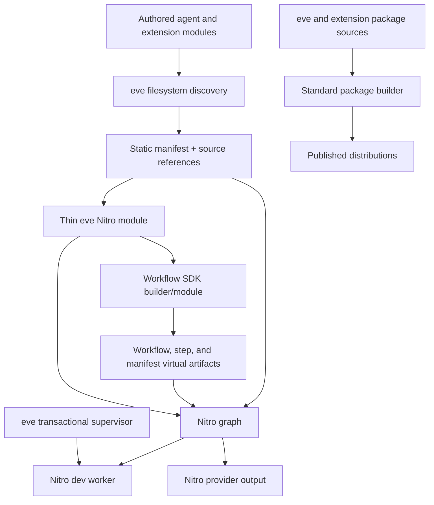

# Nitro bundling consolidation plan

## Outcome

Delete eve's custom application and Workflow bundlers by assigning each graph one owner:

- Nitro owns the complete application graph, development server bundle, provider output,
  dependency tracing, externals, queues, assets, and final build lifecycle.
- Workflow SDK owns Workflow/step/serde discovery, transforms, intermediate artifacts, step
  registration, route adapters, and manifests.
- eve owns filesystem-first agent semantics and a thin Nitro module that supplies eve policy
  through public upstream APIs.
- A standard package builder owns the published `eve` and extension distributions.
- eve retains its development supervisor only while Nitro lacks equivalent transactional worker
  activation and draining.

The Workflow and dynamic-tool cutovers together should retire at least 3,500 gross production
lines and 3,000 old compiler-test lines; new thin-module and semantic tests make net deletion
smaller. The completed program should also remove private access to Nitro's Rolldown installation
and the custom authored module bundler. Package build configuration and a thin Nitro module are not
considered custom bundlers.

This plan follows the evidence in
[`nitro-bundling-audit.md`](./nitro-bundling-audit.md).

## Non-negotiable semantics

Deleting code is successful only if these observable behaviors remain:

1. `workflowEntry` and `turnWorkflow` retain cross-deployment identities when a run targets
   `deploymentId: "latest"`.
2. Co-deployed agents use disjoint queue topics.
3. Local and Vercel execution use the same Workflow compiler, Nitro server graph, and entrypoint
   semantics; an evaluated native queue transport need not be an HTTP route.
4. A failed development candidate never replaces the active server.
5. Existing HTTP streams, WebSockets, and in-flight Workflow work drain on the retired server.
6. Generated artifacts remain available for every worker that still references them.
7. App-configured externals and selected optional native engines are traced once by Nitro.
8. Dynamic session/turn tools replay with the same executor, captures, approval, schemas, and
   `toModelOutput` behavior they had when resolved.
9. Embedded Next.js and other multi-service builds do not acquire eve's generic root functions or
   routes.
10. Extension publication remains a dist-only package contract and does not depend on generated
    application code at runtime.
11. Vercel emits one compiled server graph and exactly one additional queue-configured function,
    independent of the number of authored workflows.

No compatibility fallback should retain the old compiler after a cutover. eve is pre-1.0; migrate
the internal or public contract, update fixtures, and delete the replaced path in the same phase.

## Target architecture



The eve Nitro module should be policy, not a compiler. A useful size test is that it can be read as
configuration plus route registration: no AST walker, raw bundler invocation, generated-source
parser, output-directory copier, or source-text replacement.

## Capability dependencies

The work has parallel upstream tracks. A Nitro release containing every desirable cleanup is not
a prerequisite for deleting the Workflow compiler.

| Deletion or behavior           | Hard dependency                                                                                         | May remain temporarily                                        |
| ------------------------------ | ------------------------------------------------------------------------------------------------------- | ------------------------------------------------------------- |
| General Workflow compiler      | Workflow stable identity, queue namespace, bootstrap/alias/external policy, and composable builder APIs | Nitro lifecycle orchestration and Vercel symlink materializer |
| Dynamic-tool compiler          | Explicit template/capture API and upstream Workflow registration of template executors                  | Package-build standardization                                 |
| Vercel flow materializer       | Tagged Nitro relative-symlink fix                                                                       | Workflow compiler can already be removed                      |
| Builder-specific Nitro plugins | Builder-neutral hook and virtual side-effect API                                                        | Thin eve Nitro module                                         |
| Authored module bundler        | A proven Nitro evaluation/build service or a runtime-only definition contract                           | Transactional eve supervisor                                  |
| Package scripts                | Standard builder plus installed-CLI packaging proof                                                     | Nitro application architecture                                |

## Contract decisions

### Thin local Nitro module

Keep an eve-owned module, consistent with Nitro maintainer guidance. It should:

- install eve handlers, plugins, schedule tasks, and aliases;
- point Workflow SDK at eve-owned source directories;
- supply the agent queue namespace and stable identity policy;
- include the compiled-artifact/bootstrap side-effect entry;
- translate agent `externalDependencies` into upstream-supported policy;
- select direct handler behavior only if an isolated test proves it remains necessary;
- add provider configuration through resolved Nitro options.

It must not:

- implement Workflow directive transforms;
- parse generated Workflow output;
- manufacture Workflow manifests or step registries;
- invoke Rolldown, esbuild, or SWC itself;
- inspect or monkey-patch a plugin by name;
- copy a completed Nitro function tree.

### Nitro configuration and target resolution

Do not expose Nitro configuration accidentally. The preferred contract is:

- disable implicit `nitro.config.*`, `.nitrorc`, and package-field loading for standalone eve
  applications;
- expose only eve-owned configuration fields that can be mapped to Nitro deliberately;
- let framework integrations supply their Nitro instance or an explicit, wrapped extension point;
- make eve invariants—builder during the migration, source roots, output ownership, Workflow
  identity, and queue namespace—non-overridable.

If a real consumer requires an application Nitro option, add it to the eve contract with a test
instead of declaring the whole third-party config surface public.

Resolve the deployment target before host preparation. Today world selection, prewarming, output
normalization, and Nitro can disagree because some read `VERCEL` before Nitro resolves its preset.
Either:

1. define an explicit eve target, pass its preset to Nitro, and assert the resolved preset matches;
   this is implementable with today's API; or
2. upstream a pure target resolver or `createNitroFromOptions()` path, then resolve once and pass
   the immutable result through preparation. Although `loadOptions()` is public today,
   `createNitro()` always loads again, so it is not yet a safe resolve-once boundary.

Use the explicit eve target unless the upstream resolve-once API lands before implementation.
The chosen design must define precedence among the eve target, `VERCEL`, `NITRO_PRESET`,
`SERVER_PRESET`, and automatic detection. Test `NITRO_PRESET=vercel` without `VERCEL`, the inverse
conflict, and development emulation. This is a prerequisite for provider cleanup, not a presumed
low-risk environment-variable replacement.

### Upstream Workflow composition API

Prefer a factory or exported builder over installing the current all-or-nothing module:

```ts
createWorkflowNitroModule({
  dirs,
  projectRoot,
  moduleSpecifierRoot,
  queue: { namespace },
  identity,
  aliases,
  externalPackages,
  additionalStepEntries,
});
```

This is an illustrative upstream shape, not an eve public API. The implementation may instead
export a `LocalBuilder` factory and route-registration helpers, provided eve does not need to copy
their internals.

The identity hook must receive kind, source path, export name, and upstream default ID. eve should
return a custom ID only for explicitly selected framework workflows. Every other function uses the
upstream default, including its path and package-version collision protection.

`moduleSpecifierRoot` is intentionally separate from `projectRoot`: one controls durable identity,
the other resolution. Conflating them recreates the current same-package collision risk.

The queue namespace must be an option plumbed into both generated Workflow entrypoints and Nitro's
queue trigger. It must not depend on setting `WORKFLOW_QUEUE_NAMESPACE` globally during a
potentially concurrent multi-agent build.

### Durable identity migration

Do not require byte-for-byte parity for every old and upstream-generated ID. Classify identities:

- `workflowEntry` and `turnWorkflow` are cross-deployment routing keys and must keep their exact
  current IDs.
- Serde class IDs that can appear in persisted data must either remain exact or have an upstream
  compatibility/migration proof.
- Ordinary workflow and step IDs may adopt upstream defaults when execution remains pinned to the
  immutable deployment that created them. Production must retain that deployment; local
  development must drain its worker and generation.
- Dynamic-template IDs are new stable path/export identities. An in-flight turn containing old
  counter-based metadata must finish on its old deployment. At the next stable turn/deployment
  boundary, session-scoped tools are re-resolved under the new runtime revision before use.

Phase 0 must prove those deployment boundaries. If a persisted ordinary ID is consumed by a newer
deployment, it joins the exact-preservation set. The cutover must not add an ID-rewriting fallback.

### Dynamic tools

Replace the implicit closure compiler with an explicit template-and-captures contract. The
preferred authoring direction is:

```ts
export const searchTool = defineDynamicToolTemplate({
  description: "Search the configured service",
  inputSchema: searchInputSchema,
  async execute(captures, input, ctx) {
    "use step";
    return search(captures.baseUrl, input.query, ctx);
  },
  approval(captures, approvalCtx) {
    return canSearch(captures.accountId, approvalCtx) ? "not-applicable" : "user-approval";
  },
  toModelOutput(captures, output) {
    return { type: "text", value: `[${captures.label}] ${output.summary}` };
  },
});

export default defineDynamic({
  events: {
    "session.started"(_event, ctx) {
      return searchTool.bind({
        accountId: resolveAccountId(ctx.session.auth),
        baseUrl: resolveBaseUrl(ctx.session.auth),
        label: resolveLabel(ctx.session.auth),
      });
    },
  },
});
```

Names remain filesystem-derived. The exported template receives a stable path/export identity;
`.bind()` produces only that identity and capture data. Workflow SDK transforms and registers the
ordinary `"use step"` executor. Replay looks up the static template from the final Nitro graph, so
approval and `toModelOutput` remain module functions rather than serialized closures.

The final name can change during API review, but the semantics are fixed:

- captures are explicit JSON-compatible data (`null`, booleans, finite numbers, strings, arrays,
  and plain objects of the same) and are validated at resolution time;
- unsupported values produce a source-located error, never `{}`;
- template identity is stable across transform order and rebuilds;
- session/turn replay restores every callable behavior;
- approval and `toModelOutput` receive the same captures as `execute`;
- `.bind()` may supply serializable description and JSON-schema overrides so event-dependent
  descriptions and schemas remain supported without carrying functions;
- step-scoped dynamic tools may use the same contract even though they need no durable replay;
- there is no AST heuristic for `execute` property spelling or lexical capture inference.

This breaking API is preferable to extending the custom transform. A codemod is optional; a legacy
runtime fallback is not.

### Authored modules

Change the internal compiler contract from “give me a pre-bundled module” toward:

```ts
interface AuthoredModuleSourceRef {
  readonly sourcePath: string;
  readonly logicalPath: string;
  readonly extensionScope?: string;
}
```

Discovery should derive identities and slots from paths and return source references plus truly
static metadata. A Nitro-owned module runner or auxiliary build service evaluates those sources
with the same aliases, tsconfig resolution, asset rules, and externals as the final graph.

Two implementation shapes are acceptable:

1. **Preferred:** Nitro exposes a builder-neutral module-evaluation/build-service API. eve uses it
   for compile-time validation and versioned dev snapshots, while Nitro still emits the sole
   production graph.
2. **Fallback:** move definition normalization to application bootstrap so the final Nitro graph
   evaluates authored modules exactly once. Before choosing this, prove that all routes, schedules,
   provider configuration, and build-time validations can be derived without executing authored
   definitions before `createNitro()`.

Do not replace the current builder with another eve-owned raw bundler wrapper. If neither shape is
viable upstream, retain the authored compiler temporarily and complete the Workflow deletion
first.

### Package distributions

Building npm output is explicitly outside Nitro:

- replace `scripts/build-rolldown.mjs` with declarative configuration for a standard library
  builder;
- build extension multi-entry output through the same standard tool or a documented package
  plugin;
- list package-production tools directly in `devDependencies`;
- keep vendoring only where the small-runtime-dependency security policy requires it;
- generate vendored artifacts reproducibly from locked inputs rather than resolving Nitro's
  transitive Rolldown.

`eve extension build` and the application/Workflow builders run from the installed CLI, not from
the eve source checkout. Their implementation must therefore be compiled or vendored into the
published eve artifact, or declared as a justified runtime dependency. Merely listing those tools
in eve's `devDependencies` would produce a broken consumer install.

If adopting upstream Workflow integration as a runtime dependency materially expands the `eve`
install, choose explicitly among:

1. an upstream self-contained, lightweight builder distribution intended for embedding,
   preferred;
2. relaxing the minimal runtime-dependency goal after measuring install size and native
   artifacts;
3. generated/vendored upstream artifacts with an automated provenance check.

Copying the Workflow module into eve as maintained source is not an acceptable fourth option.
A lightweight module can remove dashboard/Vite-only weight, but it cannot make the per-agent
esbuild/SWC compilation disappear.

## Upstream work

Each upstream contribution should be independently useful and narrowly tested. Open RFCs only
where an API shape needs maintainer agreement; send direct fixes for isolated defects.

### Nitro

1. **Preserve symlinks in function-rule output.**
   Add `verbatimSymlinks: true` to the Vercel function-tree copy and a fixture containing an nf3
   relative package link. Verify the emitted target remains relative after the temporary build
   directory is removed. This unlocks deletion of
   `materializeVercelWorkflowFunctionOutput()`.

2. **Add a builder-neutral pre-bundle hook.**
   Replace or complement the Rollup-typed `rollup:before` hook with a discriminated hook that
   identifies Rollup, Rolldown, or Vite and exposes supported mutation. Port upstream Workflow and
   eve integration tests to it.

3. **Represent side effects on public virtual modules.**
   Allow a virtual descriptor such as `{ code, moduleSideEffects: true }`. This removes plugins
   that only prevent step registration or instrumentation from being tree-shaken.

4. **Expose a complete programmatic lifecycle.**
   Add a documented `buildNitro()`-style function that owns prepare, assets, prerender, compile,
   and result reporting. Preserve the lower-level functions for advanced callers. The return value
   should identify resolved preset, builder, output directory, and generated functions. Also
   accept already resolved options, or expose a pure target resolver, so framework preparation and
   Nitro creation cannot resolve different providers. Ensure framework callers can explicitly
   disable all application config-file/rc/package-field loading.

5. **Design auxiliary module builds only after the Workflow cutover.**
   If authored modules still require pre-evaluation, propose a builder-neutral service with named
   entries, virtual inputs, aliases, external policy, output manifest, invalidation, and explicit
   disposal. Extend Vite services rather than creating a separate Rolldown-only API if the
   contracts can converge.

6. **Optionally upstream transactional worker replacement.**
   Treat readiness, rollback, generation retention, and draining as one supervisor contract. Do
   not upstream only the worker spawn and leave eve reconstructing the safety boundary.

### Workflow SDK

1. **Add an explicit Nitro queue namespace.**
   Add `queueNamespace` to builder/Nitro module configuration and forward it to
   `createWorkflowEntrypointOptionsCode()` and `getWorkflowQueueTrigger()`. The lower-level helpers
   already accept a namespace; the missing seam is module configuration. Using the dynamic trigger
   helper also preserves `WORKFLOW_SEQUENTIAL_REPLAYS=1` and its `maxConcurrency: 1`. Test two
   modules in one process plus sequential replay.

2. **Expose identity roots and stable-ID policy.**
   Surface and forward the builder's existing `moduleSpecifierRoot` separately from `projectRoot`,
   then add a narrowly scoped ID override. Test package versions, workspace packages, non-exported
   files, duplicate names, and Windows paths.

3. **Support bootstrap and alias inputs.**
   Add extra step side-effect entries and builder aliases/resolution hooks so frameworks can
   install runtime state without patching the generated step file. First prove that configured
   directories and the existing Nitro-build-directory exclusion fully define the transform input;
   add a filter hook only for a reproduced gap.

4. **Make Nitro v3 external policy explicit.**
   The current module reads Nitro v2's `externals.external`, which is absent in Nitro v3. Accept
   literal external packages as Workflow options or consume a new builder-neutral Nitro policy.

5. **Export composable integration pieces.**
   Export the local builder factory, route registration, and build queue—or provide
   `createWorkflowNitroModule(options)`—so eve can keep a thin module without copying source.

6. **Own the Nitro queue-event adapter.**
   If `vercel:queue` replaces the virtual flow HTTP adapter, Workflow SDK should decode the event,
   dispatch workflow versus step messages, and define batch, acknowledgement, retry, partial
   failure, and idempotency semantics. The spike must also account for Nitro's runtime
   `@vercel/queue` import and preserve the zero-auth local Workflow world. Native queue transport is
   optional unless it proves better than the supported virtual-route/function-rule path.

7. **Offer a lightweight integration package.**
   Split dashboard/Vite-only dependencies or make them optional so a production framework adapter
   does not pull in every integration surface.

## Implementation phases

### Phase 0: characterize the contract

Add tests before changing ownership:

- stable `workflowEntry` and `turnWorkflow` IDs across two eve package versions;
- `deploymentId: "latest"` routing from an old driver to a new turn workflow;
- persisted serde-class and ordinary step/workflow identity behavior across a deployment boundary;
- two co-deployed agents with distinct queue namespaces;
- local Workflow delivery and production Vercel trigger output; if the native Nitro bridge is
  evaluated, include batches, acknowledgements, retries, partial failure, and duplicate delivery;
- Workflow steps, serde classes, hooks, streams, errors, retries, source maps, and public-manifest
  off/on modes;
- session-, turn-, and step-scoped dynamic tools across at least two Workflow steps;
- dynamic executor, approval, schema, capture, and `toModelOutput` parity after replay;
- multiple exported dynamic templates in one file and stable IDs across clean builds/deployments;
- native/optional packages, pnpm nesting, conditional exports, and app external dependencies;
- standalone Vercel output and embedded multi-service output;
- failed candidate, open stream, WebSocket, and retired-generation development cases.
- `nitro.config.*`, `.nitrorc`, and package-field inputs to document current precedence before they
  are disabled or wrapped;
- `NITRO_PRESET=vercel` without `VERCEL`, conflicting target signals, and development emulation.

Record:

- clean and incremental build time;
- development rebuild and ready time;
- output file count and total/on-disk bytes;
- each Vercel function's logical and physical size;
- `node_modules` trace contents;
- published `eve` install size.

Reproduce or close each high-priority defect from the audit. A defect that cannot be reproduced
must still receive a focused invariant test before its code is removed.

During this phase, pin `builder: "rolldown"` until the integration is builder-neutral and decide
whether app `public/` is supported; set `noPublicDir: true` if not. Treat configuration loading and
provider target resolution as separate contract changes after their current behavior is captured.

Exit criteria: the matrix passes on the existing implementation and produces stable baseline
artifacts and metrics.

### Phase 1: land independent Nitro cleanups

Send the symlink fix and builder-neutral hook/virtual side-effect work while the Workflow upstream
track proceeds in parallel. Test Nitro main or its nightly against the Phase 0 matrix without
changing eve's production pin.

In eve, implement the explicit target contract and assert Nitro's resolved preset after the
characterization tests establish the migration. Disable implicit app-local Nitro configuration
through supported loader options, upstreaming a dedicated disable flag if the current c12 surface
cannot express it cleanly. Target unification should precede provider-output comparison in Phase 2.

When a tagged Nitro release contains the required fixes:

- upgrade the exact pin;
- delete the flow-function materializer;
- replace builder-specific hooks where available;
- narrow warning suppressions;
- use Nitro's full lifecycle API if it has landed;
- keep multi-service pruning and host-middleware copying until a separate ownership API replaces
  them.

Exit criteria: no completed Nitro output is copied merely to repair Nitro semantics, and the
application host uses only documented Nitro build hooks.

These exit criteria do not block Phases 2–3. If the relevant Nitro release is not tagged, retain
the isolated materializer or hook adapter while still deleting eve's Workflow compiler.

### Phase 2: prove the upstream Workflow adapter

Implement the Workflow upstream PRs and create an eve spike module. Run it behind an internal test
switch, never a user-visible compatibility flag.

For each fixture, build once with the existing compiler and once with the spike in separate
subprocesses and isolated directories. Separate processes prevent global step registries,
transform counters, and environment reads from contaminating the comparison. Compare:

- exact IDs in the durable-preservation set and classified changes for deployment-local IDs;
- manifest semantics;
- registered handlers and route patterns;
- queue trigger topics and environment;
- external package decisions;
- source-map source paths;
- final Nitro trace and Vercel output.

Generated JavaScript bytes need not match. Every identity classified as cross-deployment or
persisted, plus all observable routes, must match its declared migration contract.

Use upstream `@workflow/builders` plus the thin local module if the full `@workflow/nitro` package
remains too broad, as recommended by Nitro's maintainer. This is acceptable only when eve calls
exported upstream builder APIs and contains no copied transform/build logic.

Exit criteria: the spike passes the Phase 0 behavior matrix and the upstream API contains every
eve-specific seam without process-global mutation or source patching. A packed eve tarball must
also build a Workflow fixture in an empty consumer project, proving that SWC/esbuild and the
builder are present without workspace dependencies.

### Phase 3: cut over Workflow and dynamic tools

Cut over the upstream Workflow builder and the dynamic template contract in the same release. Do
not build a temporary adapter from counter-based dynamic IDs to upstream IDs.

1. Register the eve module during Nitro creation.
2. Feed it eve execution roots, identity policy, namespace, aliases, bootstrap entries, and
   externals.
3. Consume the upstream manifest directly.
4. Use its flow/webhook handlers, or a deliberately selected native queue adapter, in development
   and production.
5. Add the dynamic template types, runtime registry, JSON capture validation, and source-derived
   template identity.
6. Let Workflow SDK transform and register each template's `"use step"` executor.
7. Persist template ID and captures, then replay executor, approval, schemas, and `toModelOutput`.
8. Migrate built-in definitions, fixtures, templates, and documentation.
9. Relocate any retained multi-service Vercel ownership helper—and the temporary symlink
   materializer if still needed—under Nitro/provider integration rather than Workflow compilation.
10. Remove both old compiler paths in the same release.

Delete:

- `builder.ts`, `builder-support.ts`, `build-queue.ts`;
- `workflow-transformer.ts`, `workflow-builders.ts`, `workflow-core-shim.ts`;
- `nitro-step-entry.ts`;
- manual manifest conversion and generated-source text replacement;
- step-entry parsing, double-transform, side-effect, and no-external plugins made redundant by the
  upstream contract;
- the `workflow:transform` plugin-name patch;
- obsolete Workflow aliases and direct-handler code after individual proof;
- `dynamic-tool-transform.ts`, `dynamic-tool-ast-references.ts`, and their transform-specific
  tests;
- the package-build dynamic transform and custom Workflow Vitest transform/setup where upstream
  `@workflow/vitest` owns equivalent behavior.

Replace the 2,139 transform tests with smaller semantic tests at the tightest applicable tiers:

- unit tests for capture validation and identity;
- integration tests for definition/replay parity;
- scenarios for multiple templates per file and source-derived identity across rebuilds and
  deployments;
- an e2e fixture for a session-scoped tool used on multiple steps.

Exit criteria: `internal/workflow-bundle` is removed; no general Workflow compiler, raw bundler
call, generated Workflow source patch, module-global dynamic counter, property-name AST match, or
inferred lexical-closure serialization remains. The aggregate deletion reaches the measured
3,500-production/3,000-old-test-line gross target.

### Phase 4: remove authored application bundling

Prototype the `AuthoredModuleSourceRef` contract and the Nitro auxiliary build/evaluation API in
parallel. Choose the architecture only after proving all build-time consumers:

- config and definition validation;
- channel and schedule route registration;
- extension scoping and overrides;
- tsconfig path aliases and asset imports;
- source-located error reporting;
- runtime compiled-artifact bootstrap.

Resolve the creation-order circularity before implementation. Authored definitions currently
supply routes, schedules, and provider data before the Nitro instance exists, while the proposed
evaluator belongs to Nitro. The preferred flow is:

1. create Nitro with the thin eve module and immutable target policy;
2. during module setup, evaluate authored source references through the upstream service;
3. normalize definitions and register handlers/tasks before Nitro's final handler synchronization;
4. include the same source modules in the final runtime graph.

This requires the evaluation service to exist during module setup. If Nitro cannot provide that
ordering, change routes/schedules to structurally readable metadata or stop this phase; do not
reintroduce a pre-Nitro eve bundler.

Document module execution explicitly. Definition modules must be top-level pure apart from
registering/returning definitions: the build evaluator may execute them for validation, and the
runtime graph executes them again at server startup. Runtime side effects belong in eve lifecycle
hooks, not module initialization. Add a test that counts build/start evaluation and catches
top-level network, timer, and process-global leakage.

Production must include authored sources directly in the one Nitro graph. Development may produce
versioned Nitro-owned service outputs, but eve's supervisor remains the activation authority until
Nitro implements the full transactional contract.

Then delete:

- `bundleAuthoredModuleCode()` and per-module evaluation bundles;
- `bundleAuthoredModuleForGeneration()` and the custom generation module-map bundle;
- custom package-boundary, tsconfig, asset, relative-extension, and ESM-banner bundler plugins when
  the upstream service owns their semantics;
- runtime use of `nitro-rolldown.ts`;
- caches that store unpruned generated `.mjs` modules under `node_modules`.

Exit criteria: application source reaches production through one Nitro graph, and no eve runtime
module invokes a general-purpose bundler or parser obtained from Nitro's private installation.

### Phase 5: standardize package and extension builds

Select a maintained library builder using an isolated spike of:

- all `eve` export conditions and declaration output;
- Vue and Svelte entries;
- extension multi-entry graphs and assets;
- compiled dependency vendoring;
- deterministic source maps and package contents;
- a packed `eve` tarball installed in an empty consumer project, followed by a real
  `eve extension build` and agent build with no workspace `devDependencies`.

Replace the imperative build script and duplicated Nitro Rolldown resolver with declarative
configuration and small lifecycle plugins only where package semantics require them. Strengthen
the vendor cache key with dependency integrity/content, publish through a staging directory, and
make stale-lock recovery process-aware. Stage extension `package.json` export changes with the
distribution so failure cannot publish one without the other.

Exit criteria: `scripts/build-rolldown.mjs` and `scripts/nitro-rolldown.mjs` are gone, extension
builds do not call the application host, the installed CLI contains every builder it executes, and
the package build has no dependency on Nitro internals.

## Validation matrix

| Dimension       | Required cases                                                                              |
| --------------- | ------------------------------------------------------------------------------------------- |
| Nitro builder   | Rolldown now; Vite only after builder-neutral hooks and an explicit support decision        |
| Runtime target  | local dev, local production Node, Vercel standalone                                         |
| Composition     | eve alone, Next.js host service, Nuxt/framework integration where applicable                |
| Filesystem      | macOS/Linux paths, Windows separator and drive-letter fixtures, symlinked pnpm store        |
| Workflow        | workflow, step, serde, hooks, streams, retry/fatal errors, source maps                      |
| Deployment      | current deployment, `latest`, package-version change, two agents in one project             |
| Queue transport | virtual route and any native bridge: batch, ack, retry, partial failure, duplicate delivery |
| Dependencies    | pure JS, conditional exports, native optional package, configured external, nested pnpm     |
| Dynamic tools   | every scope, multiple entries, captures, approval, output schema, `toModelOutput`, rebuild  |
| Development     | successful replacement, failed candidate, active stream, WebSocket, runtime-only update     |
| Provider output | routes, triggers, cron, environment, relative links, function sizes, multi-service pruning  |
| Installed CLI   | packed tarball in an empty project: agent build and extension build without workspace deps  |

Run the narrowest relevant test during development. Before each ownership cutover run:

```sh
pnpm fmt
pnpm lint
pnpm typecheck
pnpm guard:invariants
pnpm docs:check
pnpm test:unit
pnpm test:integration
pnpm build
pnpm test:scenario
```

Provider/e2e behavior that cannot run locally must be covered in the appropriate fixture eval and
validated in CI before merge.

## Rollout and pull request shape

Keep changes reviewable and reversible without maintaining two production implementations:

1. characterization tests and baseline metrics;
2. Nitro cleanup PRs and Workflow API PRs in parallel;
3. upstream Workflow spike tests;
4. Workflow plus dynamic-tool cutover and deletion;
5. tagged Nitro upgrades and their unlocked deletions as releases become available;
6. authored-module contract and upstream service;
7. package-build standardization.

This ordering shows review units, not a single serial chain. Only the hard dependencies in the
capability table block a cutover.

Use artifact comparison only in tests. Never execute both Workflow implementations for real
requests, because duplicate queue consumers or step registrations would invalidate the test and
risk side effects.

Every eve PR that changes the published package needs a changeset. Public dynamic-tool changes
need user documentation, migration examples, and a minor changeset because they break the public
API. Upstream release pins should remain exact and move only after the selected commit is in a
published tag.

## Risks and stopping rules

- If upstream stable IDs cannot express eve's cross-deployment contract, stop the Workflow cutover
  and resolve identity design upstream. Do not post-process IDs.
- If upstream Workflow aliases create two runtime registries, stop and fix package identity. Do
  not bridge two global maps.
- If the dependency-light package split is rejected, bring an explicit install-size and security
  tradeoff to maintainers before adding the full module as a runtime dependency.
- If Nitro's dev runner cannot preserve transactional activation, retain eve's supervisor. Code
  deletion is not worth dropping active streams.
- If a standard package builder cannot express extension multi-entry output, write a narrow plugin
  over its public API; do not route package production through Nitro.
- If a reported Nitro tracing regression reproduces, reduce it to an upstream fixture and fix the
  tracer. Do not restore a second eve dependency tree.

## Definition of done

The program is complete when:

- exactly one Nitro application graph produces local production and provider output;
- local and Vercel queues use Nitro's supported queue path;
- Workflow SDK is the only directive/step/serde compiler;
- eve's Nitro integration is a small public-API policy module;
- `src/internal/workflow-bundle` and its custom compiler tests are removed;
- dynamic tools use explicit templates and serializable captures;
- no generated Workflow JavaScript is parsed or text-patched by eve;
- no completed Nitro function is recopied to repair Nitro behavior;
- no eve runtime or package script resolves `rolldown` through Nitro's private installation;
- authored application source is bundled only by Nitro;
- development retains readiness, rollback, retention, and draining;
- package and extension output use standard package tooling;
- the full validation matrix passes without a legacy fallback;
- build time, output size, and install size remain within Phase 0 budgets; a regression requires a
  recorded maintainer approval that names the correctness, security, or upstream-maintenance
  benefit being purchased.

The deletion target is a consequence of these ownership boundaries. It should not be achieved by
moving the same compiler code into a differently named eve module.
