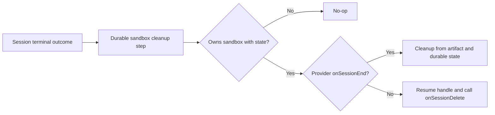

# Sandbox session terminal cleanup

## Summary

Session-owned sandbox resources currently survive when an eve session completes, expires, or fails because provider deletion is available only through a live handle. Add one provider lifecycle hook for terminal session cleanup and invoke it from every terminal session path.

## Provider API

```ts
interface SandboxProviderImplementation<Options, Artifact, State, Session> {
  // Existing prepare, start, and resume methods.
  onSessionEnd?(
    context: SandboxProviderSessionContext,
    artifact: Readonly<Artifact>,
    state: Readonly<State>,
    options: { reason: "completed" | "expired" | "failed" },
  ): Promise<void>;
}
```

The hook operates from durable state rather than a live handle, is idempotent, and owns permanent cleanup of session-specific provider resources. Providers without the hook retain the existing behavior by resuming the handle and invoking `onSessionDelete()`.

## Semantics

- Run after a session reaches `done`, `expired`, or `failed`, including timeout, reset, and close paths that resolve to expiration.
- Do not run for parked sessions, deployment or compaction handoffs, process shutdown, or authored `sandbox.stop()`.
- Do not run for a child session that borrows another session's sandbox.
- Do nothing when the session never opened a sandbox or already deleted it explicitly.
- Retry cleanup through the durable step boundary. Exhausted cleanup failures are logged without replacing the session's terminal outcome.
- Clear provider state after successful cleanup so repeated finalization is a no-op.



## Validation

Cover every terminal reason, unopened and explicitly deleted sandboxes, borrowed parent sandboxes, provider-hook arguments, fallback handle deletion, idempotent replay, and cleanup failure isolation. Update custom-provider documentation with the terminal hook and its distinction from stop, runtime shutdown, and explicit deletion.
