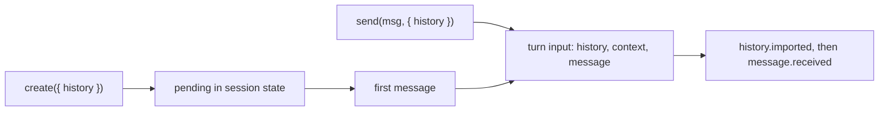

# Adding prior history to sessions

> **AI status:** Written entirely by AI; human review pending.

## Summary

Apps want to start or continue an eve session with conversation eve did not produce: a stored
transcript, a conversation moving from another system, a branch of an earlier exchange, or the
earlier replies of a Slack thread the agent was mentioned into. Today the only option is
`context: string[]`. Those strings become user-role messages, so the model reads the prior
conversation as one user describing it. They also never reach the event stream, so clients cannot
display them.

This proposal adds a `history` option of user and assistant text. `send()` adds it as real turns
right before that message, and a new `create()` on channel addresses starts a session from it
without running a turn. The stream publishes added entries in `history.imported`. History always
applies where it is passed: nothing is conditional on whether a session already exists.

Requests that converge here: #91 (external transcripts), #3524 (branching from settled history,
closed as a duplicate), and Slack `threadContext`.

## Authoring API

```ts
/** One prior message passed as `history`. */
export interface SessionHistoryMessage {
  /** Optional app-owned id, echoed in `history.imported`. Unique within one call. */
  readonly id?: string;
  readonly role: "user" | "assistant";
  /** Plain text. Channels render speaker attribution into this text when needed. */
  readonly content: string;
}
```

`create()` starts a session that waits for its first message. It is the primary API for
migration, app-owned persistence, and branching:

```ts
POST("/conversations/:id/session", async (req, { from, params }) => {
  const auth = await authenticate(req);
  const conversation = await db.conversations.findForUser(params.id!, auth);
  const session = await from(`conversation:${conversation.id}`).create({
    auth,
    history: conversation.messages.map((m) => ({ id: m.id, role: m.role, content: m.text })),
  });
  return Response.json({ sessionId: session.id });
});
```

`send()` takes the same option. That covers channel code that must add history and answer in
one call, such as seeding from a platform thread:

```ts
await from(token).send(text, { auth, history: transcript });
```

Every built-in channel's message hook result, including `eveChannel`'s `onMessage`, gains
`history?` and passes it to `send()`. `SendPayload`, `ChannelSendOptions`, and `SessionSendOptions`
carry it for custom channels.

## Semantics

**Always applied.** `send()` history joins that delivery's turn input: it sits after earlier
history and before the turn's `context` and message, whether the send creates the session or
continues it. Payloads coalesced into one turn contribute their history in order. History follows
the same paths as `context`: a message consumed as a plain-text answer to a pending question drops
both.

**`create()`.** If a session owns the address, `create()` returns it unchanged. Otherwise it
starts a session without a message and waits, bounded, until that session claims the address, so
an immediate `send()` finds it and concurrent `create()` calls settle on the winner. The history
waits in session state and joins the first message's turn, so it reaches model history through
the same path as `send()` history.

**Server-resolved only.** History comes from authored code. The eve HTTP request body does not
accept it, and no client SDK option sets it. Code that loads stored history must authorize the
caller against that conversation.

**Validation.** `send()` and `create()` throw `InvalidSessionHistoryError` before anything is
enqueued. The error names the offending entry and rule: unknown role, empty content, an overlong
or duplicate id, or exceeding 500 messages or 512 KiB of content per call. These caps are
placeholders until measured against Workflow payload limits.

**Model history.** User entries become `kind: "user"` messages with
`metadata: { "eve.imported": true }`. Assistant entries become plain assistant text. No tool
calls, results, files, reasoning, or provider options are created.

**Display history.** `history.imported` carries `messages` (`id?`, `role`, `text`), `sequence`,
and `turnId`, and precedes the `message.received` of the turn the entries joined. The default
reducer places them before that turn's message, ahead of any unconfirmed optimistic message.
Imported messages carry `metadata.imported` and no `turnId`, so a turn's response never streams
into one.

**Everything else is unchanged.** Session state, sandbox, memory, and pending input are untouched.
After joining history, entries are ordinary messages: pre-model compaction counts them, compaction
and deployment handoffs carry them, and `clear()` removes them.



## Runtime boundary

History is framework-owned turn input next to `context`. The turn step attaches each payload's
history after the channel's deliver hook runs, so a custom hook cannot drop it. The harness turns
it into model messages in `prepareTurnInput`, and the `receive` transition publishes the event.
`create()` reuses message-free session creation; the pending history lives in session state until
the first message. No new workflow entry kind, checkpoint version, or step is needed. The option
and event bump the extension capability epochs that expose them; prior epochs stay supported
because both changes are additive.

## Slack

`threadContext` keeps its options and its behavior for messages in a thread that already has a
session: the `since` slice is prepended as an attributed transcript. Only a message that starts
the thread's session changes. Its slice is added as `history`, with this app's replies as
assistant turns and everyone else as attributed user turns. Choosing between the two needs a
`resolveSession()` check. A lost race only changes the representation of that slice (history
versus transcript); nothing is dropped. When a hook returns its own `history`, the transcript
behavior applies.

Slack shows rendered output, not what the model actually produced, so seeded assistant turns
approximate it.

## Non-goals

- Reading or forking sessions. Apps can build history from a session's event stream themselves.
- Client-supplied history over HTTP or the client SDKs.
- Channel-level history hooks. Most requests create sessions explicitly rather than per thread.
- Tool calls and results, files and images, reasoning, and provider-specific message parts.
- Separate display text and model text.
- Workarounds for stranded sessions (#3022). Those belong in deployment handoff, not in history.
- Appending history without a turn. #3023's `observe` is that operation.

## Requests and coverage

| Request                                       | Source            | Coverage         | Notes                                                               |
| --------------------------------------------- | ----------------- | ---------------- | ------------------------------------------------------------------- |
| Continue a migrated transcript                | #91               | Covered for text | `create()` per conversation. Tool calls, reasoning, and files drop. |
| App-owned persistence                         | #91               | Covered          | Server route calls `create()`; the client resumes by session id.    |
| Clients display imported history              | #91, #3524        | Covered          | `history.imported` renders on live and replayed streams.            |
| Client-supplied history                       | #91               | Non-goal         | Server-only.                                                        |
| Real roles instead of a transcript blob       | #91, #75          | Covered          |                                                                     |
| Initialize without execution                  | #3524             | Covered          | `create()` runs no model or tool.                                   |
| Empty history                                 | #3524             | Covered          |                                                                     |
| Map imported ids                              | #3524             | Covered          | App ids become message ids.                                         |
| Preserve tool calls and results               | #3524             | Follow-up        |                                                                     |
| Clear errors for invalid history              | #3524             | Covered          |                                                                     |
| Settled-history export, fork, or rewind       | #3524, #75        | Not covered      | Userland can build history from the event stream.                   |
| Mid-thread Slack mentions see earlier replies | `threadContext`   | Improved         | First message adds them as roles; later messages unchanged.         |
| Follow a thread without mentions              | #223, #874, #3023 | Out of scope     |                                                                     |

## Validation

- Unit: validation rules; history placement before each turn's context and message across turns;
  reducer placement before pending optimistic messages and before an active turn's response;
  Slack seeding on a message that starts the session, with unchanged catch-up.
- E2E: a fixture channel creates a session from Alice's history, a first message answers from
  it, and a later `send()` adds Bob's exchange; each turn publishes `history.imported` before its
  `message.received`.

## Open questions

1. **Imported user message kind.** `"user"` plus metadata treats imported text like typed input. A
   dedicated kind would let compaction, memory, and filters tell them apart.
2. **Cap values.** 500 messages and 512 KiB per call need checking against Workflow payload and
   event limits.
3. **`history.imported` content.** Full text duplicates the inbox payload in the stream.
4. **Tool calls and results.** A validated tool tier would reuse the legacy import's
   `normalizeHistory` and state its trust and approval semantics.
