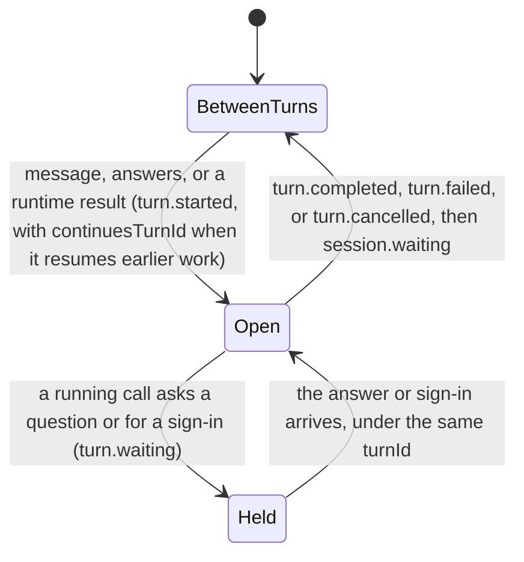
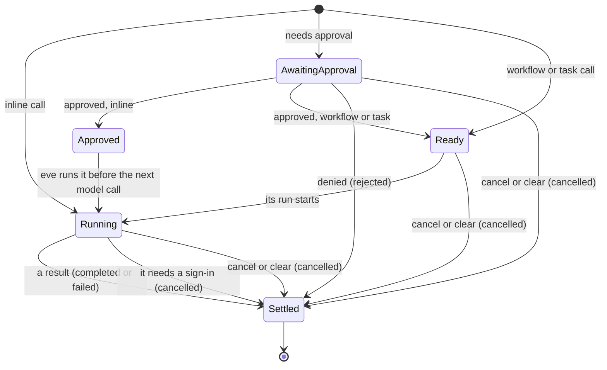
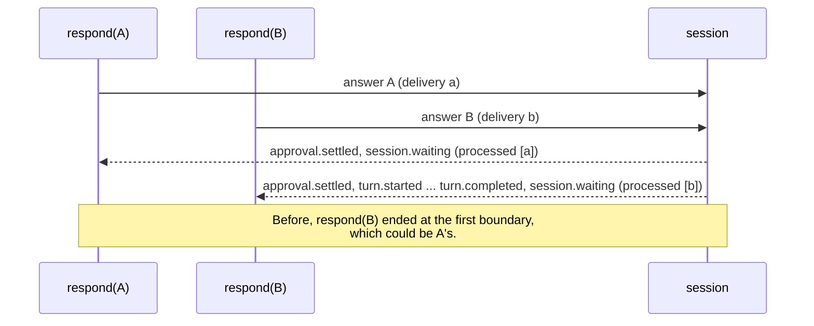
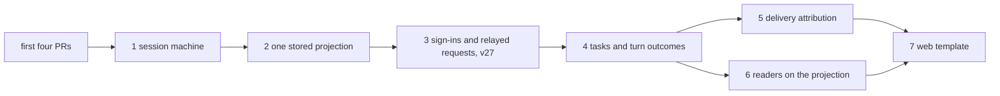

# One source of truth for session state

## Summary

eve computes the state of a session in many places. On the server, pending work lives in ten
durable records. wherever we add code that changes a record, we need to be sure that we emit
a matching stream event so that consumers can know that that transition happened. this is
impossible in practice and we have a huge number of subtle issues linking back to this.

even if we do emit events as needed, web chat, `eve dev`, `respond()`, Slack task cards,
evals, and ACP each read those events with their own rules, and they disagree. A subagent
that fails shows as failed in the chat but completed in ACP, and an eval that checks for
a completed call passes.

This plan gives each piece of session state exactly one owner:

- **A session state machine** is the only code that changes pending work or builds lifecycle events.
- **A session projection** is folded from the events the machine publishes. It answers every
  lifecycle question, on the server and in every reader, with the same code.
- **Private records** hold what the stream never shows. Each is keyed by an ID the projection
  tracks and is dropped when its owner closes.
- **Caches** are written in one place.

We add information to the streamed events to give authoritative answers to facts that readers
currently have to guess, and every reader uses the same projection instead of a custom fold over
the streamed events. The work lands in the seven PRs listed under [Implementation plan](#implementation-plan).

The main text covers the design and rollout. Expand the labeled sections for inventories,
protocol fields, and detailed before/after code.

## Starting point

This plan assumes these four PRs have merged:

| PR    | What it establishes                                                                                                                                                                                    |
| ----- | ------------------------------------------------------------------------------------------------------------------------------------------------------------------------------------------------------ |
| #3878 | Stable part IDs for text and reasoning; authorization parts matched by `attemptId`; replayed tool events no longer reopen settled approvals                                                            |
| #3879 | One conversation client: hooks and `EveAgentStore` return `ConversationState` (messages plus turns, inputs, tasks, and agent sessions), with canonical `conversation` beside a custom reducer's `data` |
| #3880 | `eve dev` runs on `EveAgentStore`                                                                                                                                                                      |
| #3965 | A task call's tool part keeps running until `task.settled`                                                                                                                                             |

After them, web chat and `eve dev` share one fold of turns, inputs, and tasks in
`ConversationState`. Everything else is unchanged: the server keeps the records below and
publishes stream version 26, and the other readers fold raw events.

## Problem

### Many copies of the same state

Ten durable records describe pending work, while lifecycle events are built in 16 files.
Every mutation must report the matching event, and every reader must interpret it consistently.

<details>
<summary>Current records and competing lifecycle readers</summary>

```text
┌─ server: ten records ────────┐           ┌─ readers, each with its own rules ───────────┐
│ pending input batches        │           │ web chat      message reducer's part.state   │
│ coordination batch           │           │ eve dev       transcript toolState           │
│ deferred step input          │           │ respond()     ClientSession TurnSegment      │
│ workflow tool runs           │  events,  │ store status  EveAgentStore helpers          │
│ approval grants              │  built in │ task cards    task-card fold                 │
│ emission state               │  16 files │ evals         derive-run-facts               │
│ relayed requests             │  ───────▶ │ ACP           the adapter's event switch     │
│ pending sign-ins             │           │                                              │
│ approval candidates          │           │ web chat and eve dev share the               │
│ task table                   │           │ ConversationState fold for turns,            │
│                              │           │ inputs, and tasks, but not calls             │
│ idle check: probes raw keys  │           └──────────────────────────────────────────────┘
└──────────────────────────────┘
```

| Question                                     | Where eve answers it                                                                                                                                                                                                                                     |
| -------------------------------------------- | -------------------------------------------------------------------------------------------------------------------------------------------------------------------------------------------------------------------------------------------------------- |
| Is a turn open? Is the session idle?         | emission state, the cached `DurableSessionState.turn`, `isSessionStateIdleForHandoff`, `ConversationState.activeTurnId`, `TurnSegment`, `EveAgentStore` status, `derive-run-facts`, the ACP adapter                                                      |
| What is pending?                             | pending input batches, the coordination batch, deferred step input, workflow tool runs, relayed requests and the cached `hasProxyInputRequests`, pending sign-ins, approval candidates, the task table, client inputs, message parts, task-card blockers |
| Where does a call stand?                     | the pending batches and run registry, the task table, `part.state`, `eve dev`'s `toolState`, client task calls, task cards, `derive-run-facts`, the ACP adapter                                                                                          |
| Which turn or call does something belong to? | emission state, `TurnDeliveryIdsKey` (messages only), the client's settlement buffering, `agentCallTurns`                                                                                                                                                |

</details>

### Where readers disagree

Three ordinary situations, as each reader reports them today:

| What happened                                  | Web chat (`part.state`)                   | `eve dev`            | Task cards                    | ACP                               | Evals                                                   |
| ---------------------------------------------- | ----------------------------------------- | -------------------- | ----------------------------- | --------------------------------- | ------------------------------------------------------- |
| A subagent fails                               | `output-error`                            | error                | `failed`                      | `completed`, as soon as it starts | `calledTool` sees `completed`; `noFailedActions` passes |
| The user or a policy denies a call             | `output-denied`                           | denied               | `failed`                      | `failed`                          | `noFailedActions` fails the run                         |
| A turn is cancelled while a workflow tool runs | `input-available`, so it shows as running | error: "interrupted" | `working`, on a finished card | `pending`                         | `pending`                                               |

Task cards here means the `TaskCardView` that channel renderers draw. Each row has one cause:

- **A task call has two results.** Its `action.result` is the start receipt the model reads, and
  its outcome arrives later in `task.settled`. The conversation reducer and task cards wait for
  `task.settled`. ACP and the eval tool-call facts take the receipt.
- **A denial has two encodings.** The user's denial is `rejected`, and a policy's is `failed`
  with `TOOL_EXECUTION_DENIED`. The message reducer checks both. Task cards and ACP report both as
  failures, and `noFailedActions` counts both.
- **A stopped call has no result.** Cancelling a turn emits `turn.cancelled` and drops the call's
  run record. Each reader decides on its own what a call without a result means.

### Why they drift

- **Mutation and reporting are separate.** Some cleanup paths drop requests without reporting
  withdrawals; `clear` can leave approvals answerable.
- **Records duplicate lifecycle facts.** Requests, task outcomes, and approval settlements are
  copied and closed by hand. Approval candidates also track whether events were emitted.
- **Readers infer what the stream omits.** They reconstruct call status, attribution, and read
  boundaries from raw events, message position, or registry shape. Partial answers can leave
  `respond()` waiting; overlapping answers can end at a sibling's boundary.
- **Execution depends on replay.** Approvals replayed through the AI SDK can be skipped after
  memory or instruction changes, while new input waits behind the parked batch.

<details>
<summary>Recent fixes in the same area</summary>

As of 2026-09-30, these PRs fix symptoms of the same problem one at a time. Each is right to
land now, and the plan keeps its tests:

- **Requests that outlive their owner.** #4083 and #4084: a run that ended, or a cancelled
  turn, dropped its relayed questions without `input.resolved` (#4079). #3953: a `serve` tool's
  `ctx.reply()` left its questions open.
- **Missing boundaries.** #3762: a rejected approval answer parked without `session.waiting`, so
  the client kept waiting.
- **Pending approval batches.** #4027: when one delivery approved two batches, only the first
  call ran. #3716: with several batches pending, a text "approve" was deferred. #3892: a step
  that also called a blocking workflow skipped the response policy. #3983: a workflow call
  dispatched while its approval was open.
- **Approvals replayed through the AI SDK.** #3903, #3901, and #3987: an approved call was
  skipped when memory or instructions moved the approval off the last message (#3899).
- **Relay routes.** #3941: a parent kept one batch of routes per child, so the answer to an
  earlier request never arrived.
- **Events published outside the owning step.** #4001: `agent.started` came from a side step
  whose changes were discarded. #3789: relayed events skipped the parent's hooks.
- **Readers re-deriving lifecycle.** #3980: channel activity counted a local agent's turn as its
  caller's, so the caller looked done early.

</details>

## Design

### Four kinds of state

Every durable piece of session state is exactly one of these:

| Kind           | What                                                                                                                                                | Written by                                     |
| -------------- | --------------------------------------------------------------------------------------------------------------------------------------------------- | ---------------------------------------------- |
| Machine state  | `TurnState`: suspended model steps and call execution payloads, queued input, deliveries awaiting a boundary, unread task results, execution grants | The session machine only                       |
| Projection     | `SessionProjection`: the active turn, announced delivery attribution, requests and decisions, calls, tasks and outcomes, sign-ins                   | Folding every published event, own and relayed |
| Private record | What readers never see, keyed by an ID the projection tracks: relay routes, sign-in attempts, task runs, approval candidates                        | The machine; dropped when its owner closes     |
| Cache          | A derived value for a reader that can't load the session, such as `hasProxyInputRequests`                                                           | The save function                              |

Both `TurnState` and `SessionProjection` are stored in durable session state, alongside private
records. Their boundary is execution information versus lifecycle facts, not private versus
public visibility: **if a fact can be derived from published events, read it from the projection.**

For an approval, the projection records the request and decision; `TurnState` retains execution
arguments and the suspended model step. For a task, the projection records its outcome;
`TurnState` tracks whether the model has consumed it. Neither keeps a second lifecycle status.
Announced delivery attribution and session-limit prompts also belong to the projection, not
independent maps or pending flags in `TurnState`.

### Single unified fold

The readers in the first diagram become small consumers of one fold. The server stores the
projection with each step, clients carry it in `ConversationState`, and evals and ACP fold a
run's events through the same function:

```text
  message, answers, results, cancel, clear
                       │
                       ▼
┌─ session machine ────────────────────────────┐
│ transition(view, input) → { turn, events }   │ ──▶ TurnState and private records
└──────────────────────┬───────────────────────┘
                       │ events
                       ▼
┌─ protocol/session-projection.ts ───────────────────────────────────────────────────────┐
│ foldSession(projection, event)                                                         │
│ callStatus · openInputs · signInState · reachedBoundary · isIdle                       │
└────────────┬───────────────────────────────┬───────────────────────────────┬───────────┘
             │ stored with each step         │ in ConversationState          │ a run's events
             ▼                               ▼                               ▼
┌─ server ─────────────────┐   ┌─ clients ──────────────────┐   ┌─ evals and ACP ────────┐
│ the machine's view       │   │ toolCallState, part.state  │   │ run facts, assertions  │
│ handoff idle check       │   │ respond() and send() ends  │   │ ACP tool call updates  │
│ hasProxyInputRequests    │   │ EveAgentStore status       │   └────────────────────────┘
│ Slack task cards         │   │ web chat, eve dev, hooks   │
└──────────────────────────┘   └────────────────────────────┘
```

Each reader keeps only its presentation. Web chat, `eve dev`, task cards, and ACP map one call
status onto their own vocabulary, so the three rows in
[Where readers disagree](#where-readers-disagree) read the same everywhere.

### Invariants

1. Only the session machine writes `TurnState` and builds lifecycle events. Callers publish what
   a transition returns.
2. The stored projection is the fold of every event the session publishes, its own and relayed
   ones. It is saved with the step that published them.
3. A private record exists only while the projection shows its owner open. Closing the owner
   means emitting its event, and the record is dropped with it.
4. Every lifecycle fact derivable from published events is owned by the projection. `TurnState`
   holds only execution payload and bookkeeping those events do not express. Dispatch eligibility
   combines projected decisions and call outcomes with execution payload; it is not a separately
   stored call status.
5. Caches are computed in the save function.

Proposed guards restrict state writers and lifecycle builders to the machine, projection writes
to `commit`, and transitions to pure logic. They do not make effects and publishing atomic.

<details>
<summary>Guard sketch</summary>

```js
// scripts/guard-invariants.mjs (sketch)
forbidImports({
  from: ["#harness/session-machine/state.js", "#harness/session-machine/events.js"],
  outside: "packages/eve/src/harness/session-machine/",
});
forbidInFile("packages/eve/src/harness/session-machine/transitions.ts", {
  imports: ["#execution/*", "#runtime/*", "node:*"], // no I/O
  calls: ["Date.now", "new Date", "randomUUID"], // time and IDs arrive in the input
});
```

</details>

### The session machine

Steps run effects inline, then pass their results into pure transitions. A transition returns
execution state and lifecycle events; `commit` publishes, folds, prunes, and saves them together.
Effects must be repeat-safe because a failed durable step is retried from the start.

<details>
<summary>Module layout, transitions, and state types</summary>

The machine is one directory. Its transition list reads as the lifecycle:

```text
harness/session-machine/
  state.ts        TurnState and its codec (private to the directory)
  events.ts       lifecycle event builders (private to the directory)
  view.ts         SessionView: turn state, stored projection, private records
  transitions.ts  every lifecycle transition
  commit.ts       publish, fold, prune, save: the only way state changes
protocol/session-projection.ts   the fold, shared with every reader
```

```ts
// harness/session-machine/transitions.ts (sketch)
export const transitions = {
  receive, // a message or answers arrive: open a turn, or join the open one
  decide, // approval decisions: approve, deny, or grant once()
  parkStep, // a model response with calls that can't all settle now
  dispatch, // ready workflow and task calls start their runs
  settle, // a call's result; commit the step once every call has one
  requireSignIn, // a call needs a sign-in: settle it cancelled, ask for the sign-in
  completeSignIn, // a sign-in callback: complete it before the turn it resumes
  relay, // a child's question or sign-in, passed up under the served call
  routeAnswer, // an answer to a relayed request: forward it, resolve it here
  finishRun, // a task or workflow run ends: settle its calls, withdraw its requests
  finishTurn, // nothing left to run: close the turn, or hold it for running calls
  cancel, // the turn is cancelled: settle, withdraw, close
  clear, // the context is cleared: settle, withdraw everything, empty history
} satisfies Record<string, (view: SessionView, input: never) => Transition>;
```

```ts
// Execution state only; no activeTurnId, approval decisions, or call/task statuses.
interface TurnState {
  readonly queued?: QueuedInput;
  readonly suspendedSteps: Readonly<Record<string, SuspendedModelStep>>;
  readonly callExecutions: Readonly<Record<string, CallExecutionPayload>>; // by projected callId
  readonly unreadTaskResults: readonly TaskResultReference[]; // payload in projection or private run
  readonly pendingBoundaryDeliveryIds: readonly string[];
  readonly grants: readonly ExecutionGrant[];
}

interface SessionView {
  readonly turn: TurnState; // execution state, despite the historical name
  readonly projection: SessionProjection;
  readonly records: PrivateRecords;
}

/** What every transition returns. Nothing else changes session state. */
interface Transition {
  readonly turn: TurnState;
  readonly records?: Partial<PrivateRecords>; // new private data, such as a relay route
  readonly events: readonly LifecycleEvent[];
}
```

</details>

Every durable step uses the same wrapper (sketch):

```ts
// harness/session-machine/commit.ts (sketch)
export async function step(
  input: SessionStepInput,
  run: (view: SessionView) => Promise<Transition>,
) {
  const view = await loadView(input);
  return await commit(view, await run(view), input.publish);
}

async function commit(view: SessionView, t: Transition, publish: Publish) {
  for (const event of t.events) await publish(event); // stream, channel, hooks, instrumentation
  const projection = prune(t.events.reduce(foldSession, view.projection), t.turn);
  return {
    turn: t.turn,
    projection,
    records: dropClosed({ ...view.records, ...t.records }, projection),
  };
}
```

**Cancellation shows the difference.** Today `publishFromSessionStep` separates what readers
hear from what gets cleared: it emits turn/session boundaries but silently removes pending
work. The machine instead reports withdrawals and stopped calls, and the fold closes them.

<details>
<summary>Before: independent publishing and cleanup callbacks</summary>

`restoreSessionStep` loads the durable session and runtime context. `publishFromSessionStep`
opens the publisher (stream, channel, hooks) and takes two independent callbacks: `publish`
decides what readers hear; `updateSession` decides what changes. The step then serializes the
context, computes caches, and returns the diff. From `execution/settle-cancelled-turn-step.ts`,
trimmed:

```ts
const step = await restoreSessionStep(input);
const durableState = step.durableSession.state;
const { published } = await publishFromSessionStep(step, {
  origin: "own",
  // What readers hear: turn.cancelled, then session.waiting.
  publish: (emit) => emitCancelledTurn(emit, getHarnessEmissionState(durableState)),
  // What changes: four records, each cleared by its own helper.
  updateSession(session, emissionState) {
    const owningTurnId =
      getPendingCoordinationBatch(session.state)?.event.turnId ??
      input.sessionState.emissionState.turnId;
    return {
      session: setHarnessEmissionState(
        clearPendingSessionLimitPrompt(
          clearAllProxyInputRequests(
            commitCancelledCoordinationBatch(
              removeBlockingWorkflowToolRuns({ ...session, outputSchema: undefined }, owningTurnId),
            ),
          ),
        ),
        emissionState,
      ),
    };
  },
});
```

The helpers remove workflow runs, commit parked calls into model history, and drop relayed
questions and the session-limit prompt. The model history says the calls were cancelled, but
the stream reports only boundaries. Each reader guesses the rest. #4083 replaces the silent
relayed-request cleanup with reported withdrawals; the proposal generalizes that fix.

</details>

After (sketch):

```ts
// execution/settle-cancelled-turn-step.ts
export async function settleCancelledTurnStep(input: SessionStepInput) {
  "use step";
  return await step(input, async (view) => cancel(view));
}

// harness/session-machine/transitions.ts
function cancel(view: SessionView): Transition {
  const { turnId } = requireOpenTurn(view.projection);
  return {
    turn: discardTurnExecution(view.turn, view.projection),
    events: [
      ...openInputs(view.projection).map(inputWithdrawn), // input.resolved "cancelled"
      ...openSignIns(view.projection).map(signInWithdrawn), // authorization.completed "failed"
      ...unsettledCalls(view.projection, turnId).map(callStopped), // action.result "cancelled", PR 4
      turnCancelled(turnId),
      sessionWaiting(),
    ],
  };
}
```

`commit` then drops the relay routes and run records whose requests and calls those events
closed. The transition discards the cancelled turn's execution payload, but no helper separately
clears a request, call status, or active-turn flag. Cancelling a task takes the same shape:
`finishRun` is the one transition for a cancelled task and for a run that ends on its own. Today
the second path clears the run's relayed requests without an event.

### What happens to `tool-loop.ts`

Today `harness/tool-loop.ts` mixes pending-work coordination, lifecycle bookkeeping, and model
execution in a 3,356-line file, with a 1,577-line harness closure. The proposal moves coordination,
parking, and finishing into transitions. Model input, streaming/recovery, inline tools,
compaction, and observability stay in the tool loop.

<details>
<summary>Before: tool-loop stages and lifecycle call sites</summary>

Outline from `main`:

```ts
// harness/tool-loop.ts today: the step body inside createToolLoopHarness (outline)
async function executeStepBody(input) {
  if (config.clearOnly) {
    /* empty history; emit context.cleared and session.waiting */
  }
  if (config.compactOnly) {
    /* compact; emit session.waiting */
  }

  // Pending work, about 370 lines. Each stage can park the step.
  const resolvedCoordination = await resolvePendingCoordination(/* deferred input, run results */);
  const coordinated = await coordinateApprovalDelivery(/* candidates, response policies */);
  if (coordinated.kind === "park") return { next: null, session };
  const pending = resolvePendingInput(/* answers settle the parked batch */);
  if (pending.outcome === "unresolved") return park(/* commit the coordination batch first */);
  if (pending.rejectedActions) {
    /* emit a rejected action.result per denial */
  }

  // Turn preamble, about 175 lines: emitTurnPreamble, instructions, memory recall,
  // the session-limit prompt, client context.

  // Model and tools, about 770 lines: tool setup, replays, the streamed model call,
  // approved workflow dispatch, session usage limits.

  // handleStepResult, about 360 lines: park for approval, park on a question,
  // park on a sign-in, continue, or finish the turn.
  return await handleStepResult(/* ... */);
}
```

Along the way the file builds 10 kinds of lifecycle events itself, among them `input.requested`,
`authorization.required`, `approval.settled`, `turn.waiting`, and `session.waiting`. It emits
from 20 call sites and sets the emission state 15 times. The #4018 draft moved the records into
`TurnState` but kept this shape.

</details>

After, the step body becomes effects between transitions (sketch):

```ts
// harness/tool-loop.ts (sketch)
export function createToolLoopHarness(config: ToolLoopHarnessConfig): StepFn {
  return (input) =>
    step(input, async (view) => {
      const policies = await runResponsePolicies(view, input.delivery, config); // user code
      const turn = receive(view, input.delivery, policies); // answers, results, messages
      if (!needsModel(turn)) return finishTurn(turn); // parked, or nothing left to run
      const response = await callModel(turn, config); // streams text, reasoning, tool input
      const results = await runReadyCalls(turn, response, config); // approved calls first
      return settle(parkStep(turn, response), results);
    });
}
```

Each transition starts from the one before it, and `commit` publishes their events in order.
Content events such as text and reasoning still stream from the model call as they arrive. Only
lifecycle events go through transitions. `clear` becomes a transition, and manual compaction a
small step of its own that calls the same compaction code.

About 700 lines leave the file: the pending-work stage and the parking half of
`handleStepResult`, with every lifecycle event it builds and every emission-state write. What
remains is the model step.

### Turn and call lifecycles

The projection records turn and call lifecycle. The machine derives scheduling conditions such
as “ready to dispatch” from those facts and execution payload; it does not store another status.

<details>
<summary>Turn/call diagrams and derived scheduling stages</summary>

A turn:



A call. These are the lifecycle and scheduling stages, not a second status enum stored in
`TurnState`. The projection records requests, decisions, run starts, and outcomes. The machine
derives which effect to run next from those facts and the saved execution payload:



| Facts and execution payload                                                                         | Derived stage / reader status                                           |
| --------------------------------------------------------------------------------------------------- | ----------------------------------------------------------------------- |
| Open approval request for a call                                                                    | Awaiting approval / `awaiting-input`                                    |
| Approved resolution, or a call requiring no approval, with execution payload but no start or result | Eligible to execute / `running`                                         |
| Call or run started, without its final outcome                                                      | Running / `running`                                                     |
| Final call or task outcome                                                                          | Settled / `completed`, `failed`, `rejected`, or `cancelled`             |
| No outcome when its turn ended                                                                      | `interrupted` for an older writer lacking explicit stopped-call results |

`Approved` and `Ready` in the diagram are derived scheduling conditions, not durable statuses.
The turn's execution phase is also derived, while its announced open/closed lifecycle lives in
the projection. If a ready or running workflow or task call exists, the turn waits on the runtime.
If only approvals or the prompt remain, the turn closes. Otherwise the model runs.

</details>

### What the records become

Legacy records split into projected facts and execution payload, rather than moving wholesale
into `TurnState`. Pruning retains facts referenced by suspended execution until it consumes them.

<details>
<summary>Record-by-record split and idle-check before/after</summary>

| Record                                                 | Lifecycle facts owned by the projection                     | Execution or presentation data that remains                                                                                    |
| ------------------------------------------------------ | ----------------------------------------------------------- | ------------------------------------------------------------------------------------------------------------------------------ |
| The six pending-work records                           | open turn, calls, approval requests and decisions           | `TurnState`: suspended model steps, call execution payloads, queued input, grants; no duplicate lifecycle statuses             |
| Approval candidates (`eve.runtime.hitl.approvalState`) | approval settlements and sign-in lifecycle                  | responder progress (candidate, expiry, challenge execution data), owned by its request; no copied settlements or emitted flags |
| `TurnDeliveryIdsKey`                                   | announced turn delivery attribution and boundary completion | queued delivery payloads and IDs still awaiting a boundary in `TurnState`; no second turn-to-delivery map                      |
| `eve.harness.pendingWorkflowInterrupt`                 | none                                                        | none; deleted                                                                                                                  |
| Pending sign-ins (`eve.runtime.pendingAuthorization`)  | open or closed, name, `callIds`, coordinates                | attempt by `attemptId`: callback URL, resume value, principal, connection instance                                             |
| Relayed requests (`eve.runtime.proxyInputRequests`)    | open or closed, kind, coordinates, question, `callId`       | route by `requestId`: continuation token, inbox, remote binding, workflow-ask route                                            |
| Task table (`eve.taskTable`)                           | name, kind, calls and outcomes                              | run by `taskId`: hook token, run ID, held commands, usage, `resumable`; unread results go to `TurnState`                       |
| Slack task cards (`channel.state`)                     | calls, statuses, blockers                                   | presentation: titles, bounded inputs, summaries, times                                                                         |

Derived questions become one-liners. Today, whether a session is idle enough to hand off probes
each record by its raw key. Every new record has to be added to this list by hand, and nothing
checks that the list is complete (from `execution/session/handoff-steps.ts`, trimmed):

```ts
export function isSessionStateIdleForHandoff(sessionState: DurableSessionState): boolean {
  const { state } = readDurableSession(sessionState);
  const workflowToolRuns = getBlockingWorkflowToolRuns(state);
  const pendingKeys = [
    "eve.runtime.pendingAuthorization",
    "eve.runtime.pendingInputBatch",
    "eve.runtime.pendingCoordinationBatch",
    "eve.runtime.deferredStepInput",
    "eve.harness.pendingWorkflowInterrupt",
  ];
  if (pendingKeys.some((key) => state?.[key] !== undefined)) return false;
  const batches = state?.["eve.runtime.pendingInputBatches"];
  if (batches !== undefined && (!Array.isArray(batches) || batches.length > 0)) return false;
  const proxyRequests = state?.["eve.runtime.proxyInputRequests"];
  if (
    proxyRequests !== undefined &&
    (!isObject(proxyRequests) || Object.keys(proxyRequests).length > 0)
  )
    return false;
  return workflowToolRuns.length === 0;
}
```

With the projection, open work is one question, and a new kind of work is covered as soon as
the stream reports it:

```ts
export const isIdle = (v: SessionView) => v.turn.queued === undefined && !hasOpenWork(v.projection);
```

</details>

### What the stream states

Each fact the session knew but the stream left unstated becomes a new field or value. No existing
field changes meaning unless a new field marks it, so a reader can tell from each event which
rules its writer followed; see [Compatibility](#compatibility).

Withdrawals and stopped calls get explicit outcomes. Requests name their owning call, sign-ins
name their attempt, and boundaries name the deliveries they finish. This removes inference by
turn position, message counting, or whichever answer happened to finish first.

<details>
<summary>Stream fields and overlapping-answer example</summary>

| Fact                                        | Readers guessed                                                      | Now                                                                                      |
| ------------------------------------------- | -------------------------------------------------------------------- | ---------------------------------------------------------------------------------------- |
| Withdrawals                                 | a cancelled turn or a finished run dropped relayed requests silently | `input.resolved` `cancelled`, `authorization.completed` `failed`, before the owner ends  |
| Which calls a sign-in stops                 | every unsettled call in a closed turn with an open sign-in           | `authorization.required.callIds`; each settles `cancelled` with `AUTHORIZATION_REQUIRED` |
| Which attempt a completion closes           | `attemptId`, else the approval candidate, else the latest attempt    | `attemptId` required on both events                                                      |
| When a sign-in callback completes           | the completion could follow the resumed turn's start                 | it precedes that turn, at the asking turn's coordinates                                  |
| Which call a relayed request serves         | the parent adopted the child's call and guessed its status           | relayed `input.requested.callId`, with the served call's coordinates and `taskId`        |
| Which turn a turn continues                 | settlements buffered between turns                                   | `turn.started.continuesTurnId` on every turn, `null` for a fresh one                     |
| Which turn runs an approved call            | the open turn, or else the next                                      | every approved resolution in `input.resolved` carries `resumeTurnId`                     |
| Calls eve stops                             | no result; readers inferred from the turn's status                   | `action.result` status `cancelled`, with `TURN_CANCELLED` or `CONTEXT_CLEARED`           |
| Policy denials                              | `failed` with `TOOL_EXECUTION_DENIED`                                | `rejected`                                                                               |
| Which step an approval policy event answers | they named the turn about to start                                   | a new field names the step that asked                                                    |
| Which deliveries a boundary finishes        | an answer's read ended at the first boundary                         | `session.waiting` and `turn.waiting` carry `processedDeliveryIds`, `[]` when none        |
| Which answer an event belongs to            | the IDs of the message that started the parked turn                  | `meta.answerDeliveryIds`; `meta.deliveryIds` keeps its meaning                           |
| Which parent call a child's turn serves     | counting the child's user messages                                   | `task.started.deliveryId` for agent calls; the child stamps it                           |

With delivery attribution, overlapping answers each reach their own boundary:



</details>

### Clients and eve's other readers

`ConversationState` combines message content with the shared projection. Every reader uses its
selectors, then maps the result to its presentation:

- Chat and `eve dev` share `toolCallState`; AI SDK `part.state` is materialized from that status.
- `send()` and `respond()` end at their delivery's boundary; store status no longer counts follow-ups.
- Agent calls match child turns by delivery ID, not message order.
- Task cards read the stored projection; evals and ACP fold their streams with the same function.
  Failed task outcomes count as failures, denials don't, and ACP updates when work actually settles.

<details>
<summary>Conversation fold and lifecycle selectors: before/after</summary>

**The conversation state.** `ConversationState` is the message list plus the projection. The
conversation reducer runs the message reducer for content and the shared fold for lifecycle, on
the same object:

```ts
// protocol/session-projection.ts: the one fold, used by the server and every reader
export interface SessionProjection {
  readonly activeTurnId?: string;
  readonly turns: Readonly<Record<string, SessionTurn>>;
  readonly inputs: Readonly<Record<string, SessionInput>>; // by requestId
  readonly tasks: Readonly<Record<string, SessionTask>>;
  readonly calls: Readonly<Record<string, SessionCall>>; // by callId
  readonly authorizations: Readonly<Record<string, SessionAuthorization>>; // by attemptId
}
export declare function foldSession<S extends SessionProjection>(state: S, event: StreamEvent): S;

// client/conversation-state.ts
export type ConversationState = EveMessageData &
  SessionProjection & {
    /** Agent sessions this client followed; only a client knows these. */
    readonly agents: Readonly<Record<string, ConversationAgentSession>>;
  };

// client/conversation-reducer.ts
export function reduceConversation(state: ConversationState, event: ClientEvent) {
  const next = { ...state, messages: reduceMessages(state, event).messages };
  return isStreamEvent(event) ? foldSession(next, event) : reduceClientEvent(next, event);
}
```

Every lifecycle question a UI asks is then a short selector over those fields. Some already are,
such as `openConversationInputs`. Others still read a second copy of the lifecycle, from message
parts or raw events (from `client/conversation-state.ts` and
`client/eve-agent-store-helpers.ts`, trimmed):

```ts
// Sign-in state, read back from message parts.
export function hasPendingAuthorizations(state: ConversationState): boolean {
  return conversationAuthorizations(state).some(
    (part) => part.state === "required" && part.awaitsCallback === true,
  );
}

// Whether a turn is open, found by scanning the raw events backward.
export function activeTurnForOptimisticFollowUp(events: readonly MessageStreamEvent[]) {
  const lastTurn = events.findLast(
    (event) =>
      event.type === "turn.started" ||
      event.type === "turn.completed" ||
      event.type === "turn.failed" ||
      event.type === "turn.cancelled" ||
      isCurrentTurnBoundaryEvent(event),
  );
  return lastTurn?.type === "turn.started" ? lastTurn.data.turnId : undefined;
}
```

With the projection:

```ts
export const pendingSignIns = (c: ConversationState) =>
  Object.values(c.authorizations).filter(
    (attempt) => attempt.status === "required" && attempt.awaitsCallback === true,
  );

// Whether a turn is open is c.activeTurnId, so the event scan goes.
```

The public type can keep `calls` and `authorizations` out, as the draft in #3986 does, so eve can
change how it stores them. The selectors read them either way.

</details>

<details>
<summary>Tool rendering and AI SDK part states: before/after</summary>

**Tool call state.** Today `eve dev` maps a tool call from the part, the inputs, the tasks, and
the store's status, in its own function (from `cli/dev/tui/transcript-parts.ts`, trimmed):

```ts
export function toolState(part, conversation, working: boolean): ToolState {
  const task = conversation.tasks[part.toolMetadata?.eve?.taskId ?? ""];
  if (task?.calls[part.toolCallId]?.status === "working") return { status: "running" };
  const state = settledToolState(part, conversation); // a switch over part.state and the inputs
  return state.status === "running" && !working
    ? { status: "error", errorText: "interrupted" }
    : state;
}
```

Web chat has no such function. Its renderers switch on `part.state`. With the projection, both ask
one selector, which takes the status from the projection and the content from the part:

```ts
export function toolCallState(
  conversation: ConversationState,
  callId: string,
  { streaming = true } = {},
): ToolCallState {
  const status = callStatus(conversation, callId, { streaming });
  const part = findToolPart(conversation.messages, callId);
  return { status, output: part?.output, errorText: part?.errorText };
}
```

The store always keeps canonical `conversation` beside a custom reducer's `data`, so this works
with any reducer.

**`part.state`.** Each tool call in `messages` is an AI SDK `UIMessage` part, and its `state`
field is what AI SDK renderers such as `useChat` UIs switch on:

```ts
{
  type: "dynamic-tool",
  toolCallId: "call_1",
  toolName: "deploy",
  input: { service: "api" },
  state: "input-available", // or approval-requested, output-available, output-error, output-denied
}
```

Today the message reducer computes `state` from events with its own rules, a second call
lifecycle beside the projection. That's how the stopped call in the table above stays
`input-available`. With the projection, the reducer keeps content (text, reasoning, tool input,
and output) and writes `state` from the call's status:

| Projection status                                    | `part.state`                                                  |
| ---------------------------------------------------- | ------------------------------------------------------------- |
| `running`                                            | `input-available`, or `output-available` with `partial: true` |
| `awaiting-input`                                     | `approval-requested`                                          |
| `completed`                                          | `output-available`                                            |
| `failed`, `cancelled`, or `interrupted` (turn ended) | `output-error`, with `errorText` saying why                   |
| `rejected`                                           | `output-denied`                                               |

`output-error` also covers calls eve stopped, and `toolCallState` tells stopped calls from failed
ones. A call interrupted because the reader's stream stopped remains a read-time judgment, passed
as `streaming`.

</details>

<details>
<summary>Read boundaries, store status, and child-turn attribution: before/after</summary>

**Reads and store status.** `respond()` and `send()` resolve at the first boundary whose
`processedDeliveryIds` lists their delivery. A boundary without the field comes from an older
writer, so they end there, as today.

`EveAgentStore` status becomes a check over the same facts. Today the store decides where a read
ends with its own boundary rule, and tracks steered messages with counters on each active turn
(from `client/eve-agent-store-helpers.ts`, trimmed):

```ts
export function isResponseBoundary(event: MessageStreamEvent, conversation: ConversationState) {
  return endsTurnSegment(event, {
    callbacks: hasPendingAuthorizations(conversation),
    requests: Object.values(conversation.inputs).some((input) => input.status !== "settled"),
  });
}

export function settledStatus(error: Error | undefined, conversation: ConversationState) {
  if (error !== undefined) return "error";
  return conversation.activeTurnId === undefined ? "ready" : "streaming";
}

// Each send also gets an ActiveTurn with acceptedFollowUps, receivedFollowUps,
// receivedFollowUpEvents, and followUpSubmissionIds, reconciled by countFollowUpDeliveries.
```

With the projection, only not-yet-accepted sends, HTTP errors, and aborts stay local:

```ts
function storeStatus(conversation: ConversationState, sends: LocalSends): EveAgentStoreStatus {
  if (sends.error !== undefined) return "error";
  if (sends.resuming) return "resuming";
  if (sends.unaccepted > 0) return "submitted";
  return sends.accepted.some((id) => !reachedBoundary(conversation, id)) ? "streaming" : "ready";
}
```

**Agent calls.** A call's child turns are the turns stamped with the delivery it sent. Today
(from `client/conversation-state.ts`, trimmed):

```ts
// The k-th message the session received came from the task's k-th call; a turn without
// a message of its own continues the previous call.
for (const message of conversation.messages) {
  if (message.role !== "user") continue;
  const callId = callIds[index++];
  ...
}
```

With the projection:

```ts
const callTurns = (child: ConversationState, deliveryId: string) =>
  Object.values(child.turns).filter((turn) => turn.deliveryIds.includes(deliveryId));
```

</details>

<details>
<summary>Task cards, eval assertions, and ACP: before/after</summary>

**Task cards, evals, and ACP.** These don't hold a `ConversationState`, but they read the same
projection. Task cards read the stored one on the server. Evals and ACP fold the events they
receive through `foldSession` and ask `callStatus`. ACP today (from `acp/adapter.ts`, trimmed):

```ts
case "action.result": {
  // A task call's receipt reads as completed; task.settled and turn.cancelled are ignored.
  const status = event.data.status !== "completed" || result.isError ? "failed" : "completed";
  await notifyUpdate(client, sessionId, { sessionUpdate: "tool_call_update", toolCallId, status });
}
```

With the projection:

```ts
const before = session.projection;
session.projection = foldSession(before, event);
for (const callId of changedCalls(before, session.projection)) {
  const status = ACP_STATUS[callStatus(session.projection, callId)];
  await notifyUpdate(client, sessionId, {
    sessionUpdate: "tool_call_update",
    toolCallId: callId,
    status,
  });
}

// ACP has no statuses for denied or stopped calls.
const ACP_STATUS: Record<SessionCallStatus, ToolCallStatus> = {
  running: "in_progress",
  "awaiting-input": "pending",
  completed: "completed",
  failed: "failed",
  rejected: "failed",
  cancelled: "failed",
  interrupted: "failed",
};
```

`noFailedActions` becomes a filter over the same statuses. Today it reads raw results, so it
counts a denial as a failure and never sees a subagent's outcome, which arrives in `task.settled`
(from `evals/assertions/run.ts`, trimmed):

```ts
const failed = result.events.filter(
  (evt) =>
    evt.type === "action.result" &&
    (evt.data.status === "failed" || evt.data.result.isError === true),
);
```

With the projection, a failed subagent fails the run and a denial doesn't:

```ts
const projection = result.events.reduce(foldSession, initialSessionProjection());
const failed = Object.keys(projection.calls).filter(
  (id) => callStatus(projection, id) === "failed",
);
```

`eve dev` already reads `ConversationState`. Its `toolState` becomes a relabeling of
`toolCallState`, and its diagnostics log reads failures from the projection instead of raw
`action.result` events, so a failed subagent reaches the log too.

</details>

## Compatibility

Sessions aren't ported to the new state. This follows existing practice:

- The session checkpoint version went from 4 to 10 between #3263 and #3970. #3970's changeset
  tells users to keep each session's owning deployment available until the session finishes.
- An incompatible handoff leaves the session on its current owner (#4032).
- On Vercel, old sessions keep running old code. Sessions park after each turn instead of
  ending (#3817), so an old deployment may serve a thread indefinitely.
- Local and in-place upgrades have no old code to keep. The next delivery fails with
  `Unsupported session checkpoint. Start a new session on this deployment.`

PRs 1–4 change durable state, so each bumps `SESSION_CHECKPOINT_VERSION`, as does any later PR
that changes it.

## Performance

The plan reshapes existing state rather than retaining a second full history. Validate:

- **Bounded server state:** retain open work, facts still referenced by execution, root links,
  and data needed for final task-card updates. PR 2 tests size over a long generated session.
- **Step count:** `commit` runs within existing steps; PR 1 compares counts before and after.
- **Client cost:** text deltas preserve lifecycle-map identity. Index inputs and message parts by
  call ID, memoize selectors, and report changed calls instead of rescanning history.
- **Stream overhead:** extra outcomes on cancel/clear, delivery IDs on boundaries, and answer metadata.

## Testing

- **Transitions are pure,** so most lifecycle tests are unit tests that call a transition and
  check the state and events it returns.
- **A stream contract checker** (`internal/testing/session-contract.ts`) is a test oracle and
  doesn't ship in eve. It checks each event against the stream before it, and the session's state
  after each step. The tool-loop fixture and the tests that read a session's workflow stream run
  it.
- **Generated sessions** run seeded random sequences of messages, answers, steering, results,
  sign-ins, cancels, and clears against a model that calls tools at random. CI runs a fixed seed
  set.
- **Older writers:** test each new fact's fallback against older events.
- **End-to-end evals and TUI smoke tests:** cover approval, sign-in, relay, cancellation, and
  overlapping-answer workflows.

<details>
<summary>Contract rules and historical draft validation</summary>

| Rule                | A reader may rely on                                                                                           |
| ------------------- | -------------------------------------------------------------------------------------------------------------- |
| `turn-order`        | one turn at a time, content inside its turn, nothing after the session ends                                    |
| `resolved-twice`    | a request resolves once                                                                                        |
| `open-after-owner`  | no request or sign-in outlives its task, turn, a clear, or the session                                         |
| `state-agreement`   | execution references agree with projected requests, decisions, and outcomes; no independent lifecycle statuses |
| `unasked-sign-in`   | a call settled for a sign-in is named by an `authorization.required`                                           |
| `own-coordinates`   | events name only turns and calls this stream announced                                                         |
| `unsettled-call`    | a completed turn leaves no call without an outcome                                                             |
| `delivery-boundary` | every accepted delivery is listed by a boundary's `processedDeliveryIds`                                       |

Drafts of most of these changes exist in #4018, #4044, #3986, and #3977. Against them, 1,500
generated seeds pass locally. On 200 seeds, removing the cancel withdrawals fails 15% of seeds,
removing the clear withdrawals fails 40%, and removing the sign-in ask beside an approval fails
55%.

</details>

## Implementation plan

Seven PRs: extract the machine, replace lifecycle copies with the stored projection, then move
readers onto it. PRs 5 and 6 can proceed independently after PR 4.



Sizes are rough net estimates for production code in `packages/eve/src`.

| #   | PR                            | Area                 | Est. net     |
| --- | ----------------------------- | -------------------- | ------------ |
| 1   | Session machine               | server               | −700 to −800 |
| 2   | One stored projection         | server, client       | 0 to +100    |
| 3   | Sign-ins and relayed requests | stream (v27), server | −190 to −280 |
| 4   | Tasks and turn outcomes       | stream, server       | −50 to −200  |
| 5   | Delivery attribution          | stream, client       | −180 to +50  |
| 6   | Readers on the projection     | client, evals, ACP   | −60 to −220  |
| 7   | Web template                  | template             | template     |

In total, production code in `packages/eve/src` should shrink by roughly 850–1,700 lines. Tests
should shrink by about 3,000, mostly suites written against the replaced records.

<details>
<summary>Per-PR scope, sequencing, and regression coverage</summary>

### 1. Session machine

- Consolidates the six pending-work records behind the machine. The machine is the only writer
  of execution state and the only builder of lifecycle events, and `commit` is the only way state
  changes. Any lifecycle fields retained for this extraction are temporary, removed in PR 2.
- Moves delivery bookkeeping and approval candidates' transitions behind the machine, and their
  emitted flags go. Only unannounced input and pending-boundary bookkeeping remain in `TurnState`
  after PR 2; announced attribution belongs to the projection.
- Adds `isIdle` and the guards, and deletes the interrupt key.
- Cancel, clear, and a run ending report every withdrawal with events the stream already has.
- eve runs approved calls itself, before the model reads their results, and `ctx.messages` is the
  model's history. `clear` withdraws approvals, the prompt, and sign-ins. A partial answer returns
  the session to waiting. Workflow calls dispatch only once ready.
- Adds the contract checker and generated sessions, test only, with the first three rules.
- Regression tests hold three cases: a policy pass that settles nothing doesn't start a turn, an
  approval's first decision stands, and a declined session-limit prompt resolves once. Ports the
  #3983 approved-workflow scenarios, the approval-resume suite, and the #3494 adversarial suite.

This is the largest PR. Most of its diff moves code out of `tool-loop.ts` or deletes records, so
it reviews best commit by commit: extract the machine, move each record onto it, then delete the
old paths.

### 2. One stored projection

- Moves the conversation reducer's turn, input, and task fold into
  `protocol/session-projection.ts`, and adds calls and sign-ins. `ConversationState` carries it.
- The server folds every published event, own and relayed, into the stored projection, with
  bounded pruning. The final durable shape stores `TurnState`, the projection, and private records
  separately.
- Replaces the machine's lifecycle reads with projection selectors and deletes duplicate open-turn,
  pending-prompt, approval-decision, call-status, and announced delivery-attribution fields.
  `TurnState` keeps only execution payload, queued input, unread results, pending-boundary delivery
  IDs, and grants. Dispatch readiness is derived, not stored. PRs 3 and 4 apply the same split to
  the remaining sign-in, relay, and task records.
- The handoff idle check and Slack task cards read it, and the task-card fold goes. Task cards
  keep their presentation details, such as titles and summaries, in channel state.
- Adds the `state-agreement` rule.

### 3. Sign-ins and relayed requests

- Sign-ins: `authorization.required.callIds`, `attemptId` required on both events, a stopped
  call settles `cancelled` with `AUTHORIZATION_REQUIRED` (header v27), and a callback's
  completion precedes the turn it resumes. Pending sign-ins become projection plus private
  attempts, and supersession emits `failed`.
- Relayed requests: a relayed `input.requested` names the served call in `callId` and uses its
  coordinates and `taskId`, and the parent stops recording the child's call. Relayed requests
  become projection plus private routes, and `hasProxyInputRequests` is derived. `turn.waiting`
  follows a relayed request only while the parent has an open turn.
- Regression tests hold three cases: a call that needs a sign-in beside an approval asks for it, a
  sign-in doesn't close a turn while runs work, and an approved call that needs a sign-in leaves
  its step. Adds the `unasked-sign-in` and `own-coordinates` rules.

### 4. Tasks and turn outcomes

- The task table splits three ways: lifecycle comes from the projection, references to results the
  model hasn't consumed move into `TurnState`, and runs become private records. The unread queue
  doesn't copy task status or outcome; it points to the projected outcome and any private result
  payload.
- `turn.started.continuesTurnId` on every turn, and `resumeTurnId` on every approved resolution.
- `cancelled` with `TURN_CANCELLED` or `CONTEXT_CLEARED` for calls eve stops, `rejected` for a
  policy's denials, and a new field on approval policy events for the step that asked.
- Adds the `unsettled-call` rule.

### 5. Delivery attribution

- `session.waiting` and `turn.waiting` carry `processedDeliveryIds`, always, and an answer's
  events carry `meta.answerDeliveryIds`, including answers forwarded to a child session or a
  workflow run. The next boundary lists an accepted delivery that the session ignores.
- `task.started.deliveryId` for agent calls, carried by the remote-agent protocol. The projection
  records each turn's delivery IDs, and `agentCallTurns` stops counting.
- `ClientSession` reads end at the boundary that lists their delivery, or at the first boundary
  from an older writer, and `TurnSegment` goes. `EveAgentStore` status is derived, and its helpers
  and follow-up counters go.
- Adds the `delivery-boundary` rule.

### 6. Readers on the projection

- `toolCallState(conversation, callId, { streaming })` and `signInState`, exported from
  `eve/client`, `eve/react`, `eve/vue`, and `eve/svelte`. `ConversationInput` gains `callId` and
  `resumeTurnId`, and tool parts keep their labels and error codes.
- The message reducer writes `part.state` from the projection.
- `eve dev`'s tool states and diagnostics, `derive-run-facts`, eval assertions, and the ACP adapter
  read the projection. `noFailedActions` counts `failed` calls only. `eve dev` resumes only root
  tool approvals in the next turn.

### 7. Web template

- Folds activity under each stretch of an answer, and shows requests inline where they arrived.
- Builds on the public selectors, with no copied helpers.

</details>

## Out of scope

- Instrumentation, tracing, and channel adapters' event handlers other than task cards.
- A call cut off mid-step. An abort discards the step's state, so the projection reads such a
  call as `cancelled` from its cancelled turn.
- A cancel during a step that already reported progress. That needs the step to checkpoint what
  it reported.
- Stream loss. A reader can only call its running calls `interrupted`.

## Related documents

This document replaces the design notes in the drafts it supersedes:

- `research/turn-state.md` (#4018);
- `research/session-stream-contract.md` (#4044);
- `research/server-session-projection.md` (#4044).

`research/client-conversation-state.md` (#3922) describes the `ConversationState` the first four
PRs implement. `research/slack-task-cards.md` describes the task cards PR 2 moves onto the
projection.
