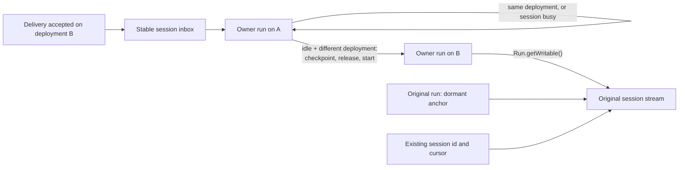

# Single-workflow sessions with ingress-driven upgrades

## Summary

eve runs each session as a long-lived Workflow run that pins the session's stable command hooks,
but that run does not execute conversational turns. Every turn is dispatched to a child turn
workflow on the deployment that accepted the channel request, and the two runs coordinate through a
private driver/child protocol: turn-control hooks, `NextDriverAction` transport, a driver-side
execution cursor, cross-run cancellation forwarding, and versioned turn-workflow inputs. That
topology guarantees a turn executes the same code that authenticated its request, at the cost of an
extra workflow start and several control round trips per turn. [Turn performance](./turn-performance.md)
identifies this as the largest remaining fixed cost: a benchmark-only inline prototype cut warm
p50 by 63.5%.

This proposal collapses the topology to one run. The session's owning workflow executes `turnStep`
directly and services its own inbox. Code alignment moves from every turn to the rare moment it
matters: when a delivery arrives from a different deployment and the session is idle, the owner
hands the settled session to a successor run on that exact deployment. The public session id,
stream, and `send()` / `respond()` APIs do not change, and no upgrade API, route, or channel
operation is added.

The tradeoff is explicit. Ordinary turns lose the cross-run overhead. The first eligible turn after
a deployment pays for the handoff, and a session with live work stays on its current deployment
until it is idle again. The first version ships with a known no-owner interval during handoff and
requests an atomic handoff primitive from Workflow in parallel.

## Current topology

```text
channel request accepted on deployment B
  -> stable session hook (owner run, started on deployment A)
  -> owner dispatches a child turn run on B            (dispatch-turn-step.ts)
  -> child claims private turn-control hooks           (turn-control-protocol.ts)
  -> child runs the turnStep loop, reporting NextDriverAction per step
  -> owner adopts state via TurnExecutionCursor, forwards cancel and deliveries
  -> child settles; owner disposes the control hook only after the next turn settles
```

The same-deployment path in [`inline-turn.ts`](../packages/eve/src/execution/inline-turn.ts) is a
half-step toward this proposal: it runs `turnStep` in the owner until a step needs coordination or
reaches another deployment, then falls back to the child through `requiresChildDispatch`. Both
paths must stay correct, so the fallback adds a third execution mode instead of removing one.

Everything below `turnStep` is unaffected by the topology. The harness, tool execution,
coordination handlers, and the independent durable runs for tasks, subagents, authored workflow
tools, timeout, and activity collection are identical in both designs.

## Target topology



One owner run executes the session:

```text
claim the stable inbox and timeout
loop:
  wait for a command
  if it is a conversational delivery from another deployment and the session is idle:
    attempt handoff; on skip or failure, continue here
  run turnStep, racing the active step against the inbox for queue, steer, cancel,
    clear, compact, and reset
  apply coordination: task acks, workflow-tool and subagent results, input,
    authorization, cancellation rollback, caller settlement
  adopt state through the one SessionStateCursor
finalize once
```

Public identity and execution ownership become separate internal facts:

```ts
interface SessionOwnership {
  readonly sessionId: string; // original run id; public stream location
  readonly ownerRunId: string; // current execution run; changes on handoff
  readonly deploymentId: string; // exact deployment of the current owner
}
```

### Ownership

| State or behavior                                                           | Sole owner                 |
| --------------------------------------------------------------------------- | -------------------------- |
| Stable inbox, continuation alias, timeout claim, terminal event             | Current owner run          |
| Durable session snapshot, event sequence, remaining limits                  | Current owner run          |
| `turnStep` execution, coordination waits, cancellation rollback, settlement | Current owner run          |
| Public stream lifetime                                                      | Original run (anchor)      |
| Task, subagent, and authored workflow-tool bodies                           | Their own runs (unchanged) |
| Model history, tool projection, approvals, public action events             | Harness (unchanged)        |

The harness never resolves runs or hooks. Ingress never coordinates handoff; it stamps deployment
metadata and resumes the inbox.

## Upgrade semantics

The package-owned channel handler already stamps trusted `acceptedDeploymentId` on every delivery,
and `send()` / `respond()` carry it through the inbox. Today that value selects where the child
turn runs. Here it is only a signal that newer (or rolled-back) code is receiving traffic; it does
not require the accepting deployment to execute that delivery.

The owner evaluates the signal once, when it first observes a conversational delivery and before
buffering or applying it. Handoff is attempted only when both hold:

- the delivery's deployment differs from the owner's, and
- the session is idle: the triggering delivery is the only unprocessed command.

Idle excludes all of the following:

- other pending, buffered, or queued commands or deliveries, including a batched arrival;
- an active model or tool step, cancellation rollback, or caller/result settlement;
- pending human input or authorization, including waits surfaced by descendants;
- any live task, subagent, or authored workflow tool, including background work;
- pending coordination, result application, or callback processing for that work.

Unknown eligibility means skip. Session-lifetime timeout and activity collection are
infrastructure, not agent work, and do not affect eligibility.

When either condition fails, the owner processes the delivery under the existing queue/steer policy
and forgets the signal. There is no latched target, no coalescing of deployment signals, and no
re-check when a turn settles or a backlog drains. Only a later delivery that is independently
eligible can trigger an upgrade, so a continuously busy session may stay on old code indefinitely.

That rule is the core simplification. Remembering a target and pursuing it later means moving live
waits, callback ownership, and task handles between deployments, which is a cross-version
coordination protocol: the thing this proposal deletes. Deferring to the next idle delivery costs
nothing in protocol and only delays code alignment for busy sessions.

HITL responses, tool and subagent results, cancellation, reset, clear, and compact never trigger
upgrades. eve never cancels or restarts work to make a session eligible.

### Exact deployment selection

Every eve-owned Workflow start receives an exact deployment id from trusted ingress or from its
current owner. A missing id and the `"latest"` selector are rejected, and eve performs no
latest-deployment lookup, because a lookup can select a deployment other than the one that
authenticated the request. Local development supplies a trusted build-generation id in the same
role.

## Checkpoint

An eligible attempt builds a `SessionCheckpoint` from the existing durable snapshot plus settled
context and lifecycle metadata:

- private model history, raw authored state, memory, sandbox attachment;
- auth and initiator context, output schema, compaction accounting;
- event sequence, remaining limits, continuation alias, original deadline.

The single triggering delivery travels alongside the checkpoint. The checkpoint never carries a
command backlog, live waits, callback ownership, or task/subagent/tool handles; the eligibility rule
guarantees none exist.

The successor rebuilds instructions, models, tools, skills, and compiled configuration from its own
bundle. It rejects a checkpoint it cannot read. There is no migration chain and no author-facing
state migration API, so raw `defineState` values must remain readable by the target code. The
public event stream is not a checkpoint (it omits private history and framework state), and the
design needs no per-turn snapshot store: the upgrade copies one settled snapshot when it is needed.

## Handoff

The first version releases hooks before starting the successor. This avoids a claim race between
two live owners; it does not provide atomic transfer (see [Open questions](#open-questions-and-upstream-request)).

1. Stage the checkpoint and the triggering delivery. The old run stays alive for recovery and
   starts no further turn work.
2. Dispose the session inbox hooks and account for every payload accepted up to disposal. If any
   other command arrived before release completed, abandon the upgrade, reclaim the inbox, and
   process the accepted commands there in order. A backlog is never transferred to salvage an
   upgrade.
3. After release and a final safety check, start a candidate on the triggering delivery's
   deployment with the checkpoint, the stable session identity, and the original stream. The
   candidate validates and hydrates, then claims the full required hook set. It performs no model
   or tool work until it owns every hook.
4. The candidate activates and processes the triggering delivery before any later arrival.
5. Once activation is confirmed, the old owner exits, or parks as the stream anchor if it is the
   original run. Recovery after activation belongs to the successor.

On failure before activation, the old owner reclaims the hooks and processes the triggering
delivery itself, but only after confirming the candidate cannot activate and has released any
partial claims. Uncertain start or activation is resolved before retrying or recovering; two owners
never run at once.

## Stream lifetime

Workflow closes a run's streams when the run completes, so the original run must outlive every
successor for the public stream to stay open. Successors append through `Run.getWritable()` on the
original run's handle, and hook metadata carries `sessionId` separately from the hook owner's run
id.

After its first handoff the original run releases the public hooks and parks on a single terminal
hook. It performs no agent execution, command routing, or background processing. Intermediate
owners exit after handing off, so at most two runs exist per session: the anchor and the current
owner. At session end the owner runs cleanup and emits its final events, then wakes the anchor to
close the stream. Upgrades never extend the session deadline.

The upstream replacement is a global stream independent of any run's lifetime. Adopt it when
available and delete the anchor. Keep the anchor mechanics behind the session runtime boundary so
public identity, streaming, and cursors are unaffected either way. Global streams are follow-up
work, not a prerequisite.

## Open questions and upstream request

Known first-version limitation: the existing [hook helpers](../packages/eve/src/execution/hook-ownership.ts)
dispose and claim in separate durable commits, so steps 2–3 above leave an interval with no hook
owner that spans candidate startup and hydration. Deliveries and controls in that interval may
need to retry. Two guarantees still hold: accepted commands are never silently dropped, and two
owners never activate. Continuous hook resolution is not guaranteed until the upstream primitive
exists.

Still to settle:

- How the SDK exposes payloads accepted by a hook between the checkpoint position and its
  disposal. Step 2 depends on a reliable final drain, and the earlier successor-run prototype
  showed this is the hard race. If disposal cannot expose them, abandon-and-reclaim is
  insufficient and handoff must wait for the primitive.
- Ingress behavior during the no-owner interval. Today a missing hook reads as an inactive or
  absent session. Bounded retry is required, and ingress must never create a replacement session
  for one that is upgrading.
- `Run.getWritable()` availability. The repo pins `@workflow/core` 5.0.0-beta.48 and uses only the
  body-local `getWritable()`; cross-run appends need the newer API and an SDK upgrade before
  implementation.
- Exact deployment selection across local build generations.

Upstream request, made in parallel and not a prerequisite for starting: an atomic,
replay-idempotent hook handoff. Inputs: expected owner, handoff id, successor, hook set, and inbox
position. Guarantees: fence the old owner, preserve every accepted payload, resolve tokens
continuously, and return the same activation result on replay across the whole multiplexed inbox,
with uncertain activation resolvable by handoff id. When available it replaces the release/start
gap inside the handoff boundary without touching ordinary execution.

## Internal boundaries

These are eve-owned internal contracts inside `execution/`, not public APIs. Each exists to absorb
a deleted path, not to wrap the Workflow SDK generally.

| Contract                                                                                                                                                                   | Replaces                                                                                                           | Responsibility                                                                                                                                        |
| -------------------------------------------------------------------------------------------------------------------------------------------------------------------------- | ------------------------------------------------------------------------------------------------------------------ | ----------------------------------------------------------------------------------------------------------------------------------------------------- |
| `SessionExecution`: `runTurn(delivery) → TurnOutcome`                                                                                                                      | `turn-dispatch.ts`, `dispatch-turn-step.ts`, the inline/child split, turn-owned coordination in `turn-workflow.ts` | Run `turnStep`, service the inbox, coordinate waits, settle locally. No driver messages.                                                              |
| `SessionCommandInbox` (extend existing)                                                                                                                                    | Turn-control hooks and `TurnControlReceiver`                                                                       | Order accepted commands across stable, continuation, and authorization/callback hooks; expose a durable position; transfer ownership. No turn policy. |
| `SessionHandoff`: `checkpoint(delivery) → ready(checkpoint) \| skipped(reason)`, `release()`, `start(checkpoint) → candidate`, `activate(candidate)`, `recover(candidate)` | New                                                                                                                | Eligibility, hydration on the target, replay-safe transfer through the inbox. The only boundary that changes when the upstream primitive lands.       |
| Session-owner start and stream operations in the existing `workflow-runtime.ts`                                                                                            | Per-turn `start()` of the child turn workflow                                                                      | Start an exact-deployment owner; open and close session output; keep workflow-body and step-side execution contexts distinct.                         |

`workflowEntry` remains the composition root and owns lifecycle and cleanup. `SessionExecution`
adopts step results through the one shared `SessionStateCursor`.

## Deletion ledger

The result must have fewer execution paths, not the old topology behind new interfaces.

- `turn-dispatch.ts`, `dispatch-turn-step.ts`, and the inline/child split in `inline-turn.ts`.
- The conversational turn workflow entrypoint, registration, and legacy runner in
  `turn-workflow.ts`; the coordination it owns moves into `SessionExecution`.
- `turn-control-protocol.ts`, `turn-control-receiver.ts`, private turn-control hooks, cross-run
  cancellation forwarding, and deferred control-hook disposal. Local abort, rollback, and
  settlement behavior stay.
- `TurnExecutionCursor` driver reporting and `NextDriverAction` transport. The shared state cursor
  and typed step outcomes stay, minus deployment-skew transport fields.
- Turn-workflow input migrations, driver-capability branches, and inbox wire versions v0–v6 with
  their encoders and migration chains. Step types still needed move out of transport modules.

Transport cutover is clean: new sessions use one stable ingress envelope with required deployment
metadata, and legacy driver/child sessions expire or reset rather than entering a bridge. Ingress
can still be newer than a busy owner, so the owner validates that one envelope and rejects
unsupported commands instead of translating them. Nothing deleted here is replaced by wait
migration, callback rebinding, or cross-version coordination.

## Out of scope

- The background pump. It is a follow-up informed by the holder-runtime refactor in
  [PR #3063](https://github.com/vercel/eve/pull/3063); that runtime, background write queues,
  detached persistence, per-turn snapshot storage, and a general holder are not ported here.
- Public upgrade or state-migration APIs: `Session.upgrade()`, a channel operation, or a route.
- A session directory and caller-assigned run ids. Separating `sessionId` from `ownerRunId`
  prepares for eve-owned run ids without requiring them.
- Changes to `turnStep`, harness semantics, or the independent runs for tasks, subagents, workflow
  tools, timeout, and activity collection.

## Invariants

- The owner run and the authored agent code it executes come from the same deployment.
- Exactly one owner is activated for a session at any time.
- Accepted commands are processed in FIFO order and never dropped, including across a handoff
  attempt.
- Handoff never duplicates model or tool work.
- No Workflow start uses `"latest"` or an absent deployment id.
- No upgrade state survives a skipped attempt; there is no remembered target.
- The public session id, stream, and cursor semantics are unchanged by any number of upgrades.

## Validation

- Same-deployment turns, including coordination waits and cancellation, run on one owner with no
  child turn run or private control hooks. Assert the deleted paths are unreachable.
- An eligible A→B delivery starts one successor on B and preserves identity, connected stream and
  cursor, settled state, limits, and deadline. Owner and authored code report B. An unreadable
  checkpoint recovers A's ownership and processes the delivery once.
- Every unsafe category skips: parked HITL, background tasks, batched deliveries, queued commands.
  Work stays on A. Settlement and queue draining trigger nothing; only a fresh eligible delivery
  does. No remembered target or live handle crosses versions.
- Inject concurrent deliveries and replay failures at every handoff step. Verify FIFO order, no
  lost accepted commands, no duplicated model/tool work, and one activated owner. Cover
  disposal-time arrivals, partial claims, failed starts, and uncertain activation.
- During the no-owner interval, ingress retries within bounds and never creates a replacement
  session. With the upstream primitive, additionally assert continuous hook resolution, including
  mixed-deployment bursts and rollbacks.
- Queue, steer, cancel, clear, compact, reset, timeout, input, authorization, task, subagent, and
  workflow-tool behavior are unchanged before, during, and after an upgrade.
- With the upgraded SDK, cross-run appends and replay preserve connected readers and cursors
  locally and hosted. Repeated upgrades leave only the anchor and the current owner; intermediate
  exits do not close the stream; final cleanup closes it once.
- Missing and `"latest"` deployment selectors are rejected, and local build-generation upgrades
  work. Use integration/scenario tests for ownership and replay, plus deterministic fixture evals
  in CI for HTTP delivery and streaming.
- The paired hosted [turn-performance benchmark](./turn-performance.md) improves warm
  same-deployment one-step p50 by at least 30% and 750 ms with at most a 10% p95 regression.
  Upgrade-turn latency is reported separately and excludes background-pump work.
