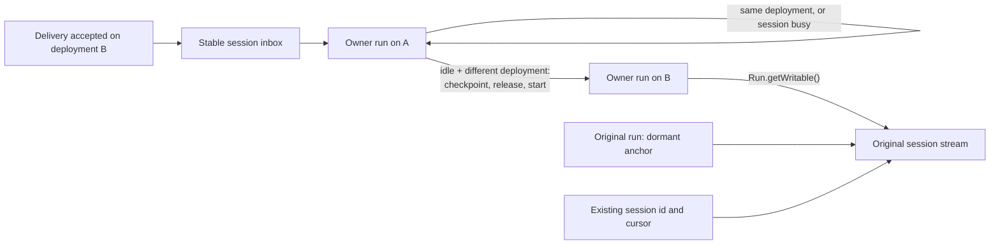

# Single-workflow sessions with ingress-driven upgrades

## Summary

eve runs each session as a long-lived Workflow run that pins the session's stable command hooks,
but that run does not execute conversational turns. Every turn is dispatched to a child turn
workflow on the deployment that accepted the channel request, and the two runs coordinate through a
private driver/child protocol: turn-control hooks, `NextDriverAction` transport, a driver-side
execution cursor, cross-run cancellation forwarding, and versioned turn-workflow inputs. That
topology guarantees a turn executes the same code that authenticated its request, at the cost of an
extra workflow start and several control round trips per turn. [Turn performance](./turn-performance.md)
identifies this as the largest remaining fixed cost: a benchmark-only inline prototype cut warm
p50 by 63.5%.

This proposal collapses the topology to one run. The session's owning workflow executes `turnStep`
directly and services its own inbox. Code alignment moves from every turn to the rare moment it
matters: when a delivery arrives from a different deployment and the session is idle, the owner
hands the settled session to a successor run on that exact deployment. The public session id,
stream, and `send()` / `respond()` APIs do not change, and no upgrade API, route, or channel
operation is added.

This is intentionally a deletion-heavy refactor, not an additive third execution mode. Large
swaths of the current conversational orchestration are expected to disappear: the child-turn
workflow, driver/child transport, private turn-control hooks, cross-run cancellation forwarding,
turn execution cursor, and deployment-skew input and migration layers. The implementation must not
preserve that topology behind compatibility interfaces; the deletion ledger below is a required
outcome of the design, while shared turn and harness behavior stays intact.

The tradeoff is explicit. Ordinary turns lose the cross-run overhead. The first eligible turn after
a deployment pays for the handoff, and a session with live work stays on its current deployment
until it is idle again. The first version shipped with a known no-owner interval during handoff;
successors now force-claim hooks in place, so the session is never unowned (see
[The no-owner interval](#the-no-owner-interval)).

## Former topology

```text
channel request accepted on deployment B
  -> stable session hook (owner run, started on deployment A)
  -> owner dispatches a child turn run on B            (dispatch-turn-step.ts)
  -> child claims private turn-control hooks           (turn-control-protocol.ts)
  -> child runs the turnStep loop, reporting NextDriverAction per step
  -> owner adopts state via TurnExecutionCursor, forwards cancel and deliveries
  -> child settles; owner disposes the control hook only after the next turn settles
```

The same-deployment path in [`inline-turn.ts`](../packages/eve/src/execution/inline-turn.ts) is a
half-step toward this proposal: it runs `turnStep` in the owner until a step needs coordination or
reaches another deployment, then falls back to the child through `requiresChildDispatch`. Both
paths must stay correct, so the fallback adds a third execution mode instead of removing one.

Everything below `turnStep` is unaffected by the topology. The harness, tool execution,
coordination handlers, and the independent durable runs for tasks, subagents, authored workflow
tools, timeout, and activity collection are identical in both designs.

## Target topology



One owner run executes the session:

```text
claim the stable inbox and timeout
loop:
  wait for a command
  if it is a conversational delivery from another deployment and the session is idle:
    attempt handoff; on skip or failure, continue here
  pump every claimed hook continuously into a merged inbox
  run turnStep; buffer incoming messages and respond to explicit cancellation
  admit steering against committed state, preserving the active turn
  apply coordination: task acks, workflow-tool and subagent results, input,
    authorization, cancellation rollback, caller settlement
  adopt state through the one SessionStateCursor
finalize once
```

Public identity and execution ownership become separate internal facts:

```ts
interface SessionOwnership {
  readonly sessionId: string; // stable public session identity
  readonly anchorRunId: string; // original run that owns the public stream
  readonly ownerRunId: string; // current execution run; changes on handoff
  readonly deploymentId: string; // exact deployment of the current owner
}
```

### Ownership

| State or behavior                                                           | Sole owner                 |
| --------------------------------------------------------------------------- | -------------------------- |
| Stable inbox, additive continuation hooks, timeout claim, terminal event    | Current owner run          |
| Durable session snapshot, event sequence, remaining limits                  | Current owner run          |
| `turnStep` execution, coordination waits, cancellation rollback, settlement | Current owner run          |
| Public stream lifetime                                                      | Original run (anchor)      |
| Task, subagent, and authored workflow-tool bodies                           | Their own runs (unchanged) |
| Model history, tool projection, approvals, public action events             | Harness (unchanged)        |

The harness never resolves runs or hooks. Ingress never coordinates handoff; it stamps deployment
metadata and resumes the inbox.

## Upgrade semantics

The package-owned channel handler already stamps trusted `acceptedDeploymentId` on every delivery,
and `send()` / `respond()` carry it through the inbox. Today that value selects where the child
turn runs. Here it is only a signal that newer (or rolled-back) code is receiving traffic; it does
not require the accepting deployment to execute that delivery.

The owner evaluates the signal once, when it first observes a conversational delivery and before
buffering or applying it. Handoff is attempted only when both hold:

- the delivery's deployment differs from the owner's, and
- the session is idle: the triggering delivery is the only unprocessed command.

Idle excludes all of the following:

- other pending, buffered, or queued commands or deliveries, including a batched arrival;
- an active model or tool step, cancellation rollback, or caller/result settlement;
- pending human input or authorization, including waits surfaced by descendants;
- any live task, active subagent turn or lease, or authored workflow tool, including background work;
- pending coordination, result application, or callback processing for that work.

Unknown eligibility means skip. Session-lifetime timeout and activity collection are
infrastructure, not agent work, and do not affect eligibility.

When either condition fails, the owner processes the delivery under the existing queue/steer policy
and forgets the signal. There is no latched target, no coalescing of deployment signals, and no
re-check when a turn settles or a backlog drains. Only a later delivery that is independently
eligible can trigger an upgrade, so a continuously busy session may stay on old code indefinitely.

That rule is the core simplification. Remembering a target and pursuing it later means moving live
waits, callback ownership, and active task or subagent leases between deployments, which is a
cross-version coordination protocol: the thing this proposal deletes. Idle subagent handles are
not leases: a `parked` conversation handle or `available` task-owned handle retains only the stable
address of an independently owned child session, so those handles move with settled session state.
Deferring to the next idle delivery costs nothing in protocol and only delays code alignment for
busy sessions.

HITL responses, tool and subagent results, cancellation, reset, clear, and compact never trigger
upgrades. eve never cancels or restarts work to make a session eligible.

### Exact deployment selection

Every eve-owned Workflow start receives an exact deployment id from trusted ingress or from its
current owner. A missing id and the `"latest"` selector are rejected, and eve performs no
latest-deployment lookup, because a lookup can select a deployment other than the one that
authenticated the request. Local development supplies a trusted build-generation id in the same
role.

## Checkpoint

An eligible attempt builds a `SessionCheckpoint` from the existing durable snapshot plus settled
context and lifecycle metadata:

- private model history, raw authored state, memory, sandbox attachment;
- auth and initiator context, output schema, compaction accounting;
- event sequence, remaining limits, the complete claimed session-hook set, and original configured timeout duration.

The single triggering delivery travels alongside the checkpoint. The checkpoint never carries a
command backlog, live waits, callback ownership, active subagent leases, or live task/tool
ownership; the eligibility rule guarantees none exist. It may carry `parked` conversation handles
or `available` task-owned handles, which retain only the stable address of an independently owned
child session. The child session itself does not move with its parent: a later continuation carries
a caller and is therefore not handoff-eligible, so the child keeps executing on the deployment that
owns it.

The successor rebuilds instructions, models, tools, skills, and compiled configuration from its own
bundle. Before claiming hooks, it shares the source's idle-state inspection: parse all retained
tasks (including settled entries) and handle state, require every retained handle to be `parked` or
`available`, and require pending-work registries to be absent or canonically empty. Task and handle
readers preserve additive metadata on updates but still validate known fields and lifecycle rules. An unreadable checkpoint is refused before activation,
so the previous owner can recover and process the triggering delivery. Authored state stays opaque. There is no migration chain and no author-facing
state migration API, so raw `defineState` values must remain readable by the target code. The
public event stream is not a checkpoint (it omits private history and framework state), and the
design needs no per-turn snapshot store: the upgrade copies one settled snapshot when it is needed.
The checkpoint carries `anchorRunId` separately from `sessionId`, so future caller-assigned session
ids do not need to identify a Workflow run.

## Handoff

The owner keeps every hook while the successor takes them over with
`createHook({ token, experimental_force: true })`. Each forced claim moves one token atomically, so
every address always resolves to a live owner.

1. Stage the checkpoint and the triggering delivery. The old run stays alive for recovery and
   starts no further turn work. If any other command is already queued, keep the session: a
   backlog is never transferred to salvage an upgrade.
2. Start a candidate on the triggering delivery's deployment with the checkpoint, the stable
   session identity, and the original stream. The checkpoint names the stable inbox and every
   continuation hook claimed during the session.
3. The candidate validates the checkpoint, then confirms a plain claim on a fence unique to this
   attempt (the activation token plus the trigger's delivery id). A start step can run twice, and
   forced claims would let the second start take the session from the first; the start that loses
   the fence exits without touching the session. The fence registers alongside validation and is
   read after it, so validation still runs inline.
4. The candidate force-claims that exact hook set and waits for the claims to register before it
   activates. A World refuses to take hooks from a run started below spec 8, and that refusal must
   surface before the old owner is told to leave. The candidate performs no model or tool work until
   it owns every hook, and processes the triggering delivery before any later arrival.
5. On activation the old owner's readers have already delivered everything their hooks accepted
   before the takeover. The old owner forwards those commands to the successor in acceptance
   order, then exits, or parks as the stream anchor if it is the original run. Forwarded commands
   trail anything that reached the successor directly in the moment between takeover and
   forwarding.

On failure before activation nothing was taken, so the old owner keeps every hook and processes the
triggering delivery itself.

The handoff version decides which protocol applies. A successor started by a version 2 source (or
later) runs on a Workflow spec that can be taken from, and uses the takeover above for its own
handoffs. A successor of a version 1 source, or an imported pre-cutover session, was started by an
older SDK and cannot be taken from. Those owners keep the unchanged release-first path in
`session/legacy-handoff.ts` (see [The no-owner interval](#the-no-owner-interval)), and a version 1
successor claims without force. A takeover source whose successor cannot force-claim, such as an
older target during a rollback, fails activation and keeps the session.

## Stream lifetime

Workflow closes a run's streams when the run completes, so the original run must outlive every
successor for the public stream to stay open. Successors append through `Run.getWritable()` on the
original run's handle, and hook metadata carries `sessionId` separately from the hook owner's run
id.

After its first handoff the original run releases the public hooks and parks on a single terminal
hook. It performs no agent execution, command routing, or background processing. Intermediate
owners exit after handing off, so at most two runs exist per session: the anchor and the current
owner. At session end the owner runs cleanup and emits its final events, then wakes the anchor to
close the stream. Each successful handoff or legacy import restarts the original configured
timeout duration. Disabled timeouts stay disabled; failed or skipped handoffs retain the
existing deadline. The current owner ignores timeout wakes before its own deadline.

The upstream replacement is a global stream independent of any run's lifetime. Adopt it when
available and delete the anchor. Keep the anchor mechanics behind the session runtime boundary so
public identity, streaming, and cursors are unaffected either way. Global streams are follow-up
work, not a prerequisite.

## Open questions and upstream request

### The no-owner interval

The branch carries no `@workflow/core` patch. `@workflow/core` ≥ 5.0.0-beta.51
landed with [vercel/workflow#3941](https://github.com/vercel/workflow/pull/3941),
which drains released step stream writers before recording `step_completed`;
the `persists model output before settlement…` integration test in
`session/entry.integration.test.ts` covers it.

Forced hook claims close this interval for takeover handoffs. It remains only
on the legacy release-first path, which releases every hook before starting the
successor, so candidate startup and hydration run with no hook owner. That path
closes the observable consequences of the interval without an upstream
primitive:

- **Handoff markers.** Before releasing, the owner claims
  `eve:inbox:handoff:<token>` for every address in its claim set and disposes
  the markers once the transfer has either activated or been recovered. Ingress
  (`session-inbox/resume.ts`) treats "hook not found, marker present" as
  "retry within a bounded window" and "hook not found, no marker" as "no
  session". A channel therefore never starts a replacement session for an
  alias that is mid-handoff, and alias-bearing sessions hand off like
  ID-addressed ones.
- **Accepted-during-release drain.** `release()` commits `hook_disposed`
  durably before stopping the readers, and the SDK delivers every event
  accepted before that commit to the iterators first, so the payloads the
  hooks accepted but the owner never read are returned and either restored on
  the retained owner or handed to the successor.

Two guarantees hold: accepted commands are never silently dropped, and two
owners never activate. Once no owner can have been started by a version 1
source or a pre-cutover driver, delete `session/legacy-handoff.ts`, the markers,
and the ingress retry loop.

## Internal boundaries

These are eve-owned internal contracts inside `execution/`, not public APIs. Each exists to absorb
a deleted path, not to wrap the Workflow SDK generally.

The owner program lives in `execution/session/`:

| Module                           | Responsibility                                                                                                                                                                                         |
| -------------------------------- | ------------------------------------------------------------------------------------------------------------------------------------------------------------------------------------------------------ |
| `entry.ts`                       | `workflowEntry`: boots an initial or handoff owner into one `SessionBoot`, then runs the program.                                                                                                      |
| `program.ts`                     | The owner loop: runs turns, waits for the next input, tries handoff, finalizes once, and reports to whichever anchor holds the stream.                                                                 |
| `turn.ts`                        | `SessionExecution.runTurn`: runs `turnStep` until the turn settles, admitting inbox traffic at committed boundaries. `ActiveTurn` owns cancellation and steering for one turn.                         |
| `turn-step.ts`                   | The `"use step"` body for one bounded batch of model calls.                                                                                                                                            |
| `input-queue.ts`                 | The one ordered queue of admitted deliveries, controls, and authorization callbacks, plus task-delivery idempotency and cancellation facts. Decides what the next turn is and whether it may hand off. |
| `admission.ts`                   | Decodes one inbox payload into a queue admission; no turn policy.                                                                                                                                      |
| `next-input.ts`                  | Waits for the next input a parked owner must act on.                                                                                                                                                   |
| `state-cursor.ts`                | The one mutable context/state pair; claims every hook the state names before publishing a transition.                                                                                                  |
| `hook-tokens.ts`                 | Derives the full hook claim set from committed state. Used by boot, every transition, handoff, and legacy import.                                                                                      |
| `handoff.ts`, `handoff-steps.ts` | The `SessionHandoff` contract shared by both strategies, and the durable steps they call.                                                                                                              |
| `takeover-handoff.ts`            | The takeover strategy: start the successor, which fences its attempt and force-claims every hook, then forward what arrived before the takeover.                                                       |
| `legacy-handoff.ts`              | The unchanged release-first strategy for owners started by a version 1 source or a pre-cutover driver: markers, release, start, activate, recover.                                                     |
| `finalization.ts`                | The single terminal path for done, expired, and failed sessions.                                                                                                                                       |
| `event-sink.ts`                  | Binds adapter context, dynamic connections, and event fan-out to one step's stream writer.                                                                                                             |
| `timeout*.ts`                    | The durable deadline timer, stamped with the arming owner so a successor ignores a predecessor's wake.                                                                                                 |

`session-inbox/` is transport only: `inbox.ts` merges every claimed hook into one FIFO and pushes
interrupts to the active turn the moment they are accepted; `resume.ts` is ingress; `address.ts`
owns token namespacing. `legacy-session/` imports a pre-cutover driver's session into this program
and is the only module that knows the former wire shapes.

## Deletion ledger

The result must have fewer execution paths, not the old topology behind new interfaces.

The current inbox implementation lives in `execution/session-inbox/`: `inbox.ts`
owns the pump, `protocol.ts` normalizes commands, `address.ts` defines identity,
and `resume.ts` owns resume-first delivery and lazy identity resolution.
Session checkpoints require embedded program memory; there is no `eve.session`
stream fallback, snapshot migration registry, or duplicate snapshot version.
The state-level version only rejects incompatible handoffs. Client event-stream
versions remain separate because stored output survives deployments.

- `turn-dispatch.ts`, `dispatch-turn-step.ts`, and the inline/child split in `inline-turn.ts`.
- The old turn engine in `turn-workflow.ts`; its coordination moves into
  `SessionExecution`. The stable `turnWorkflow` name remains only as an import entrypoint.
- `turn-control-protocol.ts`, `turn-control-receiver.ts`, private turn-control hooks, cross-run
  cancellation forwarding, and deferred control-hook disposal. Local abort, rollback, and
  settlement behavior stay.
- `TurnExecutionCursor` driver reporting and `NextDriverAction` transport. The shared state cursor
  and typed step outcomes stay, minus deployment-skew transport fields.
- Turn-workflow input migrations, driver-capability branches, and inbox wire versions v0–v6 with
  their migration chains. Historical decoding and outbound encoding live only in
  `execution/legacy-session/`. Step types still needed move out of transport modules.

Transport cutover is clean: new sessions use one stable ingress envelope with required deployment
metadata, and legacy driver/child sessions enter the isolated one-time import in `execution/legacy-session/` on their next turn dispatch. The import preserves committed conversation data and interrupts pending execution; old drivers remain stream anchors until final completion. Import supports drivers from eve 0.45 onward (wire versions 1–7, turn-input versions 1–2, embedded snapshots); an older driver is reported inactive so its channel starts a fresh session. Ingress
can still be newer than a busy owner, so the owner validates that one envelope and rejects
unsupported commands instead of translating them. Nothing deleted here is replaced by wait
migration, callback rebinding, or cross-version coordination.

## Alias and steering follow-through

Channel handlers add addresses with `session.continuation.alias(rawToken)`
or `channel.continuation.alias(rawToken)`. The runtime namespaces the token,
records it in the serialized context, and claims every new address when the
step commits. The most recently selected alias is exposed as `continuation.token`;
all earlier addresses remain valid. There is no rekey API or replacement claim.
The checkpoint names the stable session inbox explicitly and carries continuation aliases separately.

Each claimed hook has one continuously running iterator reader. Readers merge
accepted payloads into one FIFO while model and tool steps run and never
pause on queue depth, so a cancel is never held behind unread input. A cancel
or reset is pushed to the active turn the moment the reader accepts it, so the
running step aborts immediately; its durable side effects apply when the
queued command is admitted at the next boundary. Authorization callbacks are
ordinary queue entries keyed by attempt; the queue resumes a challenge once
every expected attempt has reported and drops callbacks for replaced attempts.
Handoff moves the entire claim set and forwards accepted, unconsumed payloads
to the successor.

`TurnRouting` admits input from the session's one queue only against committed state.
`steer` preserves completed work, turn identity, and accumulated usage.
`queue` remains pending until settlement. A different delegated caller also
waits for its own turn. Runtime results and addressed responses retain their
existing routing. Explicit cancellation uses the abort signal; steering does not.

Steering applies only while the turn is still open: `turnStep` returned
`continue` and the model wants another step. The harness emits `turn.completed`
and `session.waiting` itself inside the settling step, so a message that arrives
after the model produced its answer starts the next turn. This matches what
other harnesses do and costs no extra durable step per turn. Model-call batching
defines the checkpoint interval and therefore the steering latency.

This follows the holder attempt's continuous-reader boundary without adopting
its separate holder and turn topology or its deferred settlement. Upstream
`step-delivery-ordering.test.ts`, `step-delivery-hop-count.test.ts`, and
`delivery-barrier-coverage.test.ts` cover iterator delivery order against cached
step results and other hooks, including layered async consumers. eve additionally
tests merged alias bursts while the owner is waiting, same-turn steering,
cancellation followed by new input, and clients following settlement races.

## Unified inbox and resume-first delivery

`SessionInbox` owns the additive address set and one merged queue. Commands,
authorization callbacks, and workflow-tool messages share that transport.
Authorization eligibility is a message-routing rule, not a second hook source.
`TurnRouting` owns turn policy and cancellation, not another transport buffer.
Independent background task workflows keep their own executor inboxes.

Startup claims one stable hook plus the initial alias, if present. The SDK also
creates an `abrt_*` hook when serializing the active turn's abort signal into a
step. That hook carries explicit cancellation, never steering. The original
owner creates its terminal anchor hook only when it attempts handoff. Handoff
activation remains a separate, handoff-only acknowledgement hook. The deadline
workflow starts concurrently with the initial turn, and both operations are
settled before leaving startup. A successor starts a new deadline from activation using
the original configured duration, and the previous owner cancels its timer.

Ingress calls `resumeHook(token, command)` directly. The returned receipt carries
the owning run ID and lazy `{ sessionId }` metadata. Only alias callers asking
for a Session handle hydrate that metadata, after resumption. Known-session
requests and internal fire-and-forget senders never hydrate it. Missing metadata
is an identity error after acceptance, not permission to resend or create a run.
`getRawHookByToken` is deleted: the SDK's standard lookup is already lazy.

The only explicit hook lookups left in eve are requested alias resolution,
reset's release acknowledgement, and replay-idempotent background-task ownership
resolution. Registration barriers remain for competing claims and callbacks
that must be registered before another run can signal them. Claims within an
adoption or handoff batch run together rather than one durable barrier per alias.

The [network-hop map](./session-network-hops.html) and its
[machine-readable data](./session-network-hops.json) distinguish source-derived
operations, cache-dependent work, and model-start dependencies. They do not
claim measured latency or a fixed count for arbitrary authored integrations.

## Out of scope

- The general holder topology from [PR #3063](https://github.com/vercel/eve/pull/3063), background
  write queues, detached persistence, and per-turn snapshot storage are not ported here.
  Its continuously owned inbox readers and deferred settlement inform the session pump.
- Public upgrade or state-migration APIs: `Session.upgrade()`, a channel operation, or a route.
- A session directory and caller-assigned session ids. Separating `sessionId`, `anchorRunId`, and
  `ownerRunId` keeps that future change from depending on Workflow run identity without adding the
  directory here.
- Changes to the independent runs for tasks, subagents, workflow tools, timeout, and activity collection.

## Invariants

- The owner run and the authored agent code it executes come from the same deployment.
- Exactly one owner is activated for a session at any time.
- Accepted commands are processed in FIFO order and never dropped, including across a handoff
  attempt.
- Handoff never duplicates model or tool work.
- No Workflow start uses `"latest"` or an absent deployment id.
- No upgrade state survives a skipped attempt; there is no remembered target.
- The public session id, stream, and cursor semantics are unchanged by any number of upgrades.

## Validation

- Same-deployment turns, including coordination waits and cancellation, run on one owner with no
  child turn run or private control hooks. Assert the deleted paths are unreachable.
- An eligible A→B delivery starts one successor on B and preserves identity, connected stream and
  cursor, settled state, limits, timeout duration, and every claimed session hook. Owner and authored code
  report B. An unreadable checkpoint recovers A's ownership and processes the delivery once.
- Every unsafe category skips: parked HITL, background tasks, active subagent turns or leases,
  batched deliveries, and queued commands. Work stays on A. Settlement and queue draining trigger
  nothing; only a fresh eligible delivery does. No remembered target or active handle crosses
  versions.
- `parked` conversation handles and `available` task-owned handles cross with settled state. The
  successor can resume them by stable child address, while the child continues on the deployment
  that owns it.
- Inject concurrent deliveries and replay failures at every handoff step. Verify FIFO order, no
  lost accepted commands, no duplicated model/tool work, and one activated owner. Cover
  disposal-time arrivals, partial claims, failed starts, and uncertain activation.
- During the no-owner interval, ID-addressed ingress retries within bounds and never creates a
  replacement session. With the upstream primitive, additionally assert continuous alias resolution, including
  mixed-deployment bursts and rollbacks.
- Queue, steer, cancel, clear, compact, reset, timeout, input, authorization, task, subagent, and
  workflow-tool behavior are unchanged before, during, and after an upgrade.
- With the upgraded SDK, cross-run appends and replay preserve connected readers and cursors
  locally and hosted. Repeated upgrades leave only the anchor and the current owner; intermediate
  exits do not close the stream; final cleanup closes it once.
- Missing and `"latest"` deployment selectors are rejected, and local build-generation upgrades
  work. Use integration/scenario tests for ownership and replay, plus deterministic fixture evals
  in CI for HTTP delivery and streaming.
- The paired hosted [turn-performance benchmark](./turn-performance.md) improves warm
  same-deployment one-step p50 by at least 30% and 750 ms with at most a 10% p95 regression.
  Upgrade-turn latency is reported separately and excludes background-pump work.
