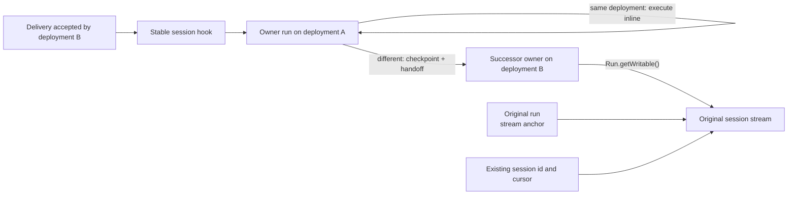

# Single-workflow sessions with ingress-driven upgrades

## Summary

eve currently keeps a long-lived session workflow pinned while dispatching every conversational
turn to a child workflow on the deployment that accepted the channel request. That preserves code
alignment across deployments, but it also requires a permanent driver/child protocol for state
transfer, cancellation, coordination, hook ownership, version skew, and result settlement. The
extra workflow start and control round trips are the largest remaining fixed cost identified in
[turn performance](./turn-performance.md).

Replace that topology with one workflow that executes conversational turns inline. Ordinary turns
continue in the current session owner. When an inbound delivery was accepted by a different
deployment, the owner moves the settled session to a successor on that exact deployment before
continuing whenever it can do so safely.

This reuses the deployment signal already carried from the HTTP channel handler through session
hook resumption. It does not add `Session.upgrade()`, `ClientSession.upgrade()`, a new channel
operation, or an upgrade route. The first delivery through a new production deployment becomes the
upgrade request. Clients keep using the existing `send()` and `respond()` APIs.

An upgrade preserves the public session id and stream. The original run becomes a dormant stream
anchor after the first upgrade, while the current owner appends through Workflow's
`Run.getWritable()`. Only the original anchor and current owner remain active after any number of
upgrades; intermediate owners exit. Independently durable work remains independent: tasks,
subagents, authored workflow tools, timeout, and activity collection still use their own workflow
runs.

This intentionally makes the first eligible delivery after a deployment slower in exchange for a
substantially smaller and faster ordinary-turn path. An owner-bound wait or incompatible checkpoint
can delay alignment, so the first post-deployment delivery is not an unconditional guarantee that
new code executes.

## Upgrade trigger

The existing request path already carries the required trusted signal:

1. The package-owned channel handler reads `VERCEL_DEPLOYMENT_ID` and stamps it as
   `acceptedDeploymentId` in `ChannelDeliveryMetadata`.
2. `send()` and `respond()` preserve that metadata while encoding for the persisted inbox version
   understood by the current owner.
3. The session owner receives the decoded delivery through its stable or continuation hook and
   compares the accepted deployment with its own recorded deployment.

When the values match, the owner executes the turn inline. When they differ, the delivery latches
the accepted deployment as the desired owner and initiates handoff at the next safe boundary. The
delivery that revealed the mismatch remains ordered with every other session command and is
consumed exactly once by either the successor or, if handoff cannot complete, the old owner.

The successor starts on `acceptedDeploymentId`, the exact deployment that parsed and authenticated
the request. Rollbacks and deployment-specific URLs therefore move the session to the deployment
receiving traffic.

Only deliveries trigger alignment. Cancellation and reset must keep addressing the current owner;
clear and compact may complete there and leave a latched alignment request for the next safe
boundary.

## Exact deployment selection

Every eve-owned Workflow start passes the exact deployment id supplied by trusted ingress or
inherited from its current owner. `"latest"` is forbidden because it performs a lookup and may
select a different deployment. A missing deployment id is an error.

## Execution and ownership

The stable `sessionId` and current Workflow `ownerRunId` become separate internal concepts. The
initial Workflow run id remains the public session id and stream location; successors receive that
identity rather than replacing it. Continuation-hook metadata carries the stable session id, so
resolution no longer assumes that the hook owner's run id is the public session id.

The session workflow owns its command hooks, durable state, event sequencing, and lifecycle. It
runs `turnStep` directly and races the active step against the command inbox for queue, steer,
cancel, clear, compact, and reset behavior. The coordination now owned by the child turn workflow
also moves into this loop: task acknowledgements, workflow-tool results, subagent results, human
input, authorization, cancellation rollback, and caller settlement.

The original run must remain active because Workflow closes its streams when their owning run
completes. On the first successful upgrade it releases the public command hooks, retains one
terminal hook, and parks. Later owners simply exit after handing off to a successor. The terminal
owner performs session cleanup and emits all final events before resuming the anchor's terminal
hook; the anchor then returns and closes the public stream.

## Safe boundaries

The owner attempts handoff only from a checkpoint that contains no partially applied model or tool
step. A mismatched ordinary delivery received during an active turn follows the existing queue or
steer policy to reach that boundary, then transfers before starting that delivery's model work.

Some parked state may still be bound to hooks or callbacks owned by the old deployment. An input or
authorization response needed to settle such state is interpreted by the old owner; the desired
deployment remains latched and handoff is retried immediately after the resulting safe boundary.
Independent work whose handles and callbacks survive the checkpoint can continue across handoff.
Any owner-bound work that cannot be transferred delays alignment rather than rejecting an existing
public operation or exposing a new blocker result.

If the target deployment cannot validate or hydrate the checkpoint, the candidate is cancelled and
the old owner processes the triggering delivery. This preserves session availability during an
incompatible rollback or deployment, while instrumentation records that the session remains on its
previous code. The proposal does not add an author-facing state migration API; raw authored
`defineState` values must be readable by the target code for handoff to succeed.

## Handoff

1. The current owner receives a delivery whose `acceptedDeploymentId` differs from its recorded
   owner deployment and latches the target without applying the delivery to model state.
2. At a safe boundary it projects a versioned checkpoint and starts a candidate session workflow
   on that exact deployment, passing the original stream writable and the stable session identity.
3. The candidate loads its compiled bundle and fully validates and hydrates the checkpoint before
   reporting readiness.
4. The stable command, continuation, and applicable callback hooks transfer at an exact inbox
   position. Commands through that position remain in the old owner's checkpoint or handoff batch;
   later commands resolve to the successor.
5. The successor records activation, consumes the triggering delivery and buffered commands in
   FIFO order, and becomes the only execution owner. The old owner either becomes the original
   stream anchor or exits.
6. A failure before activation cancels the candidate and leaves the old owner, hook positions, and
   buffered commands authoritative.

The checkpoint preserves committed model history, raw authored state, memory, sandbox attachment,
auth and initiator context, output schema, compaction accounting, event sequencing, remaining
limits, the continuation alias, task and subagent handles, and the original absolute deadline. The
successor rebuilds instructions, models, tools, skills, and compiled configuration from its own
bundle.

The public event stream is not a sufficient checkpoint. It intentionally omits private model
history and framework state. Persisting authoritative shared state after every turn would avoid an
upgrade-time copy, but would recreate the holder branch's storage and synchronization machinery.
The infrequent ingress-driven upgrade therefore copies one settled snapshot instead.

## Atomic handoff requirement

Workflow currently disposes an old hook and claims its replacement in separate durable commits.
The repository's successor-run prototype demonstrates both the observable no-owner gap and the
harder race where a command is accepted by the old hook after its checkpoint position. Retryable
markers cover the first case but cannot recover the second.

Automatic alignment makes application-level quiescence unusable as a production contract: the
ordinary delivery triggers the handoff, and another delivery may arrive concurrently. Do not ship a
dispose-then-claim implementation that can acknowledge and lose that second command.

The production design therefore requires an upstream atomic, replay-idempotent hook handoff. Given
a token, expected owner, handoff id, successor, and inbox position, one durable operation must fence
the old owner, preserve every accepted payload, continuously resolve the token, and return the same
result on replay. This is a correctness gate, not a reason to introduce a public upgrade API.

If Workflow cannot expose that primitive, the available fallbacks are an eve-owned stable
sequencer/relay or an explicit maintenance operation with enforced quiescence. Both retain more
ordinary-path machinery; prefer the upstream primitive before adopting either fallback.

## Simplification and compatibility

The single workflow removes the per-turn workflow start, private turn-control hooks, driver/child
state cursor, cross-run cancellation protocol, `NextDriverAction` transport, turn workflow
migrations, and compatibility code whose only purpose is ferrying state between a pinned driver and
per-turn children. It retains and repurposes accepted-deployment stamping and inbox wire
negotiation as the automatic handoff trigger.

This does not introduce a session directory, persistent per-turn snapshot store, general holder
workflow, or new TypeScript client surface. The stream anchor is the original session run and
performs no ordinary command routing after upgrade. The holder-runtime work in PR #3063 is evidence
for stream and state behavior, not the implementation base for this proposal.

Adopt a clean transport cutover. Legacy driver/child sessions expire or reset rather than entering
a bridge or dual-runtime path. New sessions use one stable inbox envelope with a required ingress
deployment id. Breaking future command changes require the target deployment to reject checkpoint
hydration safely, never reinterpret an unknown payload.

Truly eve-owned run ids are deferred. The Workflow version that adds `Run.getWritable()` still
does not accept a caller-provided run id. Separating stable session identity from current execution
ownership prepares for that SDK capability without requiring a directory now.

## Validation

- Multiple same-deployment turns execute under one session workflow run, without a conversational
  child workflow or turn-control hook.
- The existing HTTP channel path stamps the accepted deployment, and `send()` and `respond()` need
  no public API or protocol call beyond their current delivery.
- Every eve-owned Workflow start passes one exact deployment id. Missing ids and the reserved
  `"latest"` selector fail invariant checks and runtime validation without initiating a lookup.
- An A-to-B delivery starts one successor on B, preserves the session id, connected stream, cursor,
  ordered event sequence, history, raw state, memory, sandbox, limits, and deadline, and executes
  the triggering turn exactly once with B's instructions, models, tools, and skills.
- Bursts at every handoff phase preserve FIFO order without command loss, duplicate model/tool
  execution, a visible missing hook, or multiple activated successors.
- Queue, steer, cancellation, clear, compact, reset, timeout, human input, authorization, tasks,
  subagents, and workflow tools preserve their existing observable behavior while alignment is
  pending or completes.
- Deployment-specific URLs align with their accepting deployment. Candidate hydration failure and
  incompatible rollback leave the old owner usable and process the triggering delivery once.
- Repeated upgrades retain exactly one original stream anchor and one current owner.
- Local development supplies a trusted build-generation id equivalent to hosted
  `acceptedDeploymentId`, uses it for every Workflow start, and upgrades automatically across
  generations.
- A paired hosted benchmark improves warm same-deployment one-step p50 by at least 30% and 750 ms,
  with no greater than a 10% p95 regression. The first post-deployment turn is reported separately
  and may pay the full checkpoint and handoff cost.
