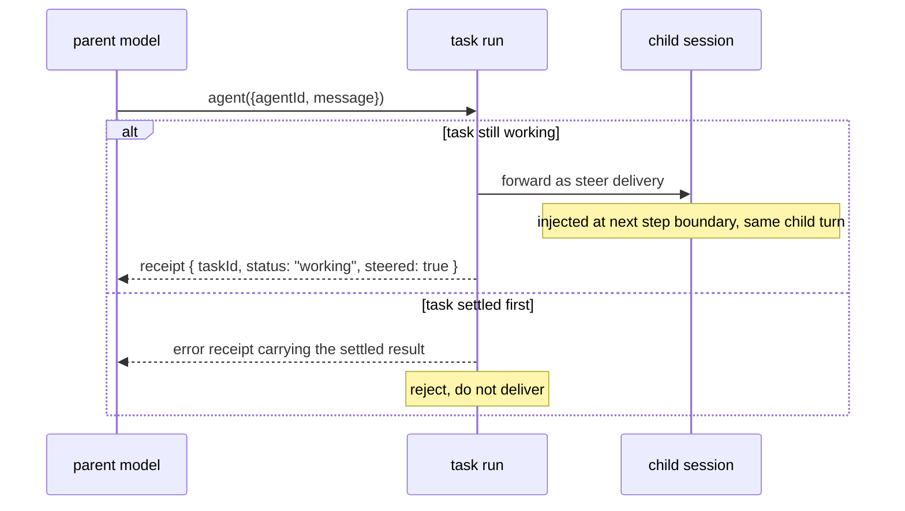

# Steering running subagents

Send a message to an agent that is already working, and have it take the
message into account without losing the work in progress.

In this document, **must**, **should**, and **may** are normative.

## Problem

Three surfaces refuse or mishandle a message to a busy agent today:

| Surface | Today | Consequence |
| --- | --- | --- |
| Subagent tool, busy child | `AGENT_BUSY` tool error | The parent can only wait or cancel; redirection is impossible |
| Channel turn, `turnPolicy: "steer"` | Buffers the message, cancels the active turn, starts a new turn | In-flight work is discarded; "steer" is really an interrupt |
| Channel turn, `turnPolicy: "queue"` | Defers to the next turn | The correction arrives after the work it meant to redirect, and a queued message can be consumed as the answer to a prompt raised after it was sent (#786) |

The missing primitive is one and the same for all three: deliver a message
into an active turn at its next safe step boundary, in the same turn, with
no cancellation. Coding agents (Claude Code, Codex CLI) already behave this
way: a mid-turn message surfaces alongside the next tool results.

## Design

### Turn policies

`TurnPolicy` becomes a three-way choice. `"steer"` changes meaning
(pre-1.0 breaking change); today's steer behavior is renamed `"interrupt"`.

| Policy | Behavior | Status |
| --- | --- | --- |
| `"queue"` | Hold until the active turn ends; start the next turn | Exists |
| `"steer"` | Inject into the active turn at its next safe step boundary; same turn id, no cancellation | This proposal |
| `"interrupt"` | Cancel the active turn; the message starts the replacement turn | Exists today under the name `"steer"` |

`DEFAULT_TURN_POLICY` stays `"steer"`, which silently upgrades default
channel behavior from destructive to non-destructive.

### Steering a subagent

No new tool and no schema change. Passing `agentId` plus `message` to a
subagent tool while that child is `working` currently fails with
`AGENT_BUSY`; it becomes a steer:

The task run is the referee for the settlement race because it is already
the single serialized writer for the task's lifecycle. Delivery is not new
either: when a child asks a question mid-run, the parent's answer already
travels from the task run into the running child
(`deliverTaskInputResponsesStep`). A steer message takes the same road;
this proposal adds one more step of that kind, not a new transport.

A task records the delegation, not the goal. Steering therefore never
changes task status: the task stays `working`, and the meaning of the work
evolves in the child's conversation, where the message lands. If a steer
amounts to a pivot, the child may refresh its ledger entry via
`task_update`; if the parent truly wants a new unit of work, `task_cancel`
plus a fresh dispatch already expresses that. No component classifies
message intent.

## Semantics

- Steered input **must** apply at the next safe step boundary of the active
  turn, under the same turn id, with no cancellation boundary. It **must
  not** interrupt an in-flight model call.
- Multiple steers **must** apply in admission order, exactly once. Every
  steer delivery carries a replay-stable delivery id (the existing
  `taskDeliveryId` pattern), so a retried durable step cannot inject twice.
- A steer **must not** implicitly answer a pending input request or tool
  approval. A message admitted before a request existed is a message, not
  an answer; only structured input responses resolve requests. This closes
  the misconsumption half of #786.
- Every steer **must** leave a durable record in the parent conversation:
  the tool call and its receipt. A parent's knowledge of its child's
  current mission is always reconstructible from the parent's own history.
- If the task settles before the steer is admitted, the steer **must** fail
  cleanly with a receipt carrying the settled result. The parent may then
  start a follow-up task; the framework **must not** silently convert the
  steer into one.
- A steer admitted between child turns (task `working`, no active turn)
  **should** start the child's next turn, i.e. degrade to queue semantics.
- A steer to a child parked on `input_required` **must** be delivered as a
  message and **must not** resolve the outstanding request.
- Remote children get the same contract over the existing callback channel.
  A pinned deployment that cannot inject **must** degrade to queue, never
  to interrupt, negotiated the way other turn capabilities already are.
- Steer deliveries **must** target the session's stable inbox token, never
  a rotating continuation alias (the #982 failure mode).

## Mechanism

Most of the machinery exists; this proposal generalizes it rather than
adding a parallel system:

- The session inbox wire already carries `turnPolicy` (v1 schema).
- The active turn already has a private inbox and a `turn-delivery-request`
  handshake that routes a delivery into a mid-flight turn without
  cancelling it, today scoped to HITL routing. Steering widens the request
  window to every safe step boundary and admits message deliveries.
- The driver's steer branch (buffer, then cancel) becomes the
  `"interrupt"` branch; the new `"steer"` branch forwards through the
  handshake and falls back to queue if the turn never reaches another
  boundary.
- Parent-to-running-child delivery through the task run already exists for
  input responses; the steer command is a sibling with the same
  local/remote split.

## Direct child access

Out of scope, deliberately. A child has no channel of its own: its inputs
are proxied from the parent, its results wake the parent, and its lifetime
ends with the parent session. Sending to a child directly would bypass the
settlement referee and break the parent-record invariant above. Child
session ids stay unexported.

This design stays forward-compatible with #1287 (a programmatic worker
handle with `send` / `status` / `stream` / `cancel`): such a handle's
`send` is exactly this steer verb and **should** route through the same
task-run admission path, exporting a capability rather than a session id.

## Delivery

Three additive stages, each independently shippable:

1. **Core injection.** The turn workflow accepts steered message deliveries
   at safe step boundaries; `"interrupt"` split out as its own policy;
   channels get true steering. Fixes #786, completes #867.
2. **Subagent steering.** `AGENT_BUSY` on `working` continuations becomes a
   steer through the task run, behind `experimental.tasks`. Receipt
   semantics as above.
3. **Remote parity.** Capability negotiation and callback-channel steer for
   remote children, aligning with the #1287 handle shape.

## Alternatives considered

- **Cancel and restart as subagent steer.** Discards in-flight work and
  duplicates side effects; retained as the explicit `"interrupt"` policy,
  rejected as the meaning of steer.
- **A new task per steer.** Requires someone to classify a message as a
  new goal; misclassification is unrecoverable, and the intent is already
  expressible with `task_cancel` plus a new dispatch.
- **A task-lifecycle steer state.** Steering does not change what state the
  work is in, only its content; MCP-aligned task status stays untouched.
- **Direct delivery to the child session, bypassing the task run.** Loses
  the settlement race referee and the parent-side record; also the #982
  addressing hazard.
