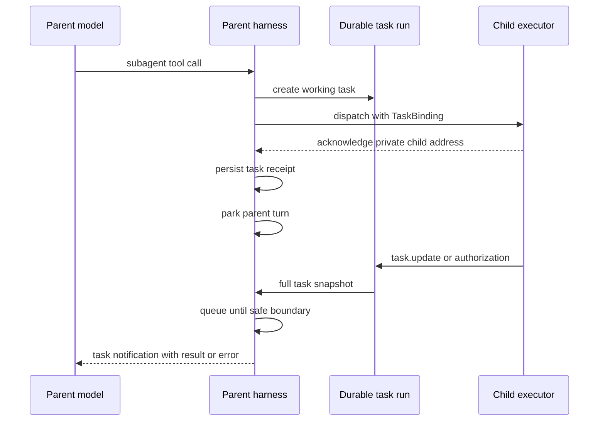

# Subagents as tasks

## Summary

Under an opt-in `experimental.tasks` mode, eve should represent long-running work as durable,
addressable tasks. This plan applies that model only to local and remote subagents. A receipt-only
subagent step records its task receipts after dispatch and parks the parent turn instead of keeping
it blocked until the children finish. A mixed step continues so the model can handle synchronous
results or dispatch failures. The parent receives result-bearing lifecycle notifications and can
cancel the task with a framework-owned tool. The child can intentionally report progress to its
parent with one framework-owned tool.

Without the flag, current subagent behavior must remain unchanged. The implementation uses a
generic background `defineTool` execution contract so the harness does not classify subagents.

This draft is based on the [Tools as Tasks proposal], the earlier background-task plan in
[PR #1085], and the storage-boundary findings from the closed [PR #1190] implementation spike.

## Current behavior

Authored tools expose `execute(input, ctx)`. Subagents are different: eve lowers them to
execute-less tools carrying `runtimeAction` metadata, then handles them after the model step
outside the authored tool API. The split is visible in the current
[`ToolDefinition` contract] and [`createNodeHarnessTools` lowering].

The harness first lets the AI SDK run ordinary tool calls. It then collects subagent tool calls
into a pending runtime-action batch. The turn workflow dispatches that batch and waits for all
results before starting the next model step. See the [runtime-action park path], the
[serial dispatch loop], and the [turn-level wait]. The dispatch loop starts children one by one;
once started, their runs proceed independently. The parent still waits for the whole batch.

Local and remote children also have different communication paths:

| Flow                              | Local child today                      | Remote child today                                                  |
| --------------------------------- | -------------------------------------- | ------------------------------------------------------------------- |
| Terminal result or failure        | Resumes the parent turn hook           | Posts `session.completed` or `session.failed` to the callback route |
| Input request, including approval | Forwarded by the subagent adapter      | No callback shape                                                   |
| Authorization event               | Forwarded by the subagent adapter      | No callback shape                                                   |
| Input response                    | Routed to the child continuation token | No callback shape                                                   |
| Cancellation                      | Descendant cancellation                | Remote `cancel-turn` request                                        |

The [local subagent adapter] forwards input and authorization events to an active parent turn.
The [remote callback route] accepts only terminal completion and failure. This is why progress
and human input cannot be added cleanly as channel-only behavior: the parent harness and remote
transport do not share a non-terminal child protocol. Current input responses use
[child response routing], while [descendant cancellation] selects separate local and remote
cancel paths.

## Goals

- Yield the parent turn after delegated work starts while the task proceeds independently.
- Wake the parent through result-bearing lifecycle notifications instead of model-paced task
  checks.
- Let a child intentionally report progress to its parent instead of leaving progress to
  channel-layer guesswork.
- Carry progress, input requests, authorization events, results, failures, and cancellation over
  one local and remote task contract.
- Keep task state durable across turns and replay.
- Preserve provider-valid history. The originating tool call receives exactly one result.
- Keep authored subagent files unchanged.
- Give local and remote subagents the same externally visible lifecycle.
- Align task status and control semantics with the MCP Tasks extension where the contracts match.

## Non-goals

- Exposing an MCP Tasks server or client endpoint in this work.
- Stabilizing the experimental background `defineTool` contract for general authored tools.
- Changing connections, skills, or dynamic workflows.
- Rolling back external side effects after cancellation.
- Retrying failed subagent work automatically.
- Streaming every progress event into model context.
- Sharing task handles across parent sessions.

## Terminology

A **task** is one unit of work with a durable identity and lifecycle. A task is not an agent
session. Terminal tasks never restart.

A **child session** is the resumable conversation owned by a delegated agent. A follow-up sent to
the same agent creates a new task bound to the same `agentId`. This matches A2A's
separation between immutable tasks and a longer-lived [`contextId`].

A **runtime action** is today's framework-internal dispatch mechanism behind execute-less tools
such as subagent calls. This plan changes how the runtime executes the two subagent kinds, not
how authored files lower to them.

A **synchronous invocation** runs inside the current harness step. Its result may trigger another
model step in the same turn.

A **background task** is owned by the parent session, not the originating turn. It may complete,
request input, or emit progress after that turn ends.

An **agent address** is the persistent identity and private routing record for one child session.
Tasks own execution lifecycle and availability; agent addresses do not duplicate `working` or
`input_required`. At most one nonterminal task may target one child session. The model-visible
`<agents>` projection keeps an occupied agent visible as busy and names its active task.

**Delegated execution** is the outcome of a background tool handing lifecycle ownership to an
external executor. The tool's `execute` returns once that executor acknowledges the work; the task
stays `working`, and every later transition arrives over the task wire.

`completed`, `failed`, and `cancelled` are terminal statuses. `input_required` is not terminal,
but it is ready for parent action. Entering either condition wakes the parent so it never
deadlocks while its child waits for input.

## Authoring contract

The root agent opts in:

```ts
export default defineAgent({
  experimental: {
    tasks: true,
  },
});
```

The flag changes only local and remote subagent calls. Every such call is registered as a
background `defineTool` definition and runs in the AI SDK tool loop. Without the flag, the same
subagent tools retain their existing `runtimeAction` path.

The generic execution contract is:

```ts
defineTool({
  execution: "background",
  async execute(input, ctx, task) {
    const executor = await startExternalWork(input, task.binding);
    return task.delegated({
      executor: executor.binding,
      receipt: executor.receipt,
    });
  },
});
```

An ordinary `execute` return completes the task with that value. `task.delegated(...)` ends the
tool call with a `working` receipt while the external executor retains lifecycle ownership. The
task runtime adds `taskId` and `status` to the tool-owned receipt.

The parent receives these framework-owned tools:

```ts
interface TaskParentTools {
  task_cancel(input: { taskIds: string[] }): Promise<TaskToolResult<boolean>>;
  task_update(input: { message: string }): Promise<{ status: "sent"; taskId: string }>;
}
```

Human responses are not a model capability. Clients answer the ordinary `input.requested` event
on the parent session, and eve routes matching responses directly to the blocked child.

The controls have distinct behavior:

- Passing `agentId` to the original subagent tool sends a follow-up after the prior task became terminal, creating a new task
  bound to the same child session. It never reopens a terminal task or answers HITL.
- `task_cancel` requests cooperative cancellation. A committed terminal state is final, so a late
  child result cannot revive a cancelled task.

There is no child-facing task tool in the first implementation. Child-to-parent lifecycle and
HITL communication is framework-owned; progress reporting remains a separate follow-up.

### Task view

```ts
type TaskStatus = "working" | "input_required" | "completed" | "failed" | "cancelled";

interface TaskView {
  readonly taskId: string;
  readonly status: TaskStatus;
  readonly statusMessage?: string;
  readonly metadata: TaskMetadata;
  readonly lastOutput?: TaskOutput;
}

interface TaskMetadata {
  readonly kind: string;
  readonly name: string;
}

type TaskOutput =
  | { readonly type: "result"; readonly data: JsonValue }
  | { readonly type: "error"; readonly data: JsonValue };
```

When `status` is `input_required`, the view must also expose the outstanding `InputRequest[]`.
Whether that becomes a discriminated `TaskView` variant or a status-specific field is an API
decision, not an implementation detail.

Task IDs are minted identifiers. They are never child session IDs, continuation tokens, callback
tokens, or authorization capabilities. A parent session owns many tasks, and lookup verifies both
the parent `sessionId` and `taskId`.

### Original call result

After durable task creation and child-dispatch acknowledgement, the originating subagent call
gets one receipt:

```json
{
  "agentId": "ag_research:...",
  "taskId": "task_01K...",
  "status": "working"
}
```

The eventual child result must not become a second result for that call. A framework-authored
task notification starts or nudges a parent turn and carries the ready state's result or error
directly. The notification is separate append-only conversation input, so history remains
provider-valid without a second read racing the queued notification.

## Task state and ownership

The mutable task record should live in a dedicated durable task run. That run is the single writer
for lifecycle transitions and appends a full `TaskView` snapshot after each accepted command.
Other paths submit commands to that run and read its snapshots.

The parent session stores only a live-task index:

```ts
interface SessionTaskIndexEntry {
  readonly metadata: TaskMetadata;
  readonly taskId: string;
  readonly taskRunId: string;
}
```

This changes one sentence in the Notion proposal, which places the record directly in durable
session state. The [PR #1190] spike found that boundary unworkable: session state is threaded
through step results, while callback routes and child executors need to update task state without
holding the current session snapshot. A task-owned run also serializes competing completion,
cancellation, and input-response transitions.

The lifecycle rules are:

```text
working <-> input_required
   |             |
   +-----> completed
   +-----> failed
   +-----> cancelled

completed, failed, and cancelled are final
```

- A background task survives turn completion and turn cancellation.
- It ends when it completes, fails, is cancelled, or its parent session ends.
- Parent-session finalization cooperatively cancels every live task before completing.
- Task cancellation commits the `cancelled` state before propagating the executor abort.
- Replayed creation for the same parent session and tool-call ID returns the same task and must not
  dispatch duplicate work.

## Delegated execution

Today, without `experimental.tasks`, the runtime parks subagent tool calls, dispatches them as a
batch after synchronous calls, and holds the turn until every action in the batch resolves (the
[runtime-action park path], [serial dispatch loop], and [turn-level wait]). With the experiment,
the AI SDK executes subagent definitions through the generic background-tool path:

1. The harness creates a durable `working` task for the subagent call.
2. It dispatches the child with the task binding.
3. The child acknowledges its private address, which is persisted on the agent record immediately.
4. Each originating call receives its receipt in durable history. The parent parks when the step
   contains only admitted task receipts; synchronous sibling results or dispatch failures continue
   the model loop.

Everything after acknowledgement — progress, input requests, authorization, terminal outcome —
arrives over the task wire instead of resolving the dispatch. Task creation, parent indexing, the
commit barrier, readiness delivery, and compensation are generic background-tool mechanisms.
Local and remote definitions own only child dispatch, agent-handle effects, and mapping the task
wire onto their executor.

### Workflow host

The dynamic-workflow sandbox drives subagent calls through the same harness tool definitions,
but its host (`createWorkflowHostTools`) still executes only `runtimeAction` tools. With
`experimental.tasks` enabled, the background subagent definitions pass the `workflowCallable`
advertising filter and are then dropped by the host, so no host tools remain and the workflow
tool is not advertised. This is an accepted scope cut: workflows are unavailable under the
experiment.

Graduating the experiment removes the `runtimeAction` dispatch path rather than extending it.
The workflow host then executes background `defineTool` definitions through the same
task-creating `execute` path the model loop uses, and `execution: "background"` becomes the
workflow-callable contract, retiring the manual `workflowCallable` flag.

## Parent and executor wire contract

The parent-facing half of a task binding is passed to a local or remote child executor. Routing
credentials never enter model-visible context, history, task events, or compaction summaries.

```ts
interface TaskBinding {
  readonly taskId: string;
  readonly token: string;
  readonly url: string;
}

interface TaskExecutorBinding {
  readonly inbound: { readonly url: string; readonly token: string };
}

type ParentInbound =
  | { readonly type: "task.update"; readonly task: TaskView }
  | { readonly type: "task.authorization"; readonly taskId: string; readonly data: JsonValue };
```

An `input_required` transition carries the full outstanding request batch in its task snapshot.
The parent emits those requests through the normal `input.requested` stream contract. Matching
responses sent to the parent session route directly through its private child proxy. Authorization
uses the same task binding but remains a distinct event because it has different disclosure rules.

The five flows that split across two transports today all converge on this one contract, for
local and remote children alike:

| Flow                              | Over the task wire                                            |
| --------------------------------- | ------------------------------------------------------------- |
| Terminal result or failure        | `task.update` with a terminal snapshot                        |
| Input request, including approval | `task.update` with `input_required` and the outstanding batch |
| Authorization event               | `task.authorization`                                          |
| Input response                    | Parent-session proxy addressed by the recorded request id     |
| Cancellation                      | `task_cancel`, committed then propagated to the executor      |

The proposed routing policy makes terminal updates and `input_required` wake a parked parent
session. During an active turn, inbound task events wait for the next safe step boundary. They
never interrupt an active model call. A task notification starts a conditionally delivered parent
turn: the model sees the notification and may act on it, but eve does not require a user-visible
channel message. A human message or input response remains required delivery.



### Agent-to-agent dependency

This plan depends on the session-addressing route and authentication envelope from the first
phase of the [agent2agent communication proposal]. Tasks and agent handles must not collapse into
one record:

- the task identifies the current unit of work;
- the handle identifies the reusable child session;
- the task's private binding lets the parent session route HITL and guarded cancellation;
- resuming that child creates a new task bound to the same handle.

The A2A draft currently records a handle after the child's first result. That is too late for
direct HITL and cancellation during `working` or `input_required`. Task dispatch must persist the private executor
binding as soon as the child acknowledges its session. The same acknowledgement may create or
update the reusable agent handle. Both records may reuse the A2A inbox route, but routing tokens
belong in one shared credential store rather than two independent session-addressing mechanisms.

## MCP alignment

The current [MCP Tasks extension] provides the closest standard vocabulary:

- `working`, `input_required`, `completed`, `failed`, and `cancelled` statuses;
- a durable task handle returned instead of a final tool result;
- `tasks/get`, `tasks/update`, and `tasks/cancel` operations;
- full task snapshots in `notifications/tasks`;
- terminal states that do not change.

eve's `task_cancel` maps to cancellation. Result-bearing notifications replace a model-facing
`tasks/get` operation: the model receives ready state at the transition that wakes it instead of
performing a second read that can race the queued notification. eve is not implementing the MCP
wire protocol in this work.

One semantic difference is decided. MCP treats a tool-level `isError: true` result as
`completed`; `failed` is reserved for JSON-RPC execution failure. eve diverges: child failure
maps to the `failed` status, and as a consequence of that transition the task's output carries
the error (`TaskOutput.error`). Failure is the state; the error output is its consequence. The
model reasons about one lifecycle field instead of cross-referencing a completed status against
an error payload.

Cancellation also differs. MCP `tasks/cancel` acknowledges intent and allows the task to finish in
a non-cancelled state. This draft commits `cancelled` before propagating abort and discards late
results. That stronger guarantee is useful for model reasoning, but it is an eve semantic rather
than MCP compatibility.

## Delivery

1. Land the final-shape task kernel inert: types, transition rules, durable task run, and session
   index. No public flag, tool, writer, or existing production caller reaches it.
2. Land authenticated create-once session creation as an independently complete channel feature.
3. Behind `experimental.tasks`, land the complete background-task runtime contract at once:
   final tools, persistence writer, stable agent identity, local/remote HITL and cancellation,
   receipts, and usage retention.
4. Gate that runtime with deterministic end-to-end acceptance in every supported world.
5. Land the final TUI consumer as one state machine, including background sections, idle wakes,
   remote child streaming through the parent, and authoritative finalization.

## Acceptance criteria

- With `experimental.tasks` absent or false, existing tool results, events, cancellation, and
  subagent blocking behavior do not change.
- With it enabled, a receipt-only slow-subagent step records its task receipts and the parent parks
  before the children complete. A later session delivery starts the next parent model step. Mixed
  steps continue immediately so the model can handle synchronous results and dispatch failures.
- With it enabled, the workflow tool is not advertised to the root session until graduation adds
  background-tool execution to the workflow host.
- The original tool call has exactly one result in durable history. Later task output cannot be
  attached to that call a second time.
- Local and remote subagents support the same five parent-child flows.
- Terminal and `input_required` transitions wake the parent. Terminal notifications carry the
  task result or error directly, and input requests use the parent session's ordinary HITL events.
- Parent-session responses route directly to the intended local task child without a parent model
  turn and cannot cross task or session ownership. Follow-up messages use the original subagent tool with `agentId`.
- One child session owns at most one nonterminal task; repeated sends return `AGENT_BUSY` and do
  not queue.
- Cancellation is cooperative and idempotent. A late completion cannot overwrite `cancelled`.
- Replay returns the same task ID for the same originating call and never dispatches the child
  twice.
- Completing the parent session cancels its live tasks.
- Resuming an existing child session creates a new task with a new task ID and the same `agentId`.
- Background budgets are best-effort: each local child is capped from the parent's remainder at
  its dispatch time, but no reservation couples sequential dispatches, so aggregate grants can
  exceed the parent's remaining session limits. The child's reported usage is retained on the
  terminal task snapshot (internal, not model-visible) so strict accounting can land later
  without data loss.

## Open questions

1. Should `TaskView` include a monotonic revision for notification deduplication, or can the task
   run's stream index remain internal?
2. What retention and TTL apply to terminal records and unanswered `input_required` tasks?
3. What is the cross-deployment version negotiation for task callbacks during rolling deploys?
4. How are repeated progress messages coalesced before they start parent model turns?
5. How are child token usage and remaining parent budgets accounted after a background child
   completes on a later turn?
6. Should background tool inputs be constrained to `JsonValue`? Today they cross the
   harness ↔ executor boundary as `unknown`: schema parsing can transform (a standard schema
   may emit e.g. a `Date`), so JSON-ness is not guaranteed by construction, and annotating the
   boundary alone would verify nothing. An honest constraint must land at the authoring layer
   (`TInput extends JsonValue` for background-capable tools) or as per-call runtime validation;
   deferred until background tools need durable/serializable inputs.

Two former open questions are settled and recorded in the [delivery plan]: failure taxonomy
(`failed` carries the error output) and wake policy (terminal and `input_required` wake a
parked parent; nothing else does).

[delivery plan]: ./subagents-as-tasks-implementation.md
[Tools as Tasks proposal]: https://app.notion.com/p/3a5e06b059c48004ad1df5c7cfa58eea
[agent2agent communication proposal]: https://app.notion.com/p/3abe06b059c4800da816f20918c5e628
[PR #1085]: https://github.com/vercel/eve/pull/1085
[PR #1190]: https://github.com/vercel/eve/pull/1190
[MCP Tasks extension]: https://modelcontextprotocol.io/extensions/tasks/overview
[`contextId`]: https://a2a-protocol.org/latest/topics/life-of-a-task/#group-related-interactions
[`ToolDefinition` contract]: https://github.com/vercel/eve/blob/a5acde8255f5e8fe38d13755a93111bce841bf2a/packages/eve/src/public/definitions/tool.ts#L117-L142
[`createNodeHarnessTools` lowering]: https://github.com/vercel/eve/blob/a5acde8255f5e8fe38d13755a93111bce841bf2a/packages/eve/src/execution/node-step.ts#L166-L234
[runtime-action park path]: https://github.com/vercel/eve/blob/a5acde8255f5e8fe38d13755a93111bce841bf2a/packages/eve/src/harness/tool-loop.ts#L1949-L1996
[serial dispatch loop]: https://github.com/vercel/eve/blob/a5acde8255f5e8fe38d13755a93111bce841bf2a/packages/eve/src/execution/dispatch-runtime-actions-step.ts#L104-L240
[turn-level wait]: https://github.com/vercel/eve/blob/a5acde8255f5e8fe38d13755a93111bce841bf2a/packages/eve/src/execution/turn-workflow.ts#L159-L198
[local subagent adapter]: https://github.com/vercel/eve/blob/a5acde8255f5e8fe38d13755a93111bce841bf2a/packages/eve/src/execution/subagent-adapter.ts#L18-L59
[remote callback route]: https://github.com/vercel/eve/blob/a5acde8255f5e8fe38d13755a93111bce841bf2a/packages/eve/src/runtime/session-callback-route.ts#L13-L130
[child response routing]: https://github.com/vercel/eve/blob/a5acde8255f5e8fe38d13755a93111bce841bf2a/packages/eve/src/execution/route-child-delivery.ts#L6-L32
[descendant cancellation]: https://github.com/vercel/eve/blob/a5acde8255f5e8fe38d13755a93111bce841bf2a/packages/eve/src/execution/cancel-descendant-turns-step.ts#L66-L147
